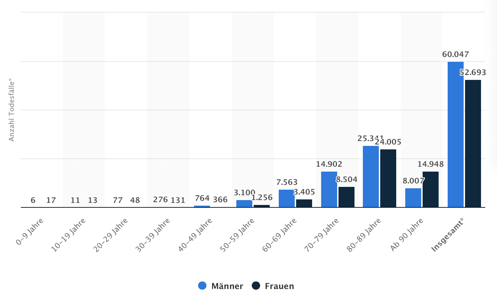
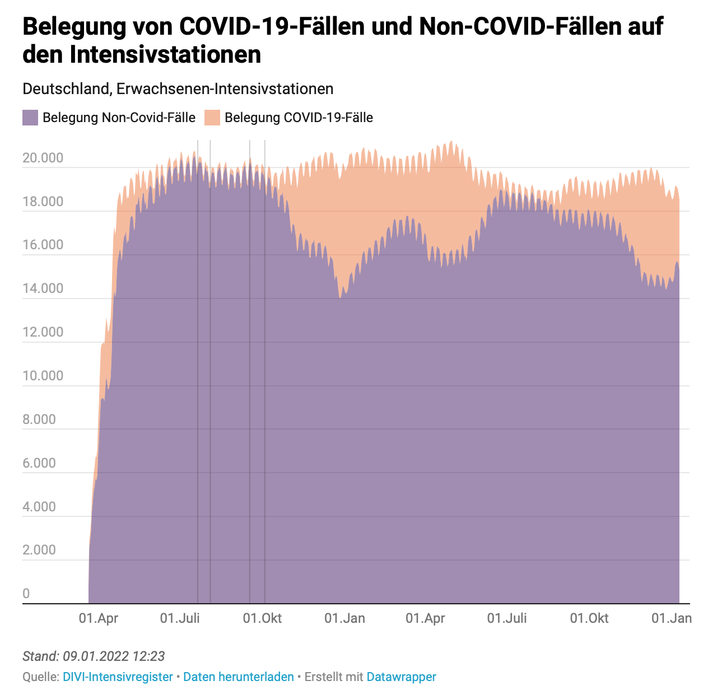
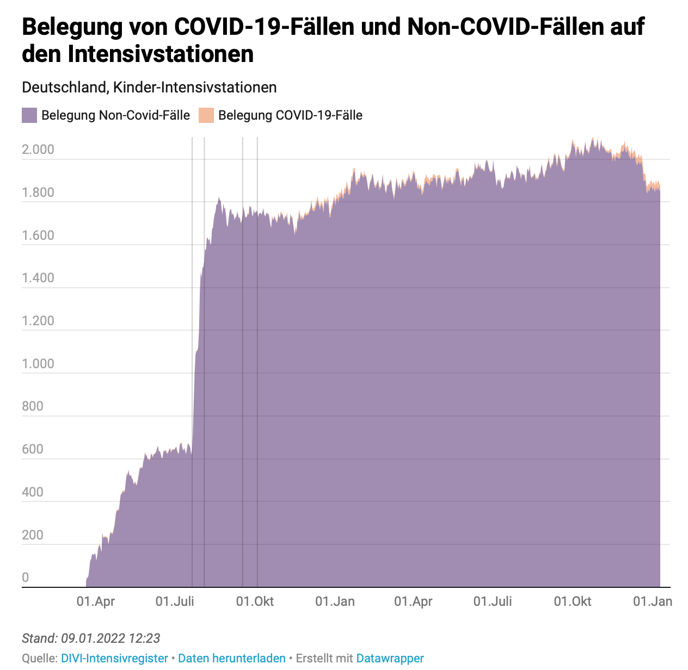

<!-- vim: set tabstop=2 shiftwidth=2 expandtab: -->

Gefährlichkeit des Viruses
--------------------------

Bereits im März 2020 kam Dr. Fauci, Direktor des National Institute of Allergy and Infectious
Diseases (NIAID) der USA und mittlerweile Chief Medical Advisor to the President, zu dem Ergebnis,
daß die Gefährlichkeit des neuen Viruses - bemessen an der Sterblichkeit - in der Größenordnung
einer Grippe liegen würde:

- **Anthony S. Fauci, H. Clifford Lane, Robert R. Redfield**:
  Covid-19 - Navigating the Uncharted, 26.3.2020  
  <https://www.nejm.org/doi/full/10.1056/NEJMe2002387>
  > If one assumes that the number of asymptomatic or minimally symptomatic cases is several times
  > as high as the number of reported cases, the case fatality rate may be considerably less than
  > 1%. This suggests that the overall clinical consequences of Covid-19 may ultimately be more akin
  > to those of a severe seasonal influenza (which has a case fatality rate of approximately 0.1%)
  > or a pandemic influenza (similar to those in 1957 and 1968) rather than a disease similar to
  > SARS or MERS, which have had case fatality rates of 9 to 10% and 36%, respectively.

Diese Abschätzung ist noch sehr pessimistisch - basierend auf den zum Zeitpunkt verfügbaren Daten -
und ist seitdem weiter verbessert worden, beispielsweise:

- **Prof. Dr. John P. A. Ioannidis**:
  Global perspective of COVID-19 epidemiology for a full-cycle pandemic, 7.10.2020  
  <https://onlinelibrary.wiley.com/doi/10.1111/eci.13423>
  > COVID-19 shows extremely strong risk stratification across age, socioeconomic factors, and
  > clinical factors. Calculation of years-of-life-lost from COVID-19 is methodologically
  > challenging and can yield misleading over-estimates. Many early deaths may have been due to
  > suboptimal management, malfunctional health systems, hydroxychloroquine, sending COVID-19
  > patients to nursing homes, and nosocomial infections; such deaths are partially avoidable moving
  > forward. About 10% of the global population may be infected by October 2020. Global infection
  > fatality rate is 0.15-0.20% (0.03-0.04% in those <70 years), with large variability across
  > locations with different age-structure, institutionalization rates, socioeconomic inequalities,
  > population-level clinical risk profile, public health measures, and health care.

- **Prof. Dr. John P. A. Ioannidis**:
  Reconciling estimates of global spread and infection fatality rates of COVID-19:
  An overview of systematic evaluations, 26.3.2021  
  <https://onlinelibrary.wiley.com/doi/10.1111/eci.13554>
  > All systematic evaluations of seroprevalence data converge that SARS-CoV-2 infection is widely
  > spread globally. Acknowledging residual uncertainties, the available evidence suggests average
  > global IFR [infection fatality rate] of ~0.15% and ~1.5-2.0 billion infections by February 2021
  > with substantial differences in IFR and in infection spread across continents, countries and
  > locations. [...] Year-to-year variability is substantial, even more so within age-strata.
  > Comparison against averages of multiple previous years is naïve, worse in countries with
  > substantial demographic changes. For example, in the first wave, an excess of 8071 deaths (SMR
  > 1.03, 95% CI 1.03-1.04) in Germany became a deficit of 4926 deaths (SMR 0.98, 95% CI 0.98-0.99)
  > after accounting for demographic changes.

Ursprünglich nahm man an, daß das Virus völlig neuartig und somit keine natürliche Immunität
vorhanden wäre, was es auch gefährlicher machen könnte. Das hat sich später als falsch
herausgestellt. Hierzu sollte man wissen, daß das menschliche Immunsystem nach einer durchstandenen
Infektion Gedächtniszellen bildet, die erneute Vertreter eines Krankheitserregers wiedererkennen und
somit die Abwehrreaktion schneller einleiten können. Die Erkennung basiert dabei auf allen
Virenbestandteilen wie Kapsid, Hüllproteine und Spikes. Hier genau liegt der Punkt: Im Gegensatz zu
Influenzaviren, die eine segmentierte RNA besitzen, die auch blockweise getauscht werden kann,
besteht die Erbinformation bei Coronaviren aus einem Strang. Dieser kann natürlich Mutationen
aufweisen, aber schlußendlich sind sich die verschiedenen Varianten der Coronaviren alle relativ
ähnlich. Dementsprechend vermutete man, daß die Gedächtniszellen aufgrund vorherigem Kontakt mit
anderen endemischen Varianten auch SARS-CoV-2 erkennen können (Kreuzimmunität). Entsprechende
Arbeiten findet man zahlreich über das Jahr 2020 verteilt, beispielsweise:

- **Julian Braun, Lucie Loyal, Marco Frentsch, et al.**:
  SARS-CoV-2-reactive T cells in healthy donors and patients with COVID-19, 29.7.2020  
  <https://www.nature.com/articles/s41586-020-2598-9>
  > Here we investigated CD4+ T cells that are reactive against the spike glycoprotein of SARS-CoV-2
  > in the peripheral blood of patients with COVID-19 and SARS-CoV-2-unexposed healthy donors. We
  > detected spike-reactive CD4+ T cells not only in 83% of patients with COVID-19 but also in 35%
  > of healthy donors. [...] This results indicate that spike-protein cross-reactive T cells are
  > present, which were probably generated during previous encounters with endemic coronaviruses.
  > The effect of pre-existing SARS-CoV-2 cross-reactive T cells on clinical outcomes remains to be
  > determined in larger cohorts. However, the presence of spike-protein cross-reactive T cells in a
  > considerable fraction of the general population may affect the dynamics of the current pandemic,
  > and has important implications for the design and analysis of upcoming trials investigating
  > COVID-19 vaccines.

- **Jose Mateus, Alba Grifoni, Alison Tarke, et al.**:
  Selective and cross-reactive SARS-CoV-2 T cell epitopes in unexposed humans, 4.8.2020  
  <https://www.science.org/doi/10.1126/science.abd3871>
  > Many unknowns exist about human immune responses to the severe acute respiratory syndrome
  > coronavirus 2 (SARS-CoV-2) virus. SARS-CoV-2–reactive CD4+ T cells have been reported in
  > unexposed individuals, suggesting preexisting cross-reactive T cell memory in 20 to 50% of
  > people. However, the source of those T cells has been speculative. Using human blood samples
  > derived before the SARS-CoV-2 virus was discovered in 2019, we mapped 142 T cell epitopes across
  > the SARS-CoV-2 genome to facilitate precise interrogation of the SARS-CoV-2–specific CD4+ T cell
  > repertoire. We demonstrate a range of preexisting memory CD4+ T cells that are cross-reactive
  > with comparable affinity to SARS-CoV-2 and the common cold coronaviruses human coronavirus
  > (HCoV)-OC43, HCoV-229E, HCoV-NL63, and HCoV-HKU1. Thus, variegated T cell memory to
  > coronaviruses that cause the common cold may underlie at least some of the extensive
  > heterogeneity observed in coronavirus disease 2019 (COVID-19) disease.

- **Annika Nelde, Tatjana Bilich, Jonas S. Heitmann, et al.**:
  SARS-CoV-2-derived peptides define heterologous and COVID-19-induced T cell recognition, 30.9.2020  
  <https://www.nature.com/articles/s41590-020-00808-x>
  > Cross-reactive SARS-CoV-2 peptides revealed pre-existing T cell responses in 81% of unexposed
  > individuals and validated similarity with common cold coronaviruses, providing a functional
  > basis for heterologous immunity in SARS-CoV-2 infection. Diversity of SARS-CoV-2 T cell
  > responses was associated with mild symptoms of COVID-19, providing evidence that immunity
  > requires recognition of multiple epitopes.

- **Prof. Dr. Peter Doshi**:
  Covid-19: Do many people have pre-existing immunity?, 17.9.2020  
  <https://www.bmj.com/content/370/bmj.m3563>
  > At least six studies have reported T cell reactivity against SARS-CoV-2 in 20% to 50% of people
  > with no known exposure to the virus. [...] In Germany reactive T cells were detected in a third
  > of SARS-CoV-2 seronegative healthy donors (23 of 68). [...] Researchers are also confident that
  > they have made solid inroads into ascertaining the origins of the immune responses. “Our
  > hypothesis, of course, was that it’s so called ‘common cold’ coronaviruses, because they’re
  > closely related,” said Daniela Weiskopf, senior author of a paper in Science that confirmed this
  > hypothesis. “We have really shown that this is a true immune memory and it is derived in part
  > from common cold viruses.”

Aus diesem Grund sind die ursprünglichen Modellrechnungen am Anfang des Jahres 2020 völlig
übertrieben gewesen. Das konnte man damals vielleicht nicht so genau wissen, mittlerweile aber
schon. Gleiches gilt für ein weiteres Detail, daß gerne unerwähnt bleibt: Die starke
Altersstratifizierung der hervorgerufenen Symptome und Todesfälle - größer noch als bei der Grippe:

Die Abbildung zeigt die Todesfälle in Deutschland im Zusammenhang mit COVID-19 basierend auf den
Daten des RKI (Quelle:
<https://de.statista.com/statistik/daten/studie/1104173/umfrage/todesfaelle-aufgrund-des-coronavirus-in-deutschland-nach-geschlecht/>,
Stand: 6.1.2022). Es fällt sofort auf, daß zwischen Kindern und der Altersgruppe der über
80-jährigen Faktor 2000 liegt, was durchaus damit erklärbar wäre, daß ein wirkungsvoller Schutz
durch das Immunsystem bereits vorlag oder bei Bedarf gebildet werden kann. So folgerten die
Unterzeichner der [Great Barrington Declaration](#great-barrington-declaration) bereits im Oktober
2020:

- **Prof. Dr. Martin Kulldorff, Prof. Dr. Sunetra Gupta, Prof. Dr. Jay Bhattacharya**:
  Great Barrington Declaration, 4.10.2020  
  <https://gbdeclaration.org>
  > Fortunately, our understanding of the virus is growing. We know that vulnerability to death from
  > COVID-19 is more than a thousand-fold higher in the old and infirm than the young. Indeed, for
  > children, COVID-19 is less dangerous than many other harms, including influenza.

Wenn man diesen Größenunterschied verschweigt, kann man relativ viel verzerren. Insbesondere
bedeutet es auch, daß es viel sinnvoller wäre, sich auf jene besonders Gefährdeten der Gesellschaft
zu konzentrieren.

Es zeigt sich, daß ein Großteil der Verstorbenen hochbetagt war. Der Altersmedian liegt bei 83
Jahren. Zum Vergleich: Die durchschnittliche Lebenserwartung liegt in Deutschland bei 81 Jahren mit
79 Jahren (Männer) und 83 Jahren (Frauen). Das wirft die berechtigte Frage auf, ob es sich
tatsächlich um die alleinige Ursache handelt. Diese Frage ist wichtig, da die unausgesprochene
Implikation noch immer lautet, daß deren Tod verhinderbar gewesen wäre, wenn nur alle geimpft
gewesen wären. Es spricht aber einiges dagegen:

1. Die Diagnose für die Statistik basiert weitestgehend auf hypersensiblen PCR-Tests (mit hohen
   Ct-Werten) ohne Berücksichtigung von Vorerkrankungen oder generell klinischer Symptomatik. Das
   ist grober Unfug. Natürlich ist das Vorhandensein des Viruses notwendige Voraussetzung für
   Kausalität, aber eben nicht hinreichend. Hier wird uns vom RKI ein notwendiges Kriterium als
   hinreichend verkauft. Das ist von der Logik her wie im Mittelalter: Wir bilden uns ein, daß das
   Virus gefährlich wäre und führen deswegen den passenden Test durch. Da der Test positiv war,
   haben wir eine Antwort gefunden und können aufhören zu denken. Weil wir aufgehört haben zu
   denken, bekommen wir unsere Einbildung bestätigt. Was soll das? Ohne Ausschluß anderer Ursachen
   befähigt der Test nicht zu einer solchen Schlußfolgerung. Nach der selben Logik könnte man
   stattdessen auch einen Herpestest machen und dann jede Menge Herpestote klassifizieren.

2. Daß das RKI nicht zwischen „an“ (Hauptdiagnose) und „mit“ (Nebendiagnose) COVID-19 unterscheidet,
   wurde zwischenzeitlich auch eingeräumt (Quelle:
   <https://www.heise.de/tp/features/Wer-zaehlt-als-Corona-Toter-5035504.html>). Das RKI schreibt in
   seiner FAQ dazu (Quelle: <https://www.rki.de/SharedDocs/FAQ/NCOV2019/gesamt.html>, Stand:
   7.1.2022):

   > In die Statistik des RKI gehen die COVID-19-Todesfälle ein, bei denen ein laborbestätigter
   > Nachweis von SARS-CoV-2 (direkter Erregernachweis) vorliegt und die in Bezug auf diese
   > Infektion verstorben sind. Das Risiko an COVID-19 zu versterben ist bei Personen, bei denen
   > bestimmte Vorerkrankungen bestehen, höher. Daher ist es in der Praxis häufig schwierig zu
   > entscheiden, inwieweit die SARS-CoV-2-Infektion direkt zum Tode beigetragen hat. Sowohl
   > Menschen, die unmittelbar an der Erkrankung verstorben sind („gestorben an“), als auch Personen
   > mit Vorerkrankungen, die mit SARS-CoV-2 infiziert waren und bei denen sich nicht abschließend
   > nachweisen lässt, was die Todesursache war („gestorben mit“) werden derzeit erfasst. Generell
   > liegt es immer im Ermessen des Gesundheitsamtes, ob ein Fall als verstorben an bzw. mit
   > COVID-19 ans RKI übermittelt wird oder nicht.

   Oder deutlich formuliert: Nichts genaues weiß man nicht. Das macht auch die üblicherweise
   verwendete Formulierung „im Zusammenhang mit COVID-19“ nötig.

3. Es sind im Zusammenhang mit COVID-19 41.201 von 112.740 Menschen auf Intensivstation verstorben
   (Quelle: <https://intensivstationen.net>, Stand: 9.1.2022). Das ist verwunderlich, handelt es
   sich doch um eine sich graduell verschlechternde Symptomatik, bei der man annehmen möchte, daß
   zuvor alles erdenkliche unternommen wurde. Auf 2 Jahre verteilt entspricht das der Größenordnung
   einer Grippe - insbesondere wenn diese in den selben Jahren laut Statistik weitestgehend
   ausgeblieben ist.

4. Die Arbeitsgemeinschaft Influenza des RKI betreibt ein Sentinelsystem (Hinweissystem mittels
   bundesweit verteilter Arztpraxen), um die epidemiologische Situation der akuten
   Atemwegserkrankungen im Allgemeinen und der Influenza im Besonderen fortlaufend zu überwachen.
   Das beinhaltet auch SARS-CoV-2. Laut dessen Daten wurde während der ersten Welle SARS-CoV-2 über
   einen Zeitraum von 13 Wochen bei maximal 3,1% der eingereichten Sentinelproben nachgewiesen. Die
   Atemwegsinfektionen wurden durchgängig von Influenza-, Rhino- und/oder hMP-Viren dominiert
   (Quelle: <https://multipolar-magazin.de/artikel/das-schweigen-der-viren>). Die aktuelle
   Verteilung kann man auf der Webseite der Arbeitsgemeinschaft unter „Nachweise respiratorischer
   Viren im Nationalen Referenzzentrum“ finden:
   <https://influenza.rki.de/Diagrams.aspx?agiRegion=0>.

Der Verdacht der Verzerrung scheint sich langsam zu bestätigen. Nach einem Bericht der ZEIT wird die
Anzahl der Personen, die wegen Corona im Krankenhaus behandelt werden müssen, um bis zu 30%
überschätzt. Ihre Erklärung hierfür lautet (Quelle: <https://www.presseportal.de/pm/9377/4840896>):

> Verantwortlich für dieses Graufeld ist das deutsche Meldesystem: Alle neuen Patienten werden
> systematisch bei der Aufnahme ins Krankenhaus auf das Virus getestet und bei einem positiven
> Befund über das Gesundheitsamt an das Robert Koch-Institut gemeldet. Für die Krankenhäuser selbst
> ist die Unterscheidung nicht erheblich: Ein Corona-Patient muss, ob er nun mit oder wegen Corona
> behandelt wird, in ein Isolierzimmer verlegt werden. Pfleger und Ärzte müssen sich bei seiner
> Behandlung besonders schützen. Politisch aber ist die Zahl der schweren Corona-Verläufe ein
> wichtiger Indikator.
>
> „Auf Grundlage der Schätzung einzelner Kliniken kann ein evidenzbasiertes Institut keine
> Bereinigung von Fällen vornehmen,“ sagt das RKI auf Anfrage der ZEIT. Das harte Kriterium sei ein
> positiver PCR-Test.

Nach Prof. Dr. Bertram Häussler könnten bei bis zu 80% der vom RKI gemeldeten Corona-Toten andere
Ursachen der Grund sein (Quelle:
<https://www.welt.de/politik/deutschland/plus233426581/Seit-Juli-2021-Corona-bei-80-Prozent-der-offiziellen-Covid-Toten-wohl-nicht-Todesursache.html>).
Wie groß die [Abweichung](https://www.zdf.de/politik/berlin-direkt/berlin-direkt-clip-1-500.html)
tatsächlich ist, dürfte nachträglich schwer zu bestimmen sein. Wir werden sehen. Dementsprechend
fand eine Studie der Uni Duisburg-Essen basierend auf der EUROSTAT-Datenbank im Jahr 2020 über alle
Todesursachen keine signifikante Übersterblichkeit:

- **Bernd Kowall, Fabian Standl, Florian Oesterling, et al.**:
  Excess mortality due to Covid-19? A comparison of total mortality in 2020 with total mortality in
  2016 to 2019 in Germany, Sweden and Spain, 3.8.2021  
  <https://journals.plos.org/plosone/article?id=10.1371/journal.pone.0255540>
  > In the first approach, the cumulative SMRs [standardized mortality ratios] show that in Germany
  > and Sweden there was no or little excess mortality in 2020 (SMR = 0.976 (95% CI: 0.974–0.978),
  > and 1.030 (1.023–1.036), respectively), while in Spain the excess mortality was 14.8% (1.148
  > (1.144–1.151)). In the second approach, the corresponding SMRs for Germany and Sweden increased
  > to 1.009 (1.007–1.011) and 1.083 (1.076–1.090), respectively, whereas results for Spain were
  > virtually unchanged. In 2020, there was barely any excess mortality in Germany for both
  > approaches. In Sweden, excess mortality was 3% without, and 8% with consideration of increasing
  > life expectancy.

### Akute Atemwegserkrankungen (ARE) ###

Da SARS-CoV-2 das selbe Symptomspektrum hervorruft wie die anderen Atemwegsviren müssen wir
natürlich die entsprechende Einordnung vornehmen.

Ich zitiere den Absatz gleich komplett (Quelle: <https://grippeweb.rki.de>, Stand: 9.1.2022):

> Die Abbildung zeigt die Gesamt-ARE-Rate in den Saisons 2017/18 bis 2021/22 sowie (zum Vergleich)
> die COVID-19-Rate von der 27. KW bis zur 52. KW 2021. Die seit der 46. KW 2021 kontinuierlich und
> zum Teil deutliche gesunkene ARE-Rate ist mit Ausnahme in der 51. KW auch in der 52. KW wieder
> gesunken. Infolge verstärkter Kontaktreduktionen in der Bevölkerung liegen die ARE-Raten wieder
> deutlich niedriger als vor der Pandemie. Die ARE-Rate liegt zwar etwas über der ARE-Rate des
> Vorjahres (2,2 %), jedoch mit 3,0 % in einem ähnlich niedrigen Bereich. Es ist zusätzlich zu
> beachten, dass im Zeitraum der Schulferien zu Weihnachten / zum Jahreswechsel in allen Vorjahren
> ein Rückgang der ARE-Rate beobachtet wurde. Neben dem Grippevirus oder SARS-CoV-2 gibt es eine
> Vielzahl weiterer Atemwegserreger, die akute Atemwegserkrankungen hervorrufen können und deren
> Übertragungen durch die Kontaktreduktion in der Bevölkerung verhindert werden. Mit einer ARE-Rate
> von 3,0 % (entsprechend 3.000 ARE-Fällen pro 100.000 Einwohner) hatten hochgerechnet auf die
> Bevölkerung in Deutschland in der 52. KW 2021 ca. 2,5 Millionen Personen eine neu aufgetretene
> akute Atemwegserkrankung (mit oder ohne Fieber), unabhängig von einem Arztbesuch. Die
> COVID-19-Rate wurde aus den nach Infektionsschutzgesetz (IfSG) an das Robert Koch-Institut (RKI)
> übermittelten Fällen mit SARS-CoV-2-Nachweis berechnet. Zum Größenvergleich wurde die
> COVID-19-Rate (braune Fläche in Abbildung 1; Stand der Meldedaten: 5.1.2022) in der gleichen
> Abbildung wie die Gesamt-ARE-Rate dargestellt. Die Zahl der zuletzt (für die 52. KW 2021)
> übermittelten COVID-19-Neu-Infektionen lag bei 0,25 % der Bevölkerung oder, anders formuliert, bei
> ca. 250 COVID-19-Fällen pro 100.000 Einwohner. Auf die Bevölkerung in Deutschland bezogen
> entspricht das einer Gesamtzahl von ca. 206.000 COVID-19-Neuinfektionen (Vorwoche: ca. 194.000).
> Die COVID-19-Rate ist im Vergleich zur Vorwoche leicht gestiegen. Während der Feiertage und zum
> Jahreswechsel ist bei der Interpretation der IfSG-Meldedaten zu beachten, dass mit einer
> geringeren Test- und Meldeaktivität zu rechnen ist.

Das RKI sagt uns hier klar, daß die Inzidenz in der letzten Woche des Jahres 2021 - wie üblich pro
100.000 Einwohner - aller Fälle von akuten Atemwegserkrankungen 3.000 betrug wozu das neue Virus
SARS-CoV-2 lediglich 250 (8,3%) beigetragen hat. Vielleicht sollten wir mehr Grippeimpfungen
empfehlen. Das könnte die Krankenhäuser viel wirkungsvoller entlasten.

### Intensivbelegung ###

Die Analyse der Beanspruchung der Intensivstationen aufgrund des neuen Viruses erfolgt mit Hilfe der
Daten des [DIVI-Intensivregisters](https://www.intensivregister.de).

 

Die Abbildungen (Quelle: <https://www.intensivregister.de/#/aktuelle-lage/zeitreihen>, Stand:
9.1.2022) zeigen die Belegungen der Intensivstationen seit April 2020 mit und ohne COVID-19 für
Erwachsene (links) sowie Kinder (rechts). Man sieht im Zusammenhang mit COVID-19 sind im
bundesdeutschen Durchschnitt nie mehr als 25% benötigt worden. In einigen sächsischen Kreisen betrug
die Belegung tatsächlich zeitweise bis zu 70%, aber eine flächendeckende Überlastung des
Gesundheitssystems durch SARS-CoV-2 ist nicht erkennbar. Eine besondere Gefährdung von Kindern
sowieso nicht.

Eine detailliertere Aufschlüsselung nach Altersgruppen und Kreisen kann man unter
<https://intensivstationen.net> finden. Die obige Abbildung (Stand: 7.1.2022) zeigt den
bundesdeutschen Durchschnitt. Bemerkenswert ist auch, daß in den Sommermonaten Juli und August der
Jahre 2020 und 2021 die Pandemie schon zweimal vorbei war. Hätten wir aufgehört Masken zu tragen,
hätten die Menschen die Pandemie nach 2 Wochen vergessen.

### Omikron ###

Ich möchte zum Abschluß dieses Kapitels noch kurz auf die neue Omikronvariante eingehen soweit es
die verfügbaren Daten bereits zulassen:

| Land        | Fälle (gesamt) | Hospitalisierungen | Rate   | Todesfälle | Rate   |
|-------------|---------------:|-------------------:|-------:|-----------:|-------:|
| Deutschland | 62.932         | 632                | 1,00%  | 16         | 0,025% |
| England     | 846.821        | 981                | 0,12%  | 75         | 0,009% |
| Dänemark    | 54.616         | 93                 | 0,17%  | k.A.       | -      |

Quellen:
- **Robert Koch-Institut**:
  Tägliche Übersicht zu Omikron-Fällen vom 07. Januar 2022  
  <https://www.rki.de/DE/Content/InfAZ/N/Neuartiges_Coronavirus/Situationsberichte/Omikron-Faelle/Omikron-Faelle.html?__blob=publicationFile>
- **UK Health Security Agency**:
  Omicron daily overview: 31 December 2021  
  <https://assets.publishing.service.gov.uk/government/uploads/system/uploads/attachment_data/file/1044522/20211231_OS_Daily_Omicron_Overview.pdf>
- **Statens Serum Institute**:
  Covid-19 Rapport om omikronvarianten, 31.12.2021  
  <https://files.ssi.dk/covid19/omikron/statusrapport/rapport-omikronvarianten-31122021-ct18>

Die Tabelle enthält den Durchschnitt über alle Altersgruppen, und das sieht gut aus. Warum die
Hospitalisierungsrate in Deutschland höher liegt als in England und Dänemark kann ich nicht
erklären. In beiden Ländern ist die Omikronvariante bereits dominant. In Deutschland liegt die
Verbreitung erst bei 20%. Der dänische Bericht enthält noch eine weitere interessante Information:
Zu den 126.223 Krankenhauseinweisungen mit bekannter SARS-CoV-2-Variante trägt Omikron nur 330
(0,7%) bei. Die Direktorin des SSI prognostiziert daher bereits das Ende der Pandemie in Dänemark
(Quelle:
<https://www.rnd.de/politik/corona-pandemie-in-zwei-monaten-vorbei-daenische-top-epidemiologin-tyra-grove-krause-geht-davon-aus-UALXWIDB4JF3LHF4O6ETO5K2QA.html>).
Die Deutsche Gesellschaft für Pädiatrische Infektiologie schlußfolgert zu Omikron (Quelle:
<https://dgpi.de/kinder-omikron-variante/>, Stand: 29.12.2021):

> Die Erfahrung auch aus den vorherigen Pandemiewellen mit den Varianten Alpha und Delta lehrt, dass
> sich ein besonderes Risiko von Kindern in keiner dieser Wellen bestätigt hat. [...]
> Selbstverständlich nehmen Kinder und Jugendliche als Teil unserer Gesellschaft am
> Pandemiegeschehen teil und sind somit auch von der Omikron-Variante betroffen. Die
> Omikron-Variante ist deutlich infektiöser als die vorhergehende Delta-Variante und wird diese auch
> in Deutschland verdrängen. Die Erkrankungsschwere liegt nach neuen Erkenntnissen allerdings in
> allen Altersgruppen deutlich unter der der Delta-Variante.

Erste Studien zur Omikronvariante sind bereits verfügbar (Pre-Print):

- **Joseph A. Lewnard, Vennis X. Hong, Manish M. Patel**:
  Clinical outcomes among patients infected with Omicron (B.1.1.529) SARS-CoV-2 variant
  in southern California, 11.1.2022  
  <https://www.medrxiv.org/content/10.1101/2022.01.11.22269045v1.full>
  > Our analyses included 52,297 cases with SGTF (Omicron) and 16,982 cases with non-SGTF (Delta
  > [B.1.617.2]) infections, respectively. Hospital admissions occurred among 235 (0.5%) and 222
  > (1.3%) of cases with Omicron and Delta variant infections, respectively. Among cases first
  > tested in outpatient settings, the adjusted hazard ratios for any subsequent hospital admission
  > and symptomatic hospital admission associated with Omicron variant infection were 0.48
  > (0.36-0.64) and 0.47 (0.35-0.62), respectively. Rates of ICU admission and mortality after an
  > outpatient positive test were 0.26 (0.10-0.73) and 0.09 (0.01-0.75) fold as high among cases
  > with Omicron variant infection as compared to cases with Delta variant infection. Zero cases
  > with Omicron variant infection received mechanical ventilation, as compared to 11 cases with
  > Delta variant infections throughout the period of follow-up (two-sided p<0.001). Median duration
  > of hospital stay was 3.4 (2.8-4.1) days shorter for hospitalized cases with Omicron variant
  > infections as compared to hospitalized patients with Delta variant infections, reflecting a
  > 69.6% (64.0-74.5%) reduction in hospital length of stay. [...] During a period with mixed Delta
  > and Omicron variant circulation, SARS-CoV-2 infections with presumed Omicron variant infection
  > were associated with substantially reduced risk of severe clinical endpoints and shorter
  > durations of hospital stay.

Wie es aussieht enttäuscht das neue hochgejubelte Killervirus in spe auf ganzer Linie. Das ganze
Thema ist jedenfalls noch lange nicht abgeschlossen und bleibt weiterhin spannend, wie auch die
nachfolgenden Themen. Es spricht aber definitiv nichts für einen Impfzwang. Weitere schön
aufbereitete Fakten zum Virus und der verursachten Erkrankung finden sich unter:
<https://corona-reframed.de>.
