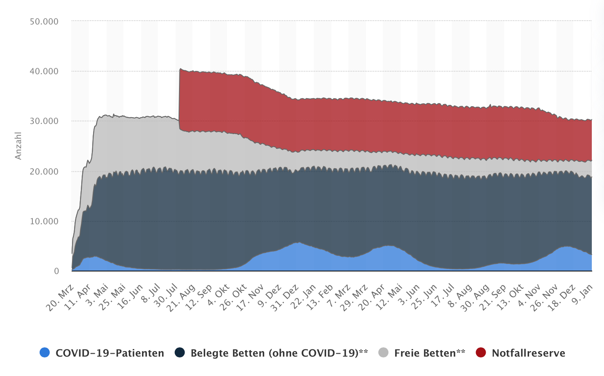

<!-- vim: set tabstop=2 shiftwidth=2 expandtab: -->

Die Rolle der Politik
---------------------

> Wenn der Zweck die Mittel heiligt, dann ist der Zweck unheilig. (Karl Marx)

### Great Barrington Declaration ###

- **Prof. Dr. Martin Kulldorff, Prof. Dr. Sunetra Gupta, Prof. Dr. Jay Bhattacharya**:
  Great Barrington Declaration, 4.10.2020  
  https://gbdeclaration.org
  > Die Great Barrington Erklärung
  >
  > Als Epidemiologen für Infektionskrankheiten und Wissenschaftler im Bereich des öffentlichen
  > Gesundheitswesens haben wir ernste Bedenken hinsichtlich der schädlichen Auswirkungen der
  > vorherrschenden COVID-19-Maßnahmen auf die physische und psychische Gesundheit und empfehlen
  > einen Ansatz, den wir gezielten Schutz (Focused Protection) nennen.
  >
  > Wir kommen politisch sowohl von links als auch von rechts und aus der ganzen Welt und haben
  > unsere berufliche Laufbahn dem Schutz der Menschen gewidmet. Die derzeitige Lockdown-Politik hat
  > kurz- und langfristig verheerende Auswirkungen auf die öffentliche Gesundheit. Zu den
  > Ergebnissen, um nur einige zu nennen, gehören niedrigere Impfraten bei Kindern, schlechtere
  > Verläufe bei Herz-Kreislauf-Erkrankungen, weniger Krebsvorsorgeuntersuchungen und eine
  > Verschlechterung der psychischen Verfassung – was in den kommenden Jahren zu einer erhöhten
  > Übersterblichkeit führen wird. Die Arbeiterklasse und die jüngeren Mitglieder der Gesellschaft
  > werden dabei am schlimmsten betroffen sein. Schüler von der Schule fernzuhalten, ist eine
  > schwerwiegende Ungerechtigkeit.
  >
  > Die Beibehaltung dieser Maßnahmen bis ein Impfstoff zur Verfügung steht, wird irreparablen
  > Schaden verursachen, wobei die Unterprivilegierten unverhältnismäßig stark betroffen sind.
  >
  > Glücklicherweise wachsen unsere Erkenntnisse über das Virus. Wir wissen, dass die Gefahr durch
  > COVID-19 zu sterben bei alten und gebrechlichen Menschen mehr als tausendmal höher ist als bei
  > jungen Menschen. Tatsächlich ist COVID-19 für Kinder weniger gefährlich als viele andere Leiden,
  > einschließlich der Influenza.
  >
  > In dem Maße, wie sich die Immunität in der Bevölkerung aufbaut, sinkt das Infektionsrisiko für
  > alle – auch für die gefährdeten Personengruppen. Wir wissen, dass alle Populationen schließlich
  > eine Herdenimmunität erreichen – d.h. den Punkt, an dem die Rate der Neuinfektionen stabil ist.
  > Dies kann durch einen Impfstoff unterstützt werden, ist aber nicht davon abhängig. Unser Ziel
  > sollte daher sein, die Mortalität und den sozialen Schaden zu minimieren, bis wir eine
  > Herdenimmunität erreichen.
  >
  > Der einfühlsamste Ansatz, bei dem Risiko und Nutzen des Erreichens einer Herdenimmunität
  > gegeneinander abgewogen werden, besteht darin, denjenigen, die ein minimales Sterberisiko haben,
  > ein normales Leben zu ermöglichen, damit sie durch natürliche Infektion eine Immunität gegen das
  > Virus aufbauen können, während diejenigen, die am stärksten gefährdet sind, besser geschützt
  > werden. Wir nennen dies gezielten Schutz (Focused Protection).
  >
  > Die zentrale Aufgabe des öffentlichen Gesundheitswesens in Bezug auf COVID-19 sollte die
  > Verabschiedung von Maßnahmen zum Schutz von gefährdeten Personengruppen sein. Zum Beispiel
  > sollten Pflegeheime Personal mit erworbener Immunität einsetzen und häufige Tests bei anderen
  > Mitarbeitern und allen Besuchern durchführen. Der Personalwechsel sollte minimiert werden.
  > Menschen im Ruhestand, die zu Hause wohnen, sollten sich Lebensmittel und andere wichtige Dinge
  > nach Hause liefern lassen. Wenn möglich, sollten sie Familienmitglieder eher draußen als drinnen
  > treffen. Eine umfassende und detaillierte Reihe an Maßnahmen, darunter auch Maßnahmen für
  > Mehrgenerationenhaushalte, kann umgesetzt werden und liegt im Rahmen der Möglichkeiten und
  > Fähigkeiten des öffentlichen Gesundheitswesens.
  >
  > Diejenigen, die nicht schutzbedürftig sind, sollten sofort wieder ein normales Leben führen
  > dürfen. Einfache Hygienemaßnahmen wie Händewaschen und der Aufenthalt zu Hause im Krankheitsfall
  > sollten von allen praktiziert werden, um den Schwellenwert für die Herdenimmunität zu senken.
  > Schulen und Universitäten sollten für den Präsenzunterricht geöffnet sein. Außerschulische
  > Aktivitäten, wie z. B. Sport, sollten wieder aufgenommen werden. Junge Erwachsene mit geringem
  > Risiko sollten normal und nicht von zu Hause aus arbeiten. Restaurants und andere Geschäfte
  > sollten öffnen können. Kunst, Musik, Sport und andere kulturelle Aktivitäten sollten wieder
  > aufgenommen werden. Menschen, die stärker gefährdet sind, können teilnehmen, wenn sie dies
  > wünschen, während die Gesellschaft als Ganzes den Schutz genießt, der den Schwachen durch
  > diejenigen gewährt wird, die Herdenimmunität aufgebaut haben.

Zuzüglich zu den Erstunterzeichnern, den Professoren der Universitäten Harvard, Oxford und Stanford,
haben sich weitere 916.587 Unterzeichner der Deklaration angeschlossen, wovon 15.638 als „medical &
public health scientists“ geführt werden (Quelle: https://gbdeclaration.org/view-signatures/, Stand:
15.1.2022).

<!--
freiwillige Erkenntnisisolation

Herdenimmunität (Herdenschutz):
- Schutz vor Infektion und Transmission (sterile Immunität)
- Herde => alle Tiere
- Mutiert langsam genug: DNA-Viren (1:1.000.000), RNA-Viren (1:1.000)

Strategiepapier BMI: Wie wir COVID-19 unter Kontrolle bekommen:
https://www.bmi.bund.de/SharedDocs/downloads/DE/veroeffentlichungen/2020/corona/szenarienpapier-covid19.html
https://fragdenstaat.de/dokumente/4123-wie-wir-covid-19-unter-kontrolle-bekommen/
https://www.abgeordnetenwatch.de/blog/informationsfreiheit/das-interne-strategiepapier-des-innenministeriums-zur-corona-pandemie

Was ist der Unterschied zwischen der Bundesregierung und der Drogenmafia?
Die Mafia zwingt dich nicht ihr Zeug zu nehmen.

Europäische Menschenrechtskonvention
https://www.echr.coe.int/Documents/Convention_deu.pdf
Grundrechte Abwehrrechte gegen den Staat
Letzten, Experimente an Menschen => Nürnberg

Ausweg Omikron ohne AfD
Abofalle (Moderna verhandelt mir Schweiz)
https://telebasel.ch/2021/12/21/loest-die-schweiz-bald-ein-impf-abo-bei-moderna/

Geboosterte brauchen kein Test im Restaurant, können aber andere anstecken und selber krank werden
Ungeimpfte dürfen im Restaurant mit Test arbeiten, weil der Test sicher ist aber nach Feierabend
nicht im Restaurant essen, weil der Test zu unsicher ist.

https://www.faz.net/aktuell/wirtschaft/corona-arbeitgeber-und-industrie-wollen-impfpflicht-statt-lockdown-17660471.html
https://www.faz.net/aktuell/karriere-hochschule/hoersaal/querdenker-proteste-wie-so-widerspruechliches-zusammenfinden-kann-17725600.html

Karl Lauterbach (Quelle: https://www.zdf.de/nachrichten/politik/corona-impfpflicht-impfregister-lauterbach-kontaktbeschraenkungen-100.html):
> Wir können nicht darauf warten, dass eine Impfpflicht überflüssig wird, weil wir eine sehr hohe
> Durchseuchung der Bevölkerung haben.

Falsch: Die Impfpflicht ist verfassungswidrig und wird nicht erst irgendwann überflüssig. Mit
welcher Impfung wurde eigentlich die spanische Grippe beendet? Oder die Pest? Auch wenn der
Vergleich etwas hinkt, da die Gefährlichkeit von Corona nicht annähernd die der anderen erreicht, so
sollte man doch erkennen, daß Epidemien von allein enden und Omikron könnte genau dafür sorgen.

Das gilt insbesondere auch für die bereits beschlossene Impfpflicht im Gesundheitswesen. Obige
Grafik (Quelle:
https://de.statista.com/statistik/daten/studie/1246685/umfrage/auslastung-von-intensivbetten-in-deutschland/)
zeigt die Intensivkapazitäten in Deutschland im zeitlichen Verlauf seit März 2020 sowie deren
Auslastung.

Man sieht aber auch den Rückgang von 32.000 auf nunmehr 21.000 Betten (ein
Drittel) bei annähernd gleichbleibendem Bedarf. Das bedeutet auch wenn jetzt noch 20-30% ungeimpftes
medizinisches Personal kündigt, können wir uns auf Probleme freuen. Aber nicht aufgrund eines
Viruses sondern der dämlichsten Politik, die man sich vorstellen kann.
https://www.welt.de/politik/deutschland/article236219718/Pflexit-40-Prozent-der-Pflegekraefte-erwaegen-ihren-Job-aufzugeben.html

Nancy Faeser: Zu viel Rücksicht auf eine kleine Minderheit
https://www.zeit.de/2022/03/nancy-faeser-innenministerin-hass-im-netz-impfpflicht

Abgeordnete Impfpflicht für vulnerable Gruppen: Altersdiskriminierung? BMI-Waage?
Wirkungsvoller wäre ein IQ-Test für Abgeordnete.

https://www.nordbayern.de/region/weiter-wirbel-um-bayerische-inzidenz-verzerrungen-grosser-als-behauptet-1.11703993
WELT AM SONNTAG juristisch -> LGL

Nach `#ImpftEuchInsKnie` kam `#AllesInDenArm`. Damit kann man auch Heroin bewerben.
Heilmittelwerbungsgesetz
-->
