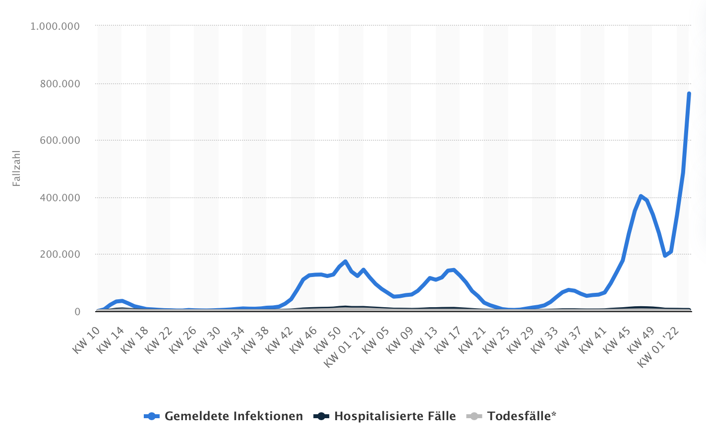

<!-- vim: set tabstop=2 shiftwidth=2 expandtab: -->

---

Fazit
-----

```text
Aktennotiz:
Dieses Kapitel ist nicht eigenständig und kann nicht losgelöst von den anderen 5 Kapiteln betrachtet werden.
```

> Unsichtbar macht sich die Dummheit, indem sie sehr große Ausmaße annimmt. (Bertold Brecht)

### Big Business ###

Big Pharma ist Big Business. Wie üblich wenn viel Geld im Spiel ist, spielen die Interessen der
Menschen eine eher untergeordnete Rolle. Zu diesem Ergebnis kamen kritische Autoren bereits vor 20
Jahren:

- **Ray Moynihan, Iona Heath, David Henry**:
  Selling sickness: the pharmaceutical industry and disease mongering, 13.4.2002 <br/>
  <https://www.bmj.com/content/324/7342/886.1.full>
  > There’s a lot of money to be made from telling healthy people they’re sick. Some forms of
  > medicalising ordinary life may now be better described as disease mongering: widening the
  > boundaries of treatable illness in order to expand markets for those who sell and deliver
  > treatments. Pharmaceutical companies are actively involved in sponsoring the definition of
  > diseases and promoting them to both prescribers and consumers. The social construction of
  > illness is being replaced by the corporate construction of disease.

Besonders treffend finde ich das Inverse Benefit Law der amerikanischen Autoren über das dortige
Gesundheitssystem. Je schlechter das Produkt um so extensiver ist das Marketing:

- **Howard Brody, Donald W. Light**:
  The Inverse Benefit Law: How Drug Marketing Undermines Patient Safety and Public Health, 20.9.2011 <br/>
  <https://ajph.aphapublications.org/doi/10.2105/AJPH.2010.199844>
  > The inverse benefit law, inspired by Hart's inverse care law, states that the ratio of benefits
  > to harms among patients taking new drugs tends to vary inversely with how extensively the drugs
  > are marketed. The law is manifested through 6 basic marketing strategies: reducing thresholds
  > for diagnosing disease, relying on surrogate endpoints, exaggerating safety claims, exaggerating
  > efficacy claims, creating new diseases, and encouraging unapproved uses.

Diese Punkte können bei dem Coronavirus als erfüllt gelten. Wir haben (a) symptomlose Kranke in den
Statistiken (Meldeinzidenz), (b) unsinnige Fokusierung auf Antikörperspiegel, obwohl diese nach
kurzer Zeit abgebaut werden und die Gedächtniszellen des Immunsystems viel relevanter wären, (c)
überzogene Wirksamkeits- und Unbedenklichkeitsversprechen, und (d) überstürzt erteilte
Notzulassungen, die mit gravierenden Nachteilen verbunden sind. Das ist auch notwendig, denn leider
laufen gewinnträchtige Patente in jeder Branche irgendwann ab, so daß neue Technologien benötigt
werden, um das weitere Wirtschaftswachstum zu sichern. Der Chief Investment Officer der Deutschen
Apotheker- und Ärztebank verrät uns:

- **Dr. Hanno Kühn**:
  Pharma-Aktien: Selektion ist Trumpf, 5.2.2021 <br/>
  <https://www.aerztezeitung.de/Wirtschaft/Pharma-Aktien-Selektion-ist-Trumpf-416809.html>
  > Auch das Patent für das innovativste Medikament läuft einmal ab. Das ist den Pharmaunternehmen
  > wohl bewusst. Und sie wissen: Den Hoch-Zeiten folgen – gerade bei Blockbuster-Patenten – Zeiten
  > mit herben Umsatzeinbußen und Gewinneinbrüchen. [...] Bis 2023 werden die Erlösrückgänge der
  > Pharmaindustrie durch Patentabläufe weltweit auf mehr als 121 Milliarden US-Dollar geschätzt,
  > davon 95 Milliarden US-Dollar allein in den USA. [...] Besonders vielversprechend ist ein
  > Gegensteuern der pharmazeutischen Industrie mit Innovationen. Die sich abzeichnenden neuartigen
  > Therapieoptionen (zum Beispiel mRNA, bi-spezifische Antikörper, Gentherapie) lassen nicht nur
  > Patienten hoffen, sondern werden bei erfolgreicher Zulassung auch die Umsatz- und Gewinnkurven
  > der Hersteller neue Höhen erklimmen lassen.

Wir leben in einem Wirtschaftssystem, das zwanghaft Wirtschaftswachstum benötigt. Leider sind neue
innovative Technologien nicht automatisch ausgereift. Die Geschichte lehrt, daß tendenziell das
Gegenteil der Fall ist. Auch BioNTech war sich der Probleme bewußt als sie im Oktober 2019 in den
USA an die Börse gingen, um weiteres Investorenkapital einzusammeln. Aus diesem Anlass erläuterte
das Unternehmen in einem umfangreichen Geschäftsbericht offen die Risiken im Zusammenhang mit seinem
Geschäft:

- **BioNTech**:
  10,000,000 American Depositary Shares, 15.10.2019 <br/>
  <https://investors.biontech.de/node/6806/html>
  > #### Risks Related to our Business ####
  >
  > _No mRNA immunotherapy has been approved, and none may ever be approved. mRNA drug development
  > has substantial clinical development and regulatory risks due to the novel and unprecedented
  > nature of this new category of therapeutics._
  >
  > As a potential new category of therapeutics, to our knowledge, no mRNA immunotherapies have been
  > approved to date by the FDA, EMA or other regulatory agency. Successful discovery and
  > development of mRNA-based (and other) immunotherapies by either us or our collaborators is
  > highly uncertain and depends on numerous factors, many of which are beyond our or their control.
  > To date, there has never been a Phase 3 trial for an mRNA-based product or a commercialized
  > mRNA-based product. Our product candidates that appear promising in the early phases of
  > development may fail to advance, experience delays in the clinic or clinical holds, or fail to
  > reach the market for many reasons, including:
  >
  > - clinical trial results may show the product candidates to be less effective than expected,
  >   including a failure to meet one or more endpoints or have unacceptable side effects or
  >   toxicities;
  > - manufacturing failures or insufficient supply of GMP materials for clinical trials, or higher
  >   than expected cost could delay or set back clinical trials, or make our product candidates
  >   commercially unattractive;
  > - our improvements in the manufacturing processes may not be sufficient to satisfy the clinical
  >   or commercial demand of our product candidates or regulatory requirements for clinical trials;
  > - changes that we make to optimize our manufacturing, testing or formulating of GMP materials
  >   could impact the safety, tolerability and efficacy of our product candidates; [...]
  >
  > #### Risks Related to our Business ####
  >
  > _Our product candidates may not work as intended, may cause undesirable side effects or may have
  > other properties that could delay or prevent their regulatory approval, limit the commercial
  > profile of an approved label, or result in significant negative consequences following marketing
  > approval, if any._ [...]
  >
  > _Monitoring the safety of patients receiving our product candidates is challenging, which could
  > adversely affect our ability to obtain regulatory approval and commercialize our product
  > candidates._ [...]
  >
  > _Our planned clinical trials or those of our collaborators may reveal significant adverse events
  > not seen in our preclinical or nonclinical studies and may result in a safety profile that could
  > delay or terminate clinical trials, or delay or prevent regulatory approval or market acceptance
  > of any of our product candidates._ [...]
  >
  > #### Risks Related to the Manufacturing of our Product Candidates and Future Pipeline ####
  >
  > _Our mRNA product candidates are based on novel technologies and any product candidates we
  > develop may be complex and difficult to manufacture. We may encounter difficulties in
  > manufacturing, product release, shelf life, testing, storage, supply chain management or
  > shipping. If we or any of the third-party manufacturers we work with encounter such
  > difficulties, our ability to supply materials for clinical trials or any approved product could
  > be delayed or stopped._ [...]
  >
  > _Our inability to manufacture sufficient quantities of our product candidates, or our failure to
  > comply with applicable regulatory requirements, would materially and adversely affect our
  > business._ [...]

Trotz aller widrigen Umstände konnten die Impfstoffhersteller in einem heroischen Kampf 14 Monate
später mit einem perfekten Produkt aufwarten, das Schutz vor Infektion, Krankheit, Tod und sogar
Transmission mit 95-prozentiger Effektivität garantiert. (Wann gibt es die erste Hollywood-Adaption
für die große Leinwand zu sehen?) Und glücklicherweise haben die Zulassungsbehörden in Europa und
den USA aufgrund der immanenten Bedrohung durch das gefährliche Virus etwaige Bedenken über Bord
geworfen. In den USA mußten dann noch die beiden Direktoren des Office of Vaccines Research & Review
der FDA kündigen (Quelle: <https://brownstone.org/articles/the-meaning-of-the-fda-resignations/>).
Es mußte schließlich schnell und unbürokratisch geholfen werden - alles für die Solidarität.

### Big Virus ###

Schließlich ist das Virus auch gefährlich. Die folgenden Abbildungen zeigen die in Deutschland im
Zusammenhang mit COVID-19 gemeldeten Infektionen, hospitalisierten Patienten und Todesfälle nach
Kalenderwoche seit März 2020 basierend auf den Daten des RKI (Quelle:
<https://de.statista.com/statistik/daten/studie/1190592/umfrage/coronainfektionen-und-hospitalisierte-faelle-in-deutschland-nach-meldewoche/>,
Stand: 30.1.2022).

<a href="images/FaelleProWoche.png"></a>

Sowie die prozentualen Anteile der jeweiligen Varianten nach Kalenderwoche beginnend im April 2021
(Quelle:
<https://de.statista.com/statistik/daten/studie/1208627/umfrage/ausbreitung-von-corona-mutationen-in-deutschland/>,
Stand: 30.1.2022).

<a href="images/VariantenProWoche.png"></a>

Deutlich sieht man die nur geringe Korrelation zwischen Meldeinzidenz und Hospitalisierungen bzw.
Todesfällen, was trotzdem niemanden daran hindert die Meldeinzidenzen täglich in den Nachrichten zu
verkünden, obwohl die Hospitalisierungsinzidenz im November 2021 politisch etabliert wurde. Was soll
uns eine Inzidenz von 1.000 sagen? Heute 999 neue Schnupfen? Das ist so wichtig wie der
sprichwörtliche Sack Reis in China. Zur besseren Vergleichbarkeit sind die jeweiligen Maxima der
Wellen in der folgenden Tabelle zusammengefaßt:

| Woche      | Variante      | Gemeldete Infektionen | Hospitalisierungen | Todesfälle | Mortalität |
|------------|---------------|----------------------:|-------------------:|-----------:|-----------:|
| KW 51 2020 | Wildtyp                   |   174.695 |             12.652 |      6.432 |     3,681% |
| KW 16 2021 | Alpha, Rest Wildtyp       |   144.748 |              8.019 |      1.605 |     1,109% |
| KW 35 2021 | Delta                     |    74.691 |              3.253 |        421 |     0,564% |
| KW 47 2021 | Delta                     |   403.424 |             10.754 |      2.911 |     0,722% |
| KW 04 2022 | 97,8% Omikron, 1,5% Delta | 1.060.988 |              5.057 |        171 |     0,016% |

Die dem RKI gemeldeten Infektionen entsprechen _nicht_ der tatsächlichen Menge an Infektionen in
Deutschland, da symptomlose bzw. leicht symptomatische Infektionen ohne Test unerkannt bleiben,
insbesondere auch zu Beginn der Pandemie mit noch geringem Testaufkommen. Demzufolge entspricht die
berechnete Mortalität auch _nicht_ der Infektionssterblichkeit. Dennoch kann man erkennen, daß alle
dem Wildtyp folgenden Varianten - entsprechend der Evolutionstheorie - schrittweise weniger
gefährlich wurden. Insbesondere die Omikronvariante ist wesentlich milder als der ursprüngliche Typ
(Faktor 192). Obwohl der Vorsitzende des Weltärztebundes Frank Ulrich Montgomery das Schlimmste
befürchtet hatte, ist wieder kein Ebola in Sicht. Charles Darwin hatte doch Recht. Das neue
hochgejubelte Killervirus in spe enttäuscht auf ganzer Linie.

### Big Decision ###

Es ist an der Zeit die große Frage zu beantworten. Um es mit den Worten von Harald Schmidt zu sagen:
Ich bin auf einem guten und vernünftigen Weg die Bestimmungen von 2G zu erfüllen. Also mit wem muß
ich rumknutschen, um Corona zu bekommen? Die Omikronvariante würde mir gefallen. Eine Impfung käme
jedenfalls nur dann in Frage, wenn die folgenden Vorbedingungen erfüllt wären:

1. Die Impfstoffe sind ordnungsgemäß zugelassen. Es sei darauf hingewiesen, daß im Moment nur eine
   Notzulassung vorliegt - obwohl keine epidemische Notlage von nationaler Tragweite mehr besteht -
   und diese Impfstoffe ein ordentliches Zulassungsverfahren wahrscheinlich nie bestehen würden.
   Außerdem darf es eine vorläufige Zulassungen nur geben, solange keine Medikamente verfügbar sind,
   die einen schweren Verlauf der Erkrankung verhindern könnten. Diese gibt es jedoch und dies ist
   auch seit Beginn der Pandemie bekannt: Ivermectin und Interferone.

2. Alle relevanten Dokumente liegen vor, wurden veröffentlicht und unabhängig geprüft. Dies schließt
   insbesondere (a) Verträge mit der Europäischen Union oder Deutschland, (b) Dokumente der
   Zulassungsverfahren und (c) Wirksamkeitsstudien sowie deren
   [Rohdaten](https://www.bmj.com/content/376/bmj.o102.full) mit ein. Hierzu sei darauf hingewiesen,
   daß Pfizer trotz Aufforderung der EMA noch immer nicht alle Dokumente zu Bestandteilen der
   Lipid-Nanopartikel eingereicht hat (Special Obligations). Desweiteren sind die Inhaltsstoffe
   ALC-0159 und ALC-0315 laut deren Herstellern nicht für die Verwendung am oder im Menschen
   zugelassen, sondern ausschließlich für Forschungszwecke bestimmt. Trotzdem wurden sie im Rahmen
   der Notzulassung vom der EMA akzeptiert. Ohne immanente Notlage kann man auf derartige
   Experimente durchaus verzichten.

3. Qualitätssicherungsprozesse in der Herstellung wurden implementiert und unabhängig geprüft.
   Etwaige gefundene Mängel wurden selbstverständlich behoben. Die obigen Punkte sind wahrlich keine
   überzogenen Anforderungen, sondern in anderen Branchen gewöhnlicher Standard.

4. Die Impfstoffe haben ihre Praxistauglichkeit unter Beweis gestellt und halten ihre
   Werbeversprechen von 95-prozentiger Effektivität. Insbesondere einen Schutz vor Transmission
   sollten sie bieten, um das Argument der Impfung aus Solidarität wirksam werden zu lassen. Das
   wäre bei einem saisonal auftretendem Virus frühestens nach dem nächsten Winter, also im Frühjahr
   2023, überprüfbar.

5. Im Falle eines Impfzwangs kommt zusätzlich hinzu, daß es sich um Impfstoffe handeln sollte, die
   nicht für Varianten entwickelt wurden, die zwischenzeitlich nicht mehr existent sind. (Das
   kaufmännische Argument, daß die Bestellungen bereits aufgegeben sind und deswegen alles noch
   verimpft werden müsse, ist irrelevant.)

6. Die Impfstoffe basieren auf dem Prinzip des klassischen Totimpfstoffs ohne neuartige
   unausgereifte Technologien und ohne Ersatzviren.

7. Mögliche Nebenwirkungen wurden untersucht und sind im Vergleich zur Gefährlichkeit des Virus
   vernachlässigbar. Da das Virus mit der Omikronvariante die Gefährlichkeit einer Grippe
   unterschritten hat, dürften Nebenwirkungen praktisch nicht vorhanden sein.

8. Der Hersteller haftet für etwaige Schäden, die durch seine Produkte entstehen. Im Falle eines
   Impfzwangs haftet zusätzlich der deutsche Staat (Solidargemeinschaft), insbesondere auch
   strafrechtlich.

9. Zur Verbesserung der Medizinethik und der gebotenen Aufklärungsarbeit wäre es ratsam die
   impfenden Ärzte nicht mit 28€ pro Impfung zu entlohnen (Quelle:
   https://www.sueddeutsche.de/wirtschaft/corona-impfung-aerzte-1.5493336). Auch der Wille etwaige
   Nebenwirkungen wahrzunehmen und zu dokumentieren sollte wenigstens vorhanden sein (Quelle:
   https://www.cicero.de/innenpolitik/debatte-um-impfskepsis-ich-wurde-kimmich-verstandnis-signalisieren-erich-freisleben).

10. Nach den ganzen Betrügereien hat die Branche und die Politik bewiesen, daß sie vertrauenswürdig
    sind. Dies würde dann bei realistischer Betrachtung die nächsten 10 Jahre in Anspruch nehmen.

Augenscheinlich dürfte es noch etwas dauern bis die mRNA-Technologie hinreichend ausgereift ist,
sollte das jemals der Fall sein. Erwartungskonform ist Gesundheitsminister und Experte™ Karl
Lauterbach natürlich anderer Meinung und drängt auf baldigen Vollzug, obwohl keine dringende
Notwendigkeit besteht (Quelle:
<https://www.zdf.de/nachrichten/politik/corona-impfpflicht-impfregister-lauterbach-kontaktbeschraenkungen-100.html>):

> Wir können nicht darauf warten, dass eine Impfpflicht überflüssig wird, weil wir eine sehr hohe
> Durchseuchung der Bevölkerung haben.

Falsch. Der Impfzwang ist verfassungswidrig und wird nicht erst irgendwann überflüssig. Mit welcher
Impfung wurde eigentlich die spanische Grippe beendet? Oder die Pest? Auch wenn der Vergleich etwas
hinkt, da die Gefährlichkeit von SARS-CoV-2 nicht annähernd die der Anderen erreicht, so sollte man
doch erkennen, daß Epidemien von allein enden. Die Omikronvariante könnte genau dafür sorgen, ohne
noch mehr Impfschäden zu verursachen. Das Warten kann sich also durchaus lohnen.

Folglich möchte ich mich lieber den Mitgliedern des Ethikrats anschließen, die gegen die Empfehlung
einer allgemeinen Impfpflicht gestimmt haben. Frau Prof. Rostalski fasst die Gründe treffend
zusammen (Quelle:
<https://www.focus.de/politik/deutschland/interview-mit-ethikratsmitglied-frauke-rostalski-sie-lehnt-allgemeine-impfpflicht-ab-sollten-solidaritaet-der-jungen-nicht-ueberstrapazieren_id_29344486.html>):

> Ich habe aus verschiedenen Gründen gegen die Ad-hoc-Empfehlung gestimmt. Zum einen bin ich der
> Ansicht, dass die erheblichen Wissensdefizite, mit denen wir nach wie vor zu kämpfen haben, es
> ausschließen, Bürgerinnen und Bürger zu einer Impfung zu verpflichten. Die Ungewissheiten
> betreffen in erster Linie die Effektivität der Wirkstoffe einschließlich ihrer Wirkdauer. Gerade
> angesichts der neuen Omikron-Variante fällt dies besonders ins Gewicht. Es spricht - nicht zuletzt
> nach Äußerungen des Expertenrats der Bundesregierung - vieles dafür, dass die vorhandenen
> Impfstoffe weniger effektiv gegen schwere Verläufe schützen.
>
> Dann aber bedeutete eine Impfpflicht, dass wir Bürgerinnen und Bürger zur Impfung mit einem Vakzin
> verpflichten, das womöglich nicht einmal die erforderliche Wirkung besitzt, um effektiv zu einer
> Entlastung des Gesundheitssystems beizutragen. Unter dieser Voraussetzung ist eine gesetzliche
> Impfpflicht nur ein sehr eingriffsintensives Symbol - fehlt es an einem effektiven Mittel, dem
> Virus zu begegnen, lässt sich dies nicht rechtfertigen.

Die Wissensdefizite sind, trotz der vollmundigen Versprechungen der Politik und der Pharmalobby,
einfach zu groß. Wie vertrauenswürdig ist eine Impfung, für deren Sicherheit und Wirksamkeit
sämtliche kritischen Stimmen zensiert werden müssen? Im Zweifel gilt: Ich glaube lieber
Wissenschaftlern, die sich mal irren, als Irren, die glauben sie seien Wissenschaftler. Die Irren
erkennt man gewöhnlich dran, daß sie nie irren.

### Hilfe zur Selbsthilfe ###

Mir ist bewußt, daß es eine gewisse Diskrepanz zwischen der Berichterstattung in den Medien und
obigen Kapiteln gibt. Es gibt hierfür zwei mögliche Erklärungen: (a) Ich liege falsch (oder spinne),
oder (b) die Medien liegen falsch (oder lügen). Beide Hypothesen kann man leicht unter Wahrung der
demokratischen Verantwortung überprüfen.

_Test 1_: Beispielsweise könnte man beides - die bundesdeutschen Nachrichten und die
Gegendarstellung in den alternativen Medien - lesen und vergleichen. Das erlaubt, selbständig zu
prüfen, wer mit der besseren Qualität aufwarten kann. Das ist jederzeit leicht machbar und erfordert
nur etwas zusätzlichen Zeitaufwand.

_Test 2_: Alternativ besteht, im Gegensatz zur Berichterstattung über ferne Länder, die Möglichkeit
sich unmittelbar zu informieren. Man könnte beispielsweise selbst spazieren gehen und etwaige
vorkommende Nazis zählen. Sollten sich nicht genügend davon finden lassen, könnte es auch die
Schlußfolgerung nahelegen, daß die mediale Berichterstattung etwas einseitig ist. Wenn man nicht den
Mut aufbringt selbst zu spazieren, wäre es auch möglich die Spaziergänger wenigstens abseits aus
sicherer Distanz zu beobachten. Die Revolution wird gewöhnlich nicht im Fernsehen gezeigt. Für die
Couchmuffel habe ich hierzu einige Amateuraufnahmen herausgesucht:

- Augsburg  4.1.2022: <https://twitter.com/mansalke/status/1478147388263084035>
- München   5.1.2022: <https://twitter.com/niy_yang/status/1478787656733667338>.
  Aus einer anderen Perspektive kann man auch das Vorgehen der Polizei sehen:
  <https://twitter.com/manaf12hassan/status/1479092879238877196>.
- Bamberg   6.1.2022: <https://twitter.com/Susa512/status/1479108621099155462>
- Magdeburg 8.1.2022: <https://twitter.com/ChristianTietz5/status/1479861010269982726>
- Hamburg   8.1.2022: <https://twitter.com/fireflymum/status/1479861294157246475>

Bitte anschauen. Interessant ist auch eine Aufnahme aus Dresden, in der ein Agent Provocateur (oder
V-Mann) für tätliche Angriffe auf Polizeibeamte gleich mehrfach verhaftet wird, was wiederum gute
Bilder für die Presse liefert (Quelle:
<https://twitter.com/alterdonauwels/status/1479827634091704329>). Ob diese Interpretation korrekt
ist, läßt sich nicht abschließend klären, das Prinzip wäre jedenfalls seit Jahrhunderten bekannt.

Du hattest mir _Haltung Zeigen_ (<https://haltung-zeigen.com>) empfohlen. Was soll das sein? Das
letzte Aufgebot der unbelehrbaren Realitätsverweigerer, die in 2 Jahren leider nichts dazugelernt
haben? Wenn sie Solidarität wünschen - darauf könnten wir uns ja einigen - dürfen sie sich gern den
Spaziergängern anschließen. Die treten nämlich für Solidarität und gegen Ausgrenzung in Form von 2G
und 2G+ ein. Und welche Haltung soll das sein? Ich bevorzuge Stehend, nicht Kriechend. Bitte schau
mal stattdessen hier:

- #FriedlichZusammen - Wir bilden Brücken wo Gräben gezogen werden <br/>
  <https://friedlichzusammen.de>
- München Steht Auf - Für Recht und Freiheit <br/>
  <https://muenchen-steht-auf.de>
- Studenten Stehen Auf <br/>
  <https://studentenstehenauf.eu/blog/forderungen-und-werte>
- 7108 Unternehmen aus Österreich für das Miteinander der Gesellschaft und für eine freie Impfentscheidung <br/>
  <https://einheit.at> (Stand: 30.1.2022)

Interessanterweise liest sich die Motivation beider Seiten in einigen Punkten sehr ähnlich. Beide
betonen die Elemente der Solidarität und Vernunft. Ich zitiere zuerst die Webseite von _Haltung
Zeigen_ (Quelle: <https://haltung-zeigen.com/dresden/rueckblick-08-01-2022/>, Stand: 30.1.2022):

> Während sich zahlreiche Menschen in den unterschiedlichsten Berufen und Berufungen für ein
> soziales Miteinander engagieren, Hilfe leisten und Leben retten, gehören mittlerweile auch
> wöchentliche Demonstrationen der sogenannten „Querdenker,“ die regelmäßig von Gewalt und Krawallen
> begleitet werden, zum Stadtbild. Bewusst sucht dieser Personenkreis den Schulterschluss mit der
> rechtsradikalen Szene und lässt sich durch „Freie Sachsen“ und andere rechte Gruppen aufstacheln
> und vereinnahmen. Wer mit Fackeln in der Hand vor dem Haus einer Politikerin aufmarschiert, wer
> Morddrohungen gegen Journalisten und engagierte Menschen ausspricht, diese auf der Straße angreift
> oder gar den Mord an dem Ministerpräsidenten plant, will keinen Dialog, sondern Umsturz. Wer
> diesem Personenkreis den Schutz in der Masse gewährt, macht sich mitschuldig.
>
> Natürlich wurden bei der Pandemiebekämpfung auch in Deutschland und Sachsen Fehler gemacht, weil
> nicht alle Entwicklungen immer in ihrem Ausmaß vorhersehbar waren, gleichwohl zeigen wir uns mit
> den schwächsten Menschen der Gesellschaft, unseren Freundinnen, unseren Nachbarn, unserer Familie
> solidarisch.
>
> Unter dem Motto: „Mit Abstand und Anstand optimistisch ins neue Jahr“ möchten die Initiatoren und
> Unterzeichnerinnen für ein solidarisches Miteinander werben und allen sonst eher leisen Menschen
> die Möglichkeit geben, ein Zeichen der Vernunft zu setzen, gleichzeitig der Gewalt, Rassismus und
> Antisemitismus und Verschwörungsideologien zu widersprechen und auch der mittlerweile über 1.400
> Verstorbenen in der Stadt Dresden im Stillen zu gedenken.

Die Begründung beginnt mit der üblichen Unterteilung in Gut und Böse. Die Guten™ stehen für soziales
Miteinander (Solidarität) und wollen nur helfen und Leben retten. Keinesfalls sollte man annehmen,
daß die Anderen etwa ähnliche Motive hegen könnten. Deswegen sind sie auch böse. Die Bösen™ suchen
von sich aus den Schulterschluß mit der rechtsradikalen Szene (Solidarität mit Nazis). Keinesfalls
könnten diese einfach nur unbedeutend mit in der Menge sein. Das macht die Anderen, da eine
freiwillige Handlung vorliegt, fast selbst zu Rechtsradikalen. Als nächstes folgt die versteckte
Gleichsetzung mit Terroristen (Fackeln, Morddrohungen, Mord des Ministerpräsidenten), denn deren
Ziele sind keinesfalls Dialog (demokratisch) sondern zweifelsfrei Umsturz (gewalttätig, totalitär).
Der Absatz endet mit offener Schuldzuweisung als Sympathisanten aufgrund der eingebildeten Gewährung
von Schutz. Tatsächlich liegt diese mitnichten vor. Wie auch? Der selbe Personenkreis dürfte sich
auch aus jedem anderen Grund visuell erkennbar auf die Straße stellen. Wenn sie dabei allerdings in
der Masse untergehen, wirken sie wie Demokraten und dürften ihre Ziele kaum erreichen. Im Übrigen
ist ein Ausschluß von echten oder vermuteten Rechtsradikalen auch nicht mit demokratischen Mitteln
wirksam umzusetzen. Wie sollte das bewerkstelligt werden? Eine freiwillige Selbstauskunft wäre zu
leicht zu umgehen. Ein Social-Credit-System nach dem Vorbild Chinas könnte funktionieren. Man darf
nur dann gegen die Politik demonstrieren, wenn der Social-Credit-Score ausweist, daß man ein braver
Befürworter ist.

Der eigentliche Zweck dieser Rhetorik ist ein anderer: Die Spaziergänger sollen - gemäß den
Äußerungen der Politik - genötigt werden ihren Standpunkt aufzugeben, um sich vermeintlich besser
von Rechtsradikalen abzugrenzen. Dabei wird implizit unterstellt dies wäre die einzige Möglichkeit
dazu, weshalb es auch alternativlos geboten wäre. Wenn die Falschen das Richtige sagen, ist es dann
richtig oder falsch? Und warum müssen die Richtigen dann unbedingt das Falsche sagen?

Absatz 2: Ein paar kleine Fehler müssen zugegeben werden sonst wirkt es zu unglaubwürdig, aber nicht
ohne sofortige Relativierung. Besser wäre keinesfalls möglich gewesen. Das ist deswegen noch lange
kein Grund die Sinnhaftigkeit der propagierten Ziele und Maßnahmen der Politik zu hinterfragen. Bloß
nicht anfangen zu denken. Das Problem besteht auch nicht darin, daß eben nicht alle Entwicklungen in
ihrem Ausmaß vorhersehbar waren, sondern daß sie maßlos überschätzt wurden. Die Betonung dieses
Standpunktes erfolgt exzessiv mit Solidarität. Eine Erklärung, warum dieser Begriff überhaupt
zutreffend wäre, fehlt.

Absatz 3: Erneute Proklamation von Solidarität garniert mit dem Wort Vernunft. Wieder keine
Erklärung. Dafür eine Widmung: Für die leisen Menschen, deren Stimmen sonst ungehört verhallen
könnten - als wenn diesem Standpunkt in den Medien nicht schon genug Platz eingeräumt würde. Danach
wird der Frame geschlossen: Gleichsetzung der Anderen mit Gewalt, Rassismus, Antisemitismus und
Verschwörungsideologien - also dem ultimativ Bösen™. Zum Abschluß fehlt noch eine Prise
Emotionalisierung: Trauer um die Verstorbenen aus Dresden - als wenn diese nicht auch ohne die
vorherige Diffamierung möglich gewesen wäre. Alternativ könnte man das Ende auch als unterschwellige
Schuldzuweisung lesen.

Während _Haltung Zeigen_ drei Viertel der Begründung darauf verwendet, zu Emotionalisieren und die
vermeintliche Böshaftigkeit der Anderen zu unterstreichen, kommt die Initiative _#FriedlichZusammen_
ohne Diffamierungen aus. Tatsächlich begründen die Initiatoren ihre Absichten mit Argumenten, wobei
Solidarität ebenso vorkommt, aber weniger exzessiv wiederholt wird (Quelle:
<https://friedlichzusammen.de/wofuer-wir-stehen/>, Stand: 30.1.2022):

> `Für ein friedliches Miteinander` #friedlichzusammen steht für ein friedliches respektvolles
> Miteinander und klar gegen jede Art von Ausgrenzung. Kein Mensch darf aufgrund von Alter,
> Herkunft, Geschlecht, Glaube, sexueller Orientierung, Hautfarbe oder des Impfstatus ausgegrenzt
> oder benachteiligt werden.
>
> `Für die Mitte der Gesellschaft` Niemand von uns leugnet die Existenz des Virus, niemand hegt
> rechtes Gedankengut und deswegen wollen wir auch nicht in diese Richtung diffamiert werden, wie es
> so oft geschieht. Wir kommen aus der Mitte der Gesellschaft und stehen für eine freiheitlich
> liberale Demokratie, die von Selbstverantwortung und Respekt für die Mitmenschen geprägt ist.
>
> `Für eine Individuelle Impfentscheidung` Wir sind gegen jede Art von Impfpflicht aber nicht per se
> gegen die Impfung. Das heißt wir möchten, dass jeder Mensch die Möglichkeit hat, eine persönliche
> Risiko-Nutzen-Abwägung zu machen, um dann individuell seine Impfentscheidung treffen zu können.
> Der Druck der seitens der Regierung auf die Ungeimpften ausgeübt wird, ist unerträglich, denn sie
> werden zu Unrecht aus der Gesellschaft ausgeschlossen.
>
> `Für die Freiheit unserer Kinder` Vor allem bei Kindern und Jugendlichen steht das Risiko der
> neuartigen Impfungen gegen Covid-19 mehrheitlich in keinem Verhältnis zum Nutzen. Wir stehen
> dafür, dass jede Impfung eine medizinische Indikation benötigt und soziale und kulturelle
> Teilhabe, oder anders ausgedrückt „Freiheit“ kein Argument sein sollte, um eine Impfung zu
> rechtfertigen.
>
> `Für Gleichheit und Inklusion` Eine Covid-Impfung darf keine Zugangsvoraussetzung für soziale und
> gesellschaftliche Teilhabe sowie den Besuch von Schulen, Hochschulen, Bildungseinrichtungen oder
> den Beruf sein. Denn wir wissen mittlerweile, dass die Impfstoffe nicht dauerhaft wirken, mangels
> steriler Immunität keine Herdenimmunität erreicht werden kann und somit auch Geimpfte relevant zum
> Infektionsgeschehen beitragen sowie selbst erkranken können.
>
> `Für mehr Aufklärung und Prävention` Wir befürworten, dass andere Maßnahmen zur Covid-Prävention,
> wie bessere Aufklärung und Vorsorgeprogramme sowie die Erforschung von Medikamenten und die
> Behandlung eine größere Bedeutung erlangen und neben die Impfung treten.
>
> `Für mehr Beachtung der Maßnahmenschäden` Es gilt nicht nur Corona im Blick zu haben, sondern all
> die negativen Folgen auf Kinder und Jugendliche, Familien, aber auch Ältere und Menschen mit
> anderen gesundheitlichen Beeinträchtigungen zu berücksichtigen. Oftmals schaden die Maßnahmen mehr
> als sie nutzen.
>
> `Für mehr diversen wissenschaftlichen Diskurs` Wir wünschen uns eine Politik, die den
> wissenschaftlichen Diskurs fördert, statt ihn zu unterbinden, die versucht den Menschen Angst zu
> nehmen, statt Angst zu schüren, die wirtschaftliche Interessen hintenanstellt und transparent mit
> ihren Bürgern kommuniziert.

Wer könnte Recht haben und wer irren? Nicht vergessen: Faschismus lebt von Mitläufern. Egal wie man
es am Ende inszeniert. Sonst wäre es schon Morgen vorbei. Und Faschist ist wer Faschismus macht.
Gleiches gilt für die Demokratie. Die bloße Einbildung dessen ist nicht ausreichend. Wenn du
heutzutage von Politik und Medien protegiert wirst, bist du ziemlich sicher im falschen Team. (Das
gilt übrigens auch für Greta.) Das läßt sich, wie schon gesagt, sehr einfach selbst überprüfen.
Sollte das alles nichts helfen, bitte folgendes Gebet - frei nach [George
Orwell](https://www.thalia.de/shop/home/artikeldetails/A1060371669) - auswendig lernen und bei
Bedarf aufsagen: „Ich wurde nicht gehirngewaschen. Meine Regierung ist nicht korrupt. Meine
Regierung will nur das Beste für mich. Krieg ist Frieden, Freiheit ist Sklaverei, Unwissenheit ist
Stärke, Ausgrenzung ist Solidarität und Impfzwang ist Freiheit.“

Zum Finale habe ich noch ein schönes Lied aus Australien:
<https://twitter.com/RitaYaeli/status/1473552683940331522>. Das darf gern als Zusammenfassung
verstanden werden. Ich suche übrigens noch Mitstreiter für eine deutsche Adaption. Hast du nicht
früher im Chor gesungen?

<!--
Man kann das Ganze schließlich auch positiv sehen: Du hattest zwar '89 gekniffen, aber Gott hatte
Nachsicht mit dir und hat dir noch eine Chance im Leben eingeräumt dich für echte Demokratie zu
engagieren.
-->
