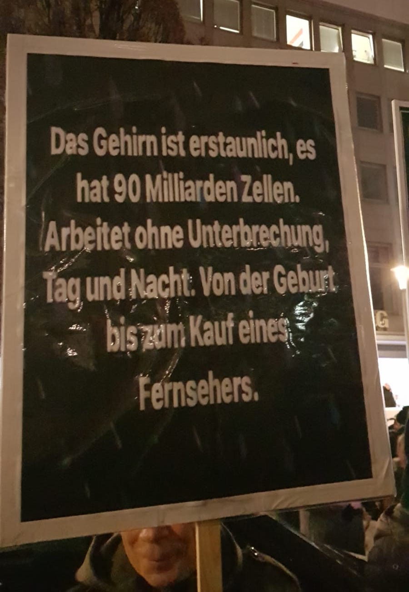
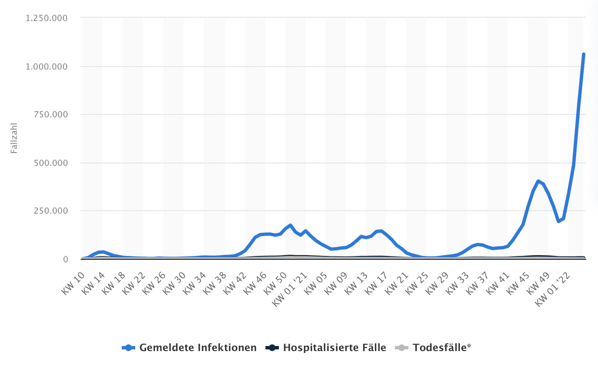
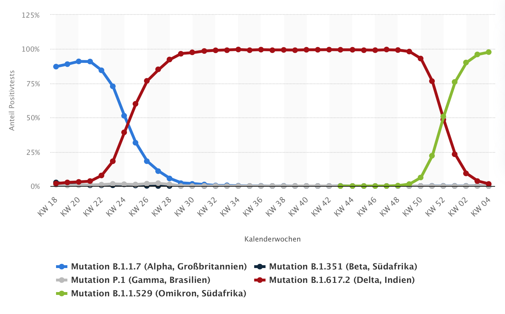

<!-- vim: set tabstop=2 shiftwidth=2 expandtab: -->

Warum ich ungeimpft bin!
========================

**Autor:**  Mario Schwalbe  
**An:**     J. O. S. (mein Chef)  
**Datum:**  30.1.2022  
**Lizenz:** CC BY-ND  

---

Ich weiß zwar nicht warum ich so einen Aufsatz schreiben soll - immerhin bin ich schon einige Zeit
aus der Schule raus - aber wenn es sein muß, bitte sehr. Ich interpretiere die Aufgabe so, daß der
Lerneffekt nicht zu kurz kommt. Wenn das erwünscht ist, kann dir vielleicht geholfen werden. Wenn
nicht, bitte nicht weiter lesen. Wir müssen jetzt etwas schwurbeln.

 
 

Einleitung
----------

> Aufklärung ist der Ausgang des Menschen aus seiner selbstverschuldeten Unmündigkeit. Unmündigkeit
> ist das Unvermögen, sich seines Verstandes ohne Leitung eines anderen zu bedienen.
> Selbstverschuldet ist diese Unmündigkeit, wenn die Ursache derselben nicht am Mangel des
> Verstandes, sondern der Entschließung und des Mutes liegt, sich seiner ohne Leitung eines anderen
> zu bedienen. _Sapere aude!_ Habe Mut, dich deines eigenen Verstandes zu bedienen! ist also der
> Wahlspruch der Aufklärung.
>   - Immanuel Kant -

Bei genauerer Betrachtung der verfahrenen Lage stellt sich heraus, daß du eigentlich die Geschichte
der letzten 2 Jahre neu lernen müßtest. Leider kann ich das nicht alles wiedergeben. Die
Aufarbeitung dürfte der Nachwelt überlassen bleiben. (Wahrscheinlich kann man die Lehrstühle der
Geschichte der Jahre 2020-2022 in der Zukunft quartalsweise vergeben.) Da ich mich außerdem nicht
mit fremden Federn schmücken will - das hier ist ja keine Doktorarbeit eines Politikers - möchte ich
zuerst auf einige Stellungnahmen zur angedachten allgemeinen Impfpflicht verweisen:

1. 7 Argumente gegen eine Impfpflicht, 6.1.2022  
   <https://7argumente.de>

2. **Ärztinnen und Ärzte für individuelle Impfentscheidung**:
   Standpunkt, 27.1.2022  
   <https://individuelle-impfentscheidung.de/standpunkt.html>

3. **Ärzte stehen auf**:
   Geringer Nutzen und noch unklare Risiken durch die COVIDImpfungen, 16.12.2021  
   <https://vera-lengsfeld.de/2021/12/16/offener-brief-geringer-nutzen-und-noch-unklare-risiken-durch-die-covidimpfungen/>

4. **Prof. Dr. med. Ulrich Keil, Prof. Dr. Andreas Schnepf, et al.**:
   Offener Brief von Wissenschaftlern gegen Impfpflicht, 9.12.2021  
   <https://www.achgut.com/artikel/wissenschaftler_wehren_sich_gegen_impfpflicht._ein_zeitdokument>

5. **Netzwerk Kritische Richter und Staatsanwälte**:
   10 Gründe gegen die Impfpflicht, 10.12.2021  
   <https://netzwerkkrista.de/2021/12/10/10-gruende-gegen-die-impfpflicht/>

6. **Dr. Martin Sprenger**:
   Mit dem Virus leben lernen, 4.1.2022  
   <https://tkp.at/wp-content/uploads/2022/01/05_01_2022_Sprenger_Alternativen-Impfpflicht.pdf>

7. **Dr. Peter F. Mayer**:
   Stellungnahme zum Covid-19 Impfpflichtgesetz, 11.12.2021  
   <https://tkp.at/2021/12/11/stellungnahme-zum-covid-19-impfpflichtgesetz-in-der-parlamentarischen-begutachtung/>

8. **Beate Bahner**:
   Rechtsgutachten zur Strafbarkeit nach dem Arzneimittelgesetz durch die Herstellung,
   Verbreitung und Anwendung (Impfung) des Impfstoffs Comirnaty von Pfizer/Biontech, 27.12.2021  
   <https://beatebahner.de/lib.medien/Rechtsgutachten%20RAin%20Bahner%20Strafbarkeit%20nach%2095%20AMG%20durch%20Impfung%2C%20korr.%2027.12.2021.pdf>

9. **Jens Berger**:
   30 Argumente gegen die Impfpflicht, 17.12.2021  
   <https://www.nachdenkseiten.de/?p=79084>

Bitte vollständig lesen. Das gehört zur Erklärung dazu, enthält es doch viele neue Erkenntnisse, die
man in den letzten 2 Jahren hätte erwerben können. Außerdem möchte ich den Autoren weitestgehend
zustimmen - allenfalls bei Beate Bahner fehlt mit die juristische Expertise. Ihre Argumentation
klingt aber schlüssig. Man kann dabei auch sehen, daß obige Stellungnahmen deutlich mehr Inhalt
aufweisen als der deutsche Ethikrat zu diesem Thema zustande bringt.

(Übrigens ist Impfpflicht auch eines der schönsten deutschen Wörter - enthält es doch die schöne
Konsonantenkombination „mpfpf“ und ist dabei auch noch ernst gemeint.)

In allen Fällen muß eine sachliche Betrachtung immer folgende Fragen berücksichtigen:
1. [Wie gefährlich ist das Virus](#gefährlichkeit-des-virus)?
2. [Wie wirksam sind die Maßnahmen, insbesondere die Impfung](#wirksamkeit-der-impfung)?
3. [Welche Nachteile bringen die Maßnahmen mit sich](#schadwirkung-der-impfung)?

Jeder vernünftige Ingenieur würde darauf aufbauend die beste Lösung zu finden versuchen. Ganz im
Gegensatz zum von Anfang an propagierten Mantra der Politik, daß nur die Impfung - am besten der
gesamten Weltbevölkerung - der Ausweg aus der Pandemie sein kann. So reden eigentlich nur
Lobbyisten, Dogmatiker oder Ideologen. Und nicht vergessen: Die Pharmaindustrie hat tendenziell
soviel Interesse an unserer Gesundheit wie die Waffenindustrie am Weltfrieden.

Insbesondere in der alltäglichen Diskussion werden immer wieder Argumente verwendet wie: „Die
Mehrheit hat doch recht.“ Antwort: Wäre dem wirklich so, dächten wir heute noch die Erde wäre flach.
Korrektheit definiert sich nicht durch Mehrheiten. Aus diesem Grund gibt es in der Wissenschaft
Standards. Oder auch: „Alle Experten sind sich doch einig. Wie kannst du dann etwas anderes
behaupten?“ Gegenfrage: In welcher Disziplin der Wissenschaften herrscht bei aktuellen
Forschungsfragen sofort Konsens? Dergleichen hat es noch nie zuvor gegeben. Allein dieser -
jedenfalls wahrgenommene - Umstand sollte misstrauisch machen. Deshalb möchte ich im folgenden auf
diese Punkte wie auch die erwähnten Fragen näher eingehen.
<!-- vim: set tabstop=2 shiftwidth=2 expandtab: -->

---

Gefährlichkeit des Virus
------------------------

> Autoritätsdusel ist der größte Feind der Wahrheit.
>   - Albert Einstein -

Bereits im März 2020 kam Dr. Fauci, Direktor des National Institute of Allergy and Infectious
Diseases (NIAID) der USA und mittlerweile Chief Medical Advisor to the President, zu dem Ergebnis,
daß die Gefährlichkeit des neuen Virus - bemessen an der Sterblichkeit - in der Größenordnung einer
Grippe liegen würde:

- **Anthony S. Fauci, H. Clifford Lane, Robert R. Redfield**:
  Covid-19 - Navigating the Uncharted, 26.3.2020  
  <https://www.nejm.org/doi/full/10.1056/NEJMe2002387>
  > If one assumes that the number of asymptomatic or minimally symptomatic cases is several times
  > as high as the number of reported cases, the case fatality rate may be considerably less than
  > 1%. _This suggests that the overall clinical consequences of Covid-19 may ultimately be more
  > akin to those of a severe seasonal influenza (which has a case fatality rate of approximately
  > 0.1%) or a pandemic influenza (similar to those in 1957 and 1968)_ rather than a disease similar
  > to SARS or MERS, which have had case fatality rates of 9 to 10% and 36%, respectively.

Diese Abschätzung ist noch sehr pessimistisch - basierend auf den zum Zeitpunkt verfügbaren Daten -
und ist seitdem weiter verbessert worden, beispielsweise:

- **Prof. Dr. John P. A. Ioannidis**:
  Global perspective of COVID-19 epidemiology for a full-cycle pandemic, 7.10.2020  
  <https://onlinelibrary.wiley.com/doi/10.1111/eci.13423>
  > COVID-19 shows extremely strong risk stratification across age, socioeconomic factors, and
  > clinical factors. Calculation of years-of-life-lost from COVID-19 is methodologically
  > challenging and can yield misleading over-estimates. Many early deaths may have been due to
  > suboptimal management, malfunctional health systems, hydroxychloroquine, sending COVID-19
  > patients to nursing homes, and nosocomial infections; such deaths are partially avoidable moving
  > forward. About 10% of the global population may be infected by October 2020. _Global infection
  > fatality rate is 0.15-0.20% (0.03-0.04% in those <70 years), with large variability across
  > locations with different age-structure, institutionalization rates, socioeconomic inequalities,
  > population-level clinical risk profile, public health measures, and health care._

- **Prof. Dr. John P. A. Ioannidis**:
  Reconciling estimates of global spread and infection fatality rates of COVID-19:
    An overview of systematic evaluations, 26.3.2021  
  <https://onlinelibrary.wiley.com/doi/10.1111/eci.13554>
  > All systematic evaluations of seroprevalence data converge that SARS-CoV-2 infection is widely
  > spread globally. _Acknowledging residual uncertainties, the available evidence suggests average
  > global IFR [infection fatality rate] of ~0.15% and ~1.5-2.0 billion infections by February 2021
  > with substantial differences in IFR and in infection spread across continents, countries and
  > locations._ [...] Year-to-year variability is substantial, even more so within age-strata.
  > Comparison against averages of multiple previous years is naïve, worse in countries with
  > substantial demographic changes. For example, in the first wave, an excess of 8071 deaths (SMR
  > 1.03, 95% CI 1.03-1.04) in Germany became a deficit of 4926 deaths (SMR 0.98, 95% CI 0.98-0.99)
  > after accounting for demographic changes.

Ursprünglich nahm man allerdings an, daß das Virus völlig neuartig und somit keine natürliche
Immunität vorhanden wäre, was es auch gefährlicher machen könnte. Das hat sich später als falsch
herausgestellt. Hierzu sollte man wissen, daß das menschliche Immunsystem nach einer durchstandenen
Infektion Gedächtniszellen bildet, die erneute Vertreter eines Krankheitserregers wiedererkennen und
somit die Abwehrreaktion schneller und effizienter einleiten können. Die Erkennung basiert dabei auf
allen Bestandteilen des Virus wie Kapsid, Hüllproteine und Spikes. Hier genau liegt der Punkt: Im
Gegensatz zu Influenzaviren, die eine segmentierte RNA besitzen, die auch blockweise getauscht
werden kann, besteht die Erbinformation bei Coronaviren aus einem Strang. Dieser kann natürlich
Mutationen aufweisen, aber schlußendlich sind sich die verschiedenen Varianten der Coronaviren alle
relativ ähnlich. Dementsprechend vermutete man, daß die Gedächtniszellen des Immunsystems aufgrund
vorherigem Kontakt mit anderen endemischen Varianten auch SARS-CoV-2 erkennen können
(Kreuzimmunität). Entsprechende Arbeiten findet man zahlreich über das Jahr 2020 verteilt,
beispielsweise:

- **Julian Braun, Lucie Loyal, Marco Frentsch, et al.**:
  SARS-CoV-2-reactive T cells in healthy donors and patients with COVID-19, 29.7.2020  
  <https://www.nature.com/articles/s41586-020-2598-9>
  > Here we investigated CD4+ T cells that are reactive against the spike glycoprotein of SARS-CoV-2
  > in the peripheral blood of patients with COVID-19 and SARS-CoV-2-unexposed healthy donors. We
  > detected spike-reactive CD4+ T cells not only in 83% of patients with COVID-19 but also in 35%
  > of healthy donors. [...] _This results indicate that spike-protein cross-reactive T cells are
  > present, which were probably generated during previous encounters with endemic coronaviruses._
  > The effect of pre-existing SARS-CoV-2 cross-reactive T cells on clinical outcomes remains to be
  > determined in larger cohorts. However, the presence of spike-protein cross-reactive T cells in a
  > considerable fraction of the general population may affect the dynamics of the current pandemic,
  > and has important implications for the design and analysis of upcoming trials investigating
  > COVID-19 vaccines.

- **Jose Mateus, Alba Grifoni, Alison Tarke, et al.**:
  Selective and cross-reactive SARS-CoV-2 T cell epitopes in unexposed humans, 4.8.2020  
  <https://www.science.org/doi/10.1126/science.abd3871>
  > Many unknowns exist about human immune responses to the severe acute respiratory syndrome
  > coronavirus 2 (SARS-CoV-2) virus. SARS-CoV-2–reactive CD4+ T cells have been reported in
  > unexposed individuals, suggesting preexisting cross-reactive T cell memory in 20 to 50% of
  > people. However, the source of those T cells has been speculative. Using human blood samples
  > derived before the SARS-CoV-2 virus was discovered in 2019, we mapped 142 T cell epitopes across
  > the SARS-CoV-2 genome to facilitate precise interrogation of the SARS-CoV-2–specific CD4+ T cell
  > repertoire. _We demonstrate a range of preexisting memory CD4+ T cells that are cross-reactive
  > with comparable affinity to SARS-CoV-2 and the common cold coronaviruses human coronavirus
  > (HCoV)-OC43, HCoV-229E, HCoV-NL63, and HCoV-HKU1. Thus, variegated T cell memory to
  > coronaviruses that cause the common cold may underlie at least some of the extensive
  > heterogeneity observed in coronavirus disease 2019 (COVID-19) disease._

- **Annika Nelde, Tatjana Bilich, Jonas S. Heitmann, et al.**:
  SARS-CoV-2-derived peptides define heterologous and COVID-19-induced T cell recognition, 30.9.2020  
  <https://www.nature.com/articles/s41590-020-00808-x>
  > Cross-reactive SARS-CoV-2 peptides revealed pre-existing T cell responses in 81% of unexposed
  > individuals and validated similarity with common cold coronaviruses, providing a functional
  > basis for heterologous immunity in SARS-CoV-2 infection. Diversity of SARS-CoV-2 T cell
  > responses was associated with mild symptoms of COVID-19, providing evidence that immunity
  > requires recognition of multiple epitopes.

- **Prof. Dr. Peter Doshi**:
  Covid-19: Do many people have pre-existing immunity?, 17.9.2020  
  <https://www.bmj.com/content/370/bmj.m3563>
  > At least six studies have reported T cell reactivity against SARS-CoV-2 in 20% to 50% of people
  > with no known exposure to the virus. [...] In Germany reactive T cells were detected in a third
  > of SARS-CoV-2 seronegative healthy donors (23 of 68). [...] Researchers are also confident that
  > they have made solid inroads into ascertaining the origins of the immune responses. “Our
  > hypothesis, of course, was that it’s so called ‘common cold’ coronaviruses, because they’re
  > closely related,” said Daniela Weiskopf, senior author of a paper in Science that confirmed this
  > hypothesis. _“We have really shown that this is a true immune memory and it is derived in part
  > from common cold viruses.”_

Aufbauend auf diesen Ergebnissen analysierte eine Forschergruppe aus Dänemark im Jahr 2021 die Art
der gebildeten Antikörper nach einer überstandenen Infektion mit SARS-CoV-2. Bei einer Erstinfektion
sollte es sich hauptsächlich um IgM-Antikörper handeln, bei einer Reinfektion mit gleichen oder
ähnlichen Viren wären IgG-Antikörper zu erwarten. Das Ergebnis ist eindeutig. Bei 202 von 203
Probanden (99,5%) fanden sie IgG-Antikörper:

- **Stine S. F. Nielsen, Line K. Vibholm, Ida Monrad, et al.**:
  SARS-CoV-2 elicits robust adaptive immune responses regardless of disease severity, 4.6.2021  
  <https://www.thelancet.com/journals/ebiom/article/PIIS2352-3964(21)00203-6/fulltext>
  > First, we analysed the presence of IgG antibodies towards multiple human coronaviruses in serum,
  > using the multiplex MSD platform. Compared to controls, we found significantly elevated levels
  > of IgG antibodies in spike RBD, spike N-terminal domain (NTD), and the nucleocapsid (p<0.0001).
  > Furthermore, IgG antibodies from SARS-CoV-2 infected individuals exhibited strongly increased
  > reactivity towards spike protein from other human beta coronaviruses: SARS-CoV-1 and Middle East
  > respiratory syndrome (MERS), as compared to the negative controls. Further, increased IgG levels
  > towards the seasonal beta coronavirus strains: HKU1 and OC43, compared to IgG from the control
  > group were also observed (p<0.0001). [...] Overall, we conclude that more than 202 (99%) of the
  > SARS-CoV-2 infected individuals in this cohort had readily detectable antibodies to SARS-CoV-2
  > spike antigen, and that broad IgG immunological recognition of SARS-CoV-2 as well as several
  > different coronavirus develops during COVID-19. [...] In conclusion, we observed that disease
  > severity is closely related to the potency and breadth of the antibody response towards
  > SARS-CoV-2. Furthermore, we identified the SARS-CoV-2 spike protein as a target of adaptive
  > immunity in >99% of the cohort, irrespective of COVID-19 symptom manifestation. Only two
  > individuals (<2%) had neither antibodies with virus neutralization capacity, nor detectable CD8+
  > T-cell responses. _Hence, we conclude that regardless of COVID-19 severity, a robust adaptive
  > immune response towards SARS-CoV-2 is elicited during primary infections_.

Für das menschliche Immunsystem ist das neuartige Virus aufgrund seiner Ähnlichkeit mit endemischen
Coronaviren folglich nicht komplett neu. Aus diesem Grund sind die ursprünglichen Modellrechnungen
am Anfang des Jahres 2020 völlig übertrieben gewesen. Das konnte man damals vielleicht nicht so
genau wissen, mittlerweile aber schon.

Gleiches gilt für ein weiteres Detail, das häufig unerwähnt bleibt: Die starke Altersstratifizierung
der hervorgerufenen Symptome und Todesfälle - größer noch als bei der Grippe. Die amerikanische
Centers for Disease Control and Prevention veröffentlichte im März 2021 die folgende Übersicht
(Quelle:
<https://www.cdc.gov/coronavirus/2019-ncov/downloads/covid-data/hospitalization-death-by-age.pdf>).

Demnach beträgt der Unterschied in der Wahrscheinlichkeit einer Infektion aller Altersgruppen
höchstens Faktor 2. Allerdings ist die Wahrscheinlichkeit zu versterben bei den über 85-Jährigen um
den Faktor 8.700 höher als bei der Referenzgruppe der 5-17-Jährigen. Für Deutschland ist eine genaue
Aufschlüsselung ebenfalls verfügbar, die den kompletten Zeitraum der Pandemie abdeckt (Quelle:
<https://de.statista.com/statistik/daten/studie/1104173/umfrage/todesfaelle-aufgrund-des-coronavirus-in-deutschland-nach-geschlecht/>,
Stand: 6.1.2022).

Die Abbildung zeigt die Todesfälle in Deutschland im Zusammenhang mit COVID-19 nach Altersgruppe und
Geschlecht basierend auf den Daten des Robert Koch-Instituts. Es fällt sofort auf, daß zwischen
Kindern und der Altersgruppe der über 80-jährigen Faktor 2.000 liegt. Diese Diskrepanz wäre durchaus
damit zu erklären, daß ein wirkungsvoller Schutz durch das Immunsystem bereits vorlag oder bei
Bedarf gebildet werden kann. Bei einem völlig neuartigem Virus ohne jeglichen Immunschutz wäre
vielmehr zu erwarten, daß das Virus alle Altersgruppen gleichermaßen betrifft. So folgerten die
Unterzeichner der [Great Barrington Declaration](#great-barrington-declaration) bereits im Oktober
2020:

- **Prof. Dr. Martin Kulldorff, Prof. Dr. Sunetra Gupta, Prof. Dr. Jay Bhattacharya**:
  Great Barrington Declaration, 4.10.2020  
  <https://gbdeclaration.org>
  > Fortunately, our understanding of the virus is growing. We know that vulnerability to death from
  > COVID-19 is more than a thousand-fold higher in the old and infirm than the young. Indeed, for
  > children, COVID-19 is less dangerous than many other harms, including influenza.

Wenn man diesen Größenunterschied allerdings verschweigt, kann man relativ viel verzerren.
Insbesondere bedeutet es auch, daß es viel sinnvoller wäre, sich mit Schutzmaßnahmen speziell auf
jene besonders Gefährdeten der Gesellschaft zu konzentrieren.

Es zeigt sich deutlich, daß ein Großteil der Verstorbenen hochbetagt war. Der Altersmedian liegt bei
83 Jahren. Zum Vergleich: Die durchschnittliche Lebenserwartung beträgt in Deutschland 81 Jahre mit
79 Jahren (Männer) und 83 Jahren (Frauen). Das wirft die berechtigte Frage auf, ob es sich
tatsächlich um die alleinige Ursache handelt. Diese Frage ist wichtig, da die unausgesprochene
Implikation noch immer lautet, daß deren Tod verhinderbar gewesen wäre, wenn nur alle geimpft
gewesen wären. Es spricht aber einiges dagegen:

1. Die Diagnose für die Statistiken basiert weitestgehend auf hypersensiblen PCR-Tests (mit hohen
   Ct-Werten) ohne Berücksichtigung von Vorerkrankungen oder generell klinischer Symptomatik. Das
   ist grober Unfug. Natürlich ist das Vorhandensein des Virus notwendige Voraussetzung für
   Kausalität, aber eben nicht hinreichend. Hier wird uns vom RKI ein notwendiges Kriterium als
   hinreichend verkauft. Das ist von der Logik her wie im Mittelalter: Wir bilden uns ein, daß das
   Virus gefährlich wäre und führen deswegen den passenden Test durch. Da der Test positiv war,
   haben wir eine Antwort gefunden und können aufhören zu denken. Weil wir aufgehört haben zu
   denken, bekommen wir unsere Einbildung bestätigt. Was soll das? Ohne Ausschluß anderer Ursachen
   befähigt der Test nicht zu einer solchen Schlußfolgerung. Nach der selben Logik könnte man
   stattdessen auch einen Herpestest machen und dann jede Menge Herpestote klassifizieren.

2. Daß das RKI nicht zwischen „an“ (Hauptdiagnose) und „mit“ (Nebendiagnose) COVID-19 unterscheidet,
   wurde zwischenzeitlich auch eingeräumt (Quelle:
   <https://www.heise.de/tp/features/Wer-zaehlt-als-Corona-Toter-5035504.html>). Das RKI schreibt in
   seiner FAQ dazu (Quelle: <https://www.rki.de/SharedDocs/FAQ/NCOV2019/gesamt.html>, Stand:
   7.1.2022):

   > _In die Statistik des RKI gehen die COVID-19-Todesfälle ein, bei denen ein laborbestätigter
   > Nachweis von SARS-CoV-2 (direkter Erregernachweis) vorliegt und die in Bezug auf diese
   > Infektion verstorben sind._ Das Risiko an COVID-19 zu versterben ist bei Personen, bei denen
   > bestimmte Vorerkrankungen bestehen, höher. Daher ist es in der Praxis häufig schwierig zu
   > entscheiden, inwieweit die SARS-CoV-2-Infektion direkt zum Tode beigetragen hat. Sowohl
   > Menschen, die unmittelbar an der Erkrankung verstorben sind („gestorben an“), als auch Personen
   > mit Vorerkrankungen, die mit SARS-CoV-2 infiziert waren und bei denen sich nicht abschließend
   > nachweisen lässt, was die Todesursache war („gestorben mit“) werden derzeit erfasst. Generell
   > liegt es immer im Ermessen des Gesundheitsamtes, ob ein Fall als verstorben an bzw. mit
   > COVID-19 ans RKI übermittelt wird oder nicht.

   Oder deutlich formuliert: Nichts genaues weiß man nicht. Das macht auch die üblicherweise
   verwendete Formulierung „im Zusammenhang mit COVID-19“ nötig.

3. Es sind im Zusammenhang mit COVID-19 41.201 von 112.740 Menschen (36,5%) in Deutschland auf
   Intensivstationen verstorben (Quelle: <https://intensivstationen.net>, Stand: 9.1.2022). Das ist
   verwunderlich, handelt es sich doch um eine sich graduell verschlechternde Symptomatik, bei der
   man annehmen möchte, daß zuvor alles erdenkliche unternommen wurde. Auf 2 Jahre verteilt
   entspricht das der Größenordnung einer Grippe - insbesondere wenn diese in den selben Jahren laut
   Statistik weitestgehend ausgeblieben ist.

4. Die Arbeitsgemeinschaft Influenza des RKI betreibt ein Sentinelsystem (Hinweissystem mittels
   bundesweit verteilter Arztpraxen), um die epidemiologische Situation der akuten
   Atemwegserkrankungen im Allgemeinen und der Influenza im Besonderen fortlaufend zu überwachen.
   Das beinhaltet auch SARS-CoV-2. Laut dessen Daten wurde während der ersten Welle SARS-CoV-2 über
   einen Zeitraum von 13 Wochen bei maximal 3,1% der eingereichten Sentinelproben nachgewiesen. Die
   Atemwegsinfektionen wurden durchgängig von Influenza-, Rhino- und/oder hMP-Viren dominiert
   (Quelle: <https://multipolar-magazin.de/artikel/das-schweigen-der-viren>). Die aktuelle
   Verteilung kann man auf der Webseite der Arbeitsgemeinschaft unter „Nachweise respiratorischer
   Viren im Nationalen Referenzzentrum“ finden:
   <https://influenza.rki.de/Diagrams.aspx?agiRegion=0>.

Der Verdacht der systematischen Verzerrung scheint sich langsam zu bestätigen. Nach einem Bericht
der ZEIT wird die Anzahl der Personen, die wegen Corona im Krankenhaus behandelt werden müssen, um
bis zu 30% überschätzt. Ihre Erklärung hierfür lautet wie folgt (Quelle:
<https://www.presseportal.de/pm/9377/4840896>):

> Verantwortlich für dieses Graufeld ist das deutsche Meldesystem: Alle neuen Patienten werden
> systematisch bei der Aufnahme ins Krankenhaus auf das Virus getestet und bei einem positiven
> Befund über das Gesundheitsamt an das Robert Koch-Institut gemeldet. Für die Krankenhäuser selbst
> ist die Unterscheidung nicht erheblich: Ein Corona-Patient muss, ob er nun mit oder wegen Corona
> behandelt wird, in ein Isolierzimmer verlegt werden. Pfleger und Ärzte müssen sich bei seiner
> Behandlung besonders schützen. Politisch aber ist die Zahl der schweren Corona-Verläufe ein
> wichtiger Indikator.
>
> „Auf Grundlage der Schätzung einzelner Kliniken kann ein evidenzbasiertes Institut keine
> Bereinigung von Fällen vornehmen,“ sagt das RKI auf Anfrage der ZEIT. Das harte Kriterium sei ein
> positiver PCR-Test.

Nach Prof. Bertram Häussler könnten bei bis zu 80% der vom RKI gemeldeten Verstorbenen andere
Ursachen der Grund sein (Quelle:
<https://www.welt.de/politik/deutschland/plus233426581/Seit-Juli-2021-Corona-bei-80-Prozent-der-offiziellen-Covid-Toten-wohl-nicht-Todesursache.html>).
Wie groß die [Abweichung](https://www.zdf.de/politik/berlin-direkt/berlin-direkt-clip-1-500.html)
tatsächlich ist, dürfte nachträglich schwer zu bestimmen sein. Wir werden noch sehen.
Dementsprechend fand eine Studie der Uni Duisburg-Essen basierend auf der EUROSTAT-Datenbank im Jahr
2020 über alle Todesursachen keine signifikante Übersterblichkeit in Deutschland im Vergleich zu den
Vorjahren:

- **Bernd Kowall, Fabian Standl, Florian Oesterling, et al.**:
  Excess mortality due to Covid-19? A comparison of total mortality in 2020 with total mortality
    in 2016 to 2019 in Germany, Sweden and Spain, 3.8.2021  
  <https://journals.plos.org/plosone/article?id=10.1371/journal.pone.0255540>
  > In the first approach, the cumulative SMRs [standardized mortality ratios] show that in Germany
  > and Sweden there was no or little excess mortality in 2020 (SMR = 0.976 (95% CI: 0.974–0.978),
  > and 1.030 (1.023–1.036), respectively), while in Spain the excess mortality was 14.8% (1.148
  > (1.144–1.151)). In the second approach, the corresponding SMRs for Germany and Sweden increased
  > to 1.009 (1.007–1.011) and 1.083 (1.076–1.090), respectively, whereas results for Spain were
  > virtually unchanged. In 2020, there was barely any excess mortality in Germany for both
  > approaches. In Sweden, excess mortality was 3% without, and 8% with consideration of increasing
  > life expectancy.

### Akute Atemwegserkrankungen (ARE) ###

Da SARS-CoV-2 das selbe Symptomspektrum hervorruft wie die anderen Atemwegsviren müssen wir
natürlich die entsprechende Einordnung vornehmen.

Ich zitiere den Absatz gleich komplett (Quelle: <https://grippeweb.rki.de>, Stand: 9.1.2022):

> Die Abbildung zeigt die Gesamt-ARE-Rate in den Saisons 2017/18 bis 2021/22 sowie (zum Vergleich)
> die COVID-19-Rate von der 27. KW bis zur 52. KW 2021. Die seit der 46. KW 2021 kontinuierlich und
> zum Teil deutliche gesunkene ARE-Rate ist mit Ausnahme in der 51. KW auch in der 52. KW wieder
> gesunken. Infolge verstärkter Kontaktreduktionen in der Bevölkerung liegen die ARE-Raten wieder
> deutlich niedriger als vor der Pandemie. Die ARE-Rate liegt zwar etwas über der ARE-Rate des
> Vorjahres (2,2 %), jedoch mit 3,0 % in einem ähnlich niedrigen Bereich. Es ist zusätzlich zu
> beachten, dass im Zeitraum der Schulferien zu Weihnachten / zum Jahreswechsel in allen Vorjahren
> ein Rückgang der ARE-Rate beobachtet wurde. Neben dem Grippevirus oder SARS-CoV-2 gibt es eine
> Vielzahl weiterer Atemwegserreger, die akute Atemwegserkrankungen hervorrufen können und deren
> Übertragungen durch die Kontaktreduktion in der Bevölkerung verhindert werden. Mit einer ARE-Rate
> von 3,0 % (entsprechend 3.000 ARE-Fällen pro 100.000 Einwohner) hatten hochgerechnet auf die
> Bevölkerung in Deutschland in der 52. KW 2021 ca. 2,5 Millionen Personen eine neu aufgetretene
> akute Atemwegserkrankung (mit oder ohne Fieber), unabhängig von einem Arztbesuch. Die
> COVID-19-Rate wurde aus den nach Infektionsschutzgesetz (IfSG) an das Robert Koch-Institut (RKI)
> übermittelten Fällen mit SARS-CoV-2-Nachweis berechnet. Zum Größenvergleich wurde die
> COVID-19-Rate (braune Fläche in Abbildung 1; Stand der Meldedaten: 5.1.2022) in der gleichen
> Abbildung wie die Gesamt-ARE-Rate dargestellt. Die Zahl der zuletzt (für die 52. KW 2021)
> übermittelten COVID-19-Neu-Infektionen lag bei 0,25 % der Bevölkerung oder, anders formuliert, bei
> ca. 250 COVID-19-Fällen pro 100.000 Einwohner. Auf die Bevölkerung in Deutschland bezogen
> entspricht das einer Gesamtzahl von ca. 206.000 COVID-19-Neuinfektionen (Vorwoche: ca. 194.000).
> Die COVID-19-Rate ist im Vergleich zur Vorwoche leicht gestiegen. Während der Feiertage und zum
> Jahreswechsel ist bei der Interpretation der IfSG-Meldedaten zu beachten, dass mit einer
> geringeren Test- und Meldeaktivität zu rechnen ist.

Das RKI sagt hier klar, daß die Inzidenz in der letzten Woche des Jahres 2021 - wie üblich pro
100.000 Einwohner - aller Fälle von akuten Atemwegserkrankungen 3.000 betrug wozu das neue Virus
SARS-CoV-2 lediglich 250 (8,3%) beigetragen hat. Vielleicht sollten wir mehr Grippeimpfungen
empfehlen, statt den Menschen einzureden, daß die Coronaimpfung zwingend geboten wäre. Das könnte
die Krankenhäuser viel wirkungsvoller entlasten.

### Belegung der Intensivstationen ###

Die Analyse der Beanspruchung der Intensivstationen aufgrund des neuen Virus erfolgt mit Hilfe der
Daten des [DIVI-Intensivregisters](https://www.intensivregister.de). Das DIVI-Intensivregister ist
eine vom Bundesgesundheitsministerium angeordnete und von der Deutschen Interdisziplinären
Vereinigung für Intensiv- und Notfallmedizin (DIVI) gemeinsam mit dem Robert Koch-Institut seit März
2020 betriebene Echtzeitdatenerfassung für Intensivkapazitäten.

Die Abbildungen (Quelle: <https://www.intensivregister.de/#/aktuelle-lage/zeitreihen>, Stand:
9.1.2022) zeigen die Belegungen der Intensivstationen seit April 2020 mit und ohne COVID-19 für
Erwachsene (links) sowie Kinder (rechts). Man sieht im Zusammenhang mit COVID-19 sind im
bundesdeutschen Durchschnitt nie mehr als 25% benötigt worden. In einigen sächsischen Kreisen betrug
die Belegung tatsächlich zeitweise bis zu 70%, aber eine flächendeckende Überlastung des
Gesundheitssystems durch SARS-CoV-2 war zu keinem Zeitpunkt zu befürchten. Eine besondere Gefährdung
von Kindern sowieso nicht.

Eine detailliertere Aufschlüsselung nach Altersgruppen und Kreisen kann man unter
<https://intensivstationen.net> finden. Die obige Abbildung (Stand: 7.1.2022) zeigt den
bundesdeutschen Durchschnitt. Bemerkenswert ist auch, daß in den Sommermonaten Juli und August der
Jahre 2020 und 2021 die Pandemie schon zweimal vorbei war. Hätten wir aufgehört Masken zu tragen,
hätten die Menschen die Pandemie nach 2 Wochen vergessen.

### Omikron ###

Ich möchte zum Abschluß dieses Kapitels noch kurz auf die neue Omikronvariante eingehen soweit es
die verfügbaren Daten bereits zulassen:

| Land        | Fälle (gesamt) | Hospitalisierungen | Rate   | Todesfälle | Rate   |
|-------------|---------------:|-------------------:|-------:|-----------:|-------:|
| Deutschland | 62.932         | 632                | 1,00%  | 16         | 0,025% |
| England     | 846.821        | 981                | 0,12%  | 75         | 0,009% |
| Dänemark    | 54.616         | 93                 | 0,17%  | k.A.       | -      |

Quellen:
- **Robert Koch-Institut**:
  Tägliche Übersicht zu Omikron-Fällen vom 07. Januar 2022  
  <https://www.rki.de/DE/Content/InfAZ/N/Neuartiges_Coronavirus/Situationsberichte/Omikron-Faelle/Omikron-Faelle.html>
- **UK Health Security Agency**:
  Omicron daily overview: 31 December 2021  
  <https://assets.publishing.service.gov.uk/government/uploads/system/uploads/attachment_data/file/1044522/20211231_OS_Daily_Omicron_Overview.pdf>
- **Statens Serum Institute**:
  Covid-19 Rapport om omikronvarianten, 31.12.2021  
  <https://files.ssi.dk/covid19/omikron/statusrapport/rapport-omikronvarianten-31122021-ct18>

Die Tabelle enthält den Durchschnitt über alle Altersgruppen, und das sieht gut aus. Warum die
Hospitalisierungsrate in Deutschland höher liegt als in England und Dänemark kann ich nicht
erklären. In beiden Ländern ist die Omikronvariante bereits dominant. In Deutschland liegt die
Verbreitung erst bei 20%. Der dänische Bericht enthält noch eine weitere interessante Information:
Zu den 126.223 Krankenhauseinweisungen mit bekannter SARS-CoV-2-Variante trägt Omikron nur 330
(0,7%) bei. Die Direktorin des SSI prognostiziert daher bereits das Ende der Pandemie in Dänemark
(Quelle:
<https://www.rnd.de/politik/corona-pandemie-in-zwei-monaten-vorbei-daenische-top-epidemiologin-tyra-grove-krause-geht-davon-aus-UALXWIDB4JF3LHF4O6ETO5K2QA.html>).
Die Deutsche Gesellschaft für Pädiatrische Infektiologie schlußfolgert zu Omikron (Quelle:
<https://dgpi.de/kinder-omikron-variante/>, Stand: 29.12.2021):

> Die Erfahrung auch aus den vorherigen Pandemiewellen mit den Varianten Alpha und Delta lehrt, dass
> sich ein besonderes Risiko von Kindern in keiner dieser Wellen bestätigt hat. [...]
> Selbstverständlich nehmen Kinder und Jugendliche als Teil unserer Gesellschaft am
> Pandemiegeschehen teil und sind somit auch von der Omikron-Variante betroffen. Die
> Omikron-Variante ist deutlich infektiöser als die vorhergehende Delta-Variante und wird diese auch
> in Deutschland verdrängen. Die Erkrankungsschwere liegt nach neuen Erkenntnissen allerdings in
> allen Altersgruppen deutlich unter der der Delta-Variante.

Erste Studien zur Abschätzung der Gefährlichkeit der Omikronvariante sind bereits verfügbar
(Preprint):

- **Eleanor G. Bentley, Adam Kirby, Parul Sharma, et al.**:
  SARS-CoV-2 Omicron-B.1.1.529 Variant leads to less severe disease than
    Pango B and Delta variants strains in a mouse model of severe COVID-19, 30.12.2021  
  <https://www.biorxiv.org/content/10.1101/2021.12.26.474085v2.full>
  > The variant is highly transmissible and partially or fully evades a spectrum of neutralising
  > antibodies due to a high number of substitutions in the spike glycoprotein. A major question is
  > the relative severity of disease caused by the Omicron variant compared with previous and
  > currently circulating variants of SARS-CoV-2. To address this, a mouse model of infection that
  > recapitulates severe disease in humans, K18-hACE2 mice, were infected with either a Pango B,
  > Delta or Omicron variant of SARS-CoV-2 and their relative pathogenesis compared. In contrast to
  > mice infected with Pango B and Delta variant viruses, those infected with the Omicron variant
  > had less severe clinical signs (weight loss), showed recovery and had a lower virus load in both
  > the lower and upper respiratory tract. This is also reflected by less extensive inflammatory
  > processes in the lungs. [...] These animal model data suggest the clinical consequences of
  > infection with the Omicron variant may be less severe but the higher transmissibility could
  > still place huge burden upon healthcare systems even if a lower proportion of infected patients
  > are hospitalised.

- **Joseph A. Lewnard, Vennis X. Hong, Manish M. Patel**:
  Clinical outcomes among patients infected with Omicron (B.1.1.529) SARS-CoV-2 variant
    in southern California, 11.1.2022  
  <https://www.medrxiv.org/content/10.1101/2022.01.11.22269045v1.full>
  > Our analyses included 52,297 cases with SGTF (Omicron) and 16,982 cases with non-SGTF (Delta
  > [B.1.617.2]) infections, respectively. Hospital admissions occurred among 235 (0.5%) and 222
  > (1.3%) of cases with Omicron and Delta variant infections, respectively. Among cases first
  > tested in outpatient settings, the adjusted hazard ratios for any subsequent hospital admission
  > and symptomatic hospital admission associated with Omicron variant infection were 0.48
  > (0.36-0.64) and 0.47 (0.35-0.62), respectively. Rates of ICU admission and mortality after an
  > outpatient positive test were 0.26 (0.10-0.73) and 0.09 (0.01-0.75) fold as high among cases
  > with Omicron variant infection as compared to cases with Delta variant infection. Zero cases
  > with Omicron variant infection received mechanical ventilation, as compared to 11 cases with
  > Delta variant infections throughout the period of follow-up (two-sided p<0.001). Median duration
  > of hospital stay was 3.4 (2.8-4.1) days shorter for hospitalized cases with Omicron variant
  > infections as compared to hospitalized patients with Delta variant infections, reflecting a
  > 69.6% (64.0-74.5%) reduction in hospital length of stay. [...] During a period with mixed Delta
  > and Omicron variant circulation, SARS-CoV-2 infections with presumed Omicron variant infection
  > were associated with substantially reduced risk of severe clinical endpoints and shorter
  > durations of hospital stay.

Wie es aussieht, enttäuscht das neue hochgejubelte Killervirus in spe auf ganzer Linie. Das ganze
Thema ist jedenfalls noch lange nicht abgeschlossen und bleibt weiterhin spannend, wie auch die
nachfolgenden Themen. Es spricht aber definitiv nichts für einen Impfzwang. Weitere schön
aufbereitete Fakten zum Virus und der verursachten Erkrankung finden sich unter:
<https://corona-reframed.de>.
<!-- vim: set tabstop=2 shiftwidth=2 expandtab: -->

---

Wirksamkeit der Impfung
-----------------------

> Dies ist das erste Medikament, dessen Versagen jenen angelastet wird, die es nicht genommen haben.
>   - Dr. Robert Malone -

Uns wurde versprochen, daß die Impfung zu 95% schützt. Und zwar sowohl vor Infektion als auch vor
Weitergabe (Transmission) - vor schweren Krankheitsverläufen und Tod garantiert. Das Robert
Koch-Institut erklärte, „dass die COVID-19-Impfung eine Virustransmission in erheblichem Maß
reduziert und dass vollständig geimpfte Personen in Bezug auf die Epidemiologie der Erkrankung keine
wesentliche Rolle mehr spielen“ (Quelle:
<https://www.rki.de/DE/Content/Infekt/EpidBull/Archiv/2021/19/Art_01.html>). Auch heute noch wird
dieser Weg als einzig möglicher Ausweg aus der Pandemie von den meisten Politikern propagiert. Doch
was bringt die Impfung wirklich?

### Zulassungsstudien ###

Die Aussage zur Wirksamkeit von 95% entstammt der Phase-III-Studie von Pfizer/BioNTech:

- **Fernando P. Polack, Stephen J. Thomas, Nicholas Kitchin, et al.**:
  Safety and Efficacy of the BNT162b2 mRNA Covid-19 Vaccine, 31.12.2020  
  <https://www.nejm.org/doi/full/10.1056/NEJMoa2034577>
  > A total of 43,548 participants underwent randomization, of whom 43,448 received injections:
  > 21,720 with BNT162b2 and 21,728 with placebo. There were 8 cases of Covid-19 with onset at least
  > 7 days after the second dose among participants assigned to receive BNT162b2 and 162 cases among
  > those assigned to placebo; BNT162b2 was 95% effective in preventing Covid-19 (95% credible
  > interval, 90.3 to 97.6). Similar vaccine efficacy (generally 90 to 100%) was observed across
  > subgroups defined by age, sex, race, ethnicity, baseline body-mass index, and the presence of
  > coexisting conditions. [...]
  >
  > Confirmed Covid-19 was defined according to the Food and Drug Administration (FDA) criteria as
  > the presence of at least one of the following symptoms: fever, new or increased cough, new or
  > increased shortness of breath, chills, new or increased muscle pain, new loss of taste or smell,
  > sore throat, diarrhea, or vomiting, combined with a respiratory specimen obtained during the
  > symptomatic period or within 4 days before or after it that was positive for SARS-CoV-2 by
  > nucleic acid amplification–based testing, either at the central laboratory or at a local testing
  > facility (using a protocol-defined acceptable test).

Diese hatte bei 21.728 Probanden der Placebogruppe 162 laborbestätigte Infektionen gefunden, bei den
21.720 Probanden der Impfgruppe dagegen nur 8. 8 von 162 macht 4,9% also 95,1% weniger. Klingt gut.
Wenn man den Menschen eine Effektivität von 95% erzählt, denken die meisten, daß 95 von 100
Geimpften geschützt wären und nur 5 nicht. Eine Impfung kann ja auch nicht perfekt sein. Das Problem
dabei: Was man denkt, entspricht der _absoluten Effektivität_. Die genannten 95% sind aber die
_relative Effektivität_. Bei der großen Anzahl der Probanden reduziert sich das _absolute Risiko_
tatsächlich von 0,75% (162/21.728) auf 0,04% (8/21.720), d.h. die _absolute Effektivität_ beträgt
nur 0,71% (0,75%-0,04%). Das bedeutet, daß man 141 Menschen impfen müßte damit einer geschützt wäre
(_Number Needed to Vaccinate_, NNTV=100%/0,71%=141), wobei die Schutzwirkung sich zudem nach der
Falldefinition der FDA richtet. Das bedeutet insbesondere, daß ein Nachweis eines Schutzes vor
Infektion oder Transmission gar nicht erbracht wurde. Bei dem Impfstoff von Moderna verhält es sich
ähnlich. Eine gute Erklärung bietet der Artikel von Multipolar (Quelle:
<https://multipolar-magazin.de/artikel/wirksamkeit-von-impfungen>).

Die Canadian Covid Care Alliance hat eine detaillierte Analyse jener Phase-III-Studie von Pfizer
vorgelegt, die auch erklären will warum das Ergebnis methodisch schlecht ist:

- **[Canadian Covid Care Alliance](https://www.canadiancovidcarealliance.org)**:
  THE PFIZER INOCULATIONS FOR COVID-19: MORE HARM THAN GOOD, 16.12.2021  
  <https://www.canadiancovidcarealliance.org/wp-content/uploads/2021/12/The-COVID-19-Inoculations-More-Harm-Than-Good-REV-Dec-16-2021.pdf>

Demnach hat der Wirkstoff von Pfizer/BioNTech neben seiner fragwürdigen Schutzwirkung das Risiko von
schwerer Krankheit und Tod (Folie 11 und 12) sogar erhöht. Ergebnisse zu Langzeitfolgen können nicht
vorliegen, da in der Studie vorzeitig nach 6 Monaten entblindet wurde, d.h. die Kontrollgruppe bekam
ein Impfangebot und wurde geimpft, womit zukünftige Vergleiche beider Gruppen unmöglich werden.

### Unabhängige Studien ###

Eine Forschergruppe aus Dänemark analysierte bereits 2021 die Art der gebildeten Antikörper nach
einer überstandenen Infektion mit SARS-CoV-2 und fand dabei, daß das Immunsystem IgG-Antikörper
bildet. Das ist verwunderlich, sollte es sich doch um IgM-Antikörper handeln, die normalerweise bei
einer Erstinfektion zu erwarten wären. Die gleiche Analyse kann man auch nach Verabreichung der
Impfstoffe durchführen. Wieder ließen sich IgG-Antikörper finden:

- **Alana F. Ogata, Chi-An Cheng, Michaël Desjardins, et al.**:
  Circulating Severe Acute Respiratory Syndrome Coronavirus 2 (SARS-CoV-2) Vaccine Antigen Detected
    in the Plasma of mRNA-1273 Vaccine Recipients, 20.5.2021  
  <https://academic.oup.com/cid/advance-article/doi/10.1093/cid/ciab465/6279075>
  > Plasma antibodies IgG, IgA, and IgM were measured against spike, S1, RBD, and nucleocapsid.
  > Antibody levels measured on day zero represent the baseline level in each participant, all who
  > had no previous report of COVID-19 infection. In all 13 participants, as expected, IgG levels
  > against spike, S1, and RBD increased after the first injection, whereas IgG against nucleocapsid
  > showed no change over time. IgA is involved in early neutralization activity and is therefore
  > crucial to target potentially short-lived IgA responses. Our Simoa assays detected increased IgA
  > against spike, S1, and RBD after the first injection. Nine participants presented measurable IgG
  > levels against S1 and spike by day 14 after the first vaccine injection. Four participants,
  > showed a delayed IgG-S1 and IgG-spike response, which did not increase until day 28 after the
  > first injection. Nonetheless, all participants showed additional boost in IgG-S1 after the
  > second injection.

- **Fatima Amanat, Mahima Thapa, Tinting Lei, et al.**:
  SARS-CoV-2 mRNA vaccination induces functionally diverse antibodies to NTD, RBD, and S2, 8.6.2021  
  <https://www.cell.com/cell/fulltext/S0092-8674(21)00706-6>
  > _The spike-reactive plasmablast response is dominated by IgG1+ cells and is comprised of a
  > mixture of cells with low and high levels of somatic hypermutation (SHM)._ [...] We next
  > examined the isotype and IgG subclass distribution among the recovered sequences. IgG1 was by
  > far the most dominant isotype in the three vaccinees.

- **Adam V. Wisnewski, Julian Campillo Luna, Carrie A. Redlich**:
  Human IgG and IgA responses to COVID-19 mRNA vaccines, 16.6.2021  
  <https://journals.plos.org/plosone/article?id=10.1371/journal.pone.0249499>
  > SARS-CoV-2 spike antigen-specific IgG and IgA elicited by infection mediate viral neutralization
  > and are likely an important component of natural immunity, however, limited information exists
  > on vaccine induced responses. We measured COVID-19 mRNA vaccine induced IgG and IgA in serum
  > serially, up to 145 days post vaccination in 4 subjects. Spike antigen-specific IgG levels rose
  > exponentially and plateaued 21 days after the initial vaccine dose. After the second vaccine
  > dose IgG levels increased further, reaching a maximum approximately 7–10 days later, and
  > remained elevated (average of 58% peak levels) during the additional >100 day follow up period.
  > COVID-19 mRNA vaccination elicited spike antigen-specific IgA with similar kinetics of induction
  > and time to peak levels, but more rapid decline in serum levels following both the 1st and 2nd
  > vaccine doses (<18% peak levels within 100 days of the 2nd shot). _The data demonstrate COVID-19
  > mRNA vaccines effectively induce spike antigen specific IgG and IgA and highlight marked
  > differences in their persistence in serum._

Aus Sicht des Immunsystems handelt es sich bei der Impfung folglich nicht um einen Erstkontakt mit
einem neuen Krankheitserreger. Das führt den Sinn einer Impfung ad absurdum, da dieser eigentlich
darin besteht, einen Erstkontakt mit einer relativ harmlosen Attrappe vorwegzunehmen. Damit soll das
Immunsystem dazu gebracht werden, Gedächtniszellen zu bilden, um bei erneutem Kontakt mit dem
eigentlichen Krankheitserreger die Abwehrreaktion schneller und effizienter einleiten zu können.

Weitere unabhängige Studien - von den eingangs erwähnten Stellungnahmen bereits referenziert - haben
zwischenzeitlich auch die anderen ursprünglichen Werbeversprechen widerlegt: (a) Die Impfung schützt
nicht vor Infektion. (b) Die Virenlast bei Geimpften ist genau so hoch wie bei Ungeimpften (kein
Schutz vor Transmission, kein Fremdschutz), beispielsweise:

- **Catherine M. Brown, Johanna Vostok, Hillary Johnson, et al.**:
  Outbreak of SARS-CoV-2 Infections, Including COVID-19 Vaccine Breakthrough Infections,
    Associated with Large Public Gatherings - Barnstable County, Massachusetts, July 2021, 6.8.2021  
  <https://www.cdc.gov/mmwr/volumes/70/wr/mm7031e2.htm>
  > In July 2021, following multiple large public events in a Barnstable County, Massachusetts,
  > town, 469 COVID-19 cases were identified among Massachusetts residents who had traveled to the
  > town during July 3–17; 346 (74%) occurred in fully vaccinated persons. Testing identified the
  > Delta variant in 90% of specimens from 133 patients. _Cycle threshold values were similar among
  > specimens from patients who were fully vaccinated and those who were not._

- **Charlotte B. Acharya, John Schrom, Anthea M. Mitchell, et al.**:
  No Significant Difference in Viral Load Between Vaccinated and Unvaccinated,
    Asymptomatic and Symptomatic Groups When Infected with SARS-CoV-2 Delta Variant, 5.10.2021  
  <https://www.medrxiv.org/content/10.1101/2021.09.28.21264262v2.full>
  > _We found no significant difference in cycle threshold values between vaccinated and
  > unvaccinated, asymptomatic and symptomatic groups infected with SARS-CoV-2 Delta._ Given the
  > substantial proportion of asymptomatic vaccine breakthrough cases with high viral levels,
  > interventions, including masking and testing, should be considered for all in settings with
  > elevated COVID-19 transmission.

- **Anika Singanayagam, Seran Hakki, Jake Dunning, et al.**:
  Community transmission and viral load kinetics of the SARS-CoV-2 delta (B.1.617.2) variant in
    vaccinated and unvaccinated individuals in the UK: a prospective, longitudinal, cohort study, 29.10.2021  
  <https://www.thelancet.com/journals/laninf/article/PIIS1473-30992100648-4/fulltext>
  > Although peak viral load did not differ by vaccination status or variant type, it increased
  > modestly with age (difference of 0.39 [95% credible interval –0.03 to 0.79] in peak log10 viral
  > load per mL between those aged 10 years and 50 years). Fully vaccinated individuals with delta
  > variant infection had a faster (posterior probability >0.84) mean rate of viral load decline
  > (0.95 log10 copies per mL per day) than did unvaccinated individuals with pre-alpha (0.69),
  > alpha (0.82), or delta (0.79) variant infections. Within individuals, faster viral load growth
  > was correlated with higher peak viral load (correlation 0.42 [95% credible interval 0.13 to
  > 0.65]) and slower decline (–0.44 [–0.67 to –0.18]). [...] Vaccination reduces the risk of delta
  > variant infection and accelerates viral clearance. _Nonetheless, fully vaccinated individuals
  > with breakthrough infections have peak viral load similar to unvaccinated cases and can
  > efficiently transmit infection in household settings, including to fully vaccinated contacts._
  > Host–virus interactions early in infection may shape the entire viral trajectory.

- **Matan Levine-Tiefenbrun, Idan Yelin, Hillel Alapi, et al.**:
  Viral loads of Delta-variant SARS-CoV-2 breakthrough infections after vaccination
    and booster with BNT162b2, 2.11.2021  
  <https://www.nature.com/articles/s41591-021-01575-4>
  > By analyzing viral loads of over 16,000 infections during the current, Delta-variant-dominated
  > pandemic wave in Israel, we found that BTIs [breakthrough infections] in recently fully
  > vaccinated individuals have lower viral loads than infections in unvaccinated individuals.
  > _However, this effect starts to decline 2 months after vaccination and ultimately vanishes 6
  > months or longer after vaccination._ Notably, we found that the effect of BNT162b2 on reducing
  > BTI viral loads is restored after a booster dose. These results suggest that BNT162b2 might
  > decrease the infectiousness of BTIs even with the Delta variant, and that, although this
  > protective effect declines with time, it can be restored, at least temporarily, with a third,
  > booster, vaccine dose.

- **Kasen K. Riemersma, Brittany E. Grogan, Amanda Kita-Yarbro, et al.**:
  Shedding of Infectious SARS-CoV-2 Despite Vaccination, 6.11.2021  
  <https://www.medrxiv.org/content/10.1101/2021.07.31.21261387v6.full>
  > RT-PCR Ct values <25 had previously been associated with shedding of infectious SARS-CoV-2. _We
  > observed low Ct values (<25) in 212 of 310 fully vaccinated (68%) and 246 of 389 (63%)
  > unvaccinated individuals. Low Ct values were detected in vaccinated people regardless of
  > symptoms at the time of testing._ Ct values <25 were detected in 7 of 24 unvaccinated (29%; CI:
  > 13-51%) and 9 of 11 fully vaccinated asymptomatic individuals (82%; CI: 48-97%), and 158 of 232
  > unvaccinated (68%, CI: 62-74%) and 156 of 225 fully vaccinated (69%; CI: 63-75%) symptomatic
  > individuals. Testing a subset of these low-Ct samples revealed infectious SARS-CoV-2 in 15 of 17
  > specimens (88%) from unvaccinated individuals and 37 of 39 (95%) from vaccinated people.
  > Infectious virus was detected in the sole specimen tested from an asymptomatic fully vaccinated
  > individual. _Although few asymptomatic individuals were sampled, these results indicate that
  > even asymptomatic, fully vaccinated people might shed infectious SARS-CoV-2. To determine
  > whether infectious virus titers differed in vaccinated and unvaccinated persons, we performed
  > plaque assays on an additional set of 48 samples with Ct <25, finding no difference in
  > infectious virus titer between groups._ Notably time from symptom onset to testing did not vary
  > by vaccination status, suggesting that our observations are not confounded by biases in
  > test-seeking behavior between vaccinated and unvaccinated persons (p=0.40).

Allein die Tatsache, daß wir nach 3G (Geimpft/Genesen/Getestet) wieder Lockdowns und verschärfte
Maßnahmen wie 2G und 2G+ benötigen, sollte diese Punkte eindrucksvoll belegen. Damit ist das
Argument der Impfung aus Solidarität, daß noch immer bemüht wird, nicht mehr gerechtfertigt -
Grundrechtseinschränkungen wie 3G, 2G und 2G+ ohnehin nicht. Das sollte nicht verwundern: Es gibt
Viren, die nach erfolgter Infektion eine Inkubationszeit benötigen bis der neue Wirt selbst wieder
infektiös wird. Kann man in diesem Zeitraum die Vermehrung verhindern, wird diese Schwelle nie
erreicht (sterile Immunität). Das ist bei Atemwegsviren aber nicht der Fall. Außerdem führen die
Impfstoffe - im Gegensatz zu einer natürlichen Infektion - nur zu Antikörpern im Blutserum, nicht
aber in den Schleimhäuten der Atemwege. Und ganz im Allgemeinen kann man alles was man einatmet auch
sofort wieder ausatmen. Eine konsequente Schlußfolgerung findet sich in:

- **Anonymous, Prof. Dr. Sucharit Bhakdi, Prof. Dr. Michael Palmer**:
  Why intramuscular COVID-19 vaccination must fail, 7.12.2021  
  <https://doctors4covidethics.org/immunology-101-why-intramuscular-covid-19-vaccination-must-fail/>
  > _All of the currently used COVID vaccines are applied by intramuscular injection, and they are
  > therefore unable to prevent infection of the upper airways with the SARS-CoV-2 virus._ In fact,
  > in their clinical trials, none of the manufacturers even attempted to demonstrate efficacy
  > against infection or transmission in their clinical trials, and the total lack of efficacy in
  > the real world has since been documented in a large study published by the CDC. The vaccines
  > can, however, lead to severe respiratory immune disease, including Th2-type immunopathology and
  > autoimmunity. _When factoring in the large number of adverse events that are being reported with
  > the current vaccines and the low case fatality rate of COVID-19, which we have discussed
  > elsewhere, it is clearly more scientific and more reasonable to strive for herd immunity by
  > natural infection rather than vaccination._

Was noch übrig bleibt wäre ein gewisser Schutz vor schwerer Symptomatik (Eigenschutz). Das RKI
schreibt dazu in seinem aktuellen Wochenbericht vom 6.1.2022 (Quelle:
<https://www.rki.de/DE/Content/InfAZ/N/Neuartiges_Coronavirus/Situationsberichte/Wochenbericht/Wochenbericht_2022-01-06.pdf?__blob=publicationFile>):

> Die nach der Farrington-Methode geschätzte Effektivität einer Grundimmunisierung gegenüber einer
> symptomatischen COVID-19-Erkrankung lag für die vergangenen 4 Wochen (Mittelwert der MW 49 bis 52)
> in der Altersgruppe 12-17 Jahre bei ca. 81%, in der Altersgruppe 18-59 Jahre bei ca. 62% und in
> der Altersgruppe ab 60 Jahre bei ca. 71%. Die mit derselben Methode geschätzte Effektivität einer
> Auffrischimpfung gegenüber einer symptomatischen COVID-19-Erkrankung lag für die vergangenen 4
> Wochen in der Altersgruppe 18-59 Jahre bei 89% und in der Altersgruppe ab 60 Jahre bei ca. 93%.

Vom RKI unerwähnt bleibt die Verzerrung, die durch die politisch verordneten Maßnahmen sowie die
kreative Zählweise des RKI selbst entstehen. Da bei 3G sowie dem Testmarathon in Schulen und
Kindergärten Personengruppen mit niedrigster Impfquote und damit bevorzugt Ungeimpfte getestet
werden, kann man annehmen, daß diese im Ergebnis auch überrepräsentiert sind. Geimpfte müssen gemäß
2G-Regeln schließlich nicht getestet werden. Desweiteren beginnt der Impfschutz offiziell erst 2
Wochen nach der zweiten Impfung, so daß etwaige Infektionen bis zu diesem Zeitpunkt noch den
Ungeimpften zugerechnet werden. Für weitere Verzerrung sorgt die kreative Idee nur Geimpfte mit
Symptomen als Impfdurchbrüche zu werten, wohingegen bei Ungeimpften bereits ein positiver PCR-Test
ausreichend ist. Normalerweise würde man die gleichen Kriterien ansetzen, wenn man beabsichtigte ein
valides Ergebnis zu erhalten. Aus diesen Gründen dürfte die vom RKI berechnete Effektivität um einen
unbekannten Faktor zu hoch ausfallen.

### Dauer der Schutzwirkung ###

Aber wenigstens mehr als nichts. Die Schutzwirkung ist allerdings auch nicht so langanhaltend wie
versprochen. Zum einen konnten die Studien keine Wirkung während der ersten 2 Wochen nach der ersten
Dosis feststellen; zum Anderen schwindet der Schutz vor allem bei der eigentlichen Zielgruppe, den
Älteren und Schwächeren, am schnellsten:

- **Peter Nordström, Marcel Ballin, Anna Nordström**:
  Effectiveness of Covid-19 Vaccination Against Risk of Symptomatic Infection, Hospitalization,
    and Death Up to 9 Months: A Swedish Total-Population Cohort Study, 25.10.2021  
  <https://papers.ssrn.com/sol3/papers.cfm?abstract_id=3949410>
  > Vaccine effectiveness of BNT162b2 against infection waned progressively from 92% (95% CI, 92-93,
  > P<0.001) at day 15-30 to 47% (95% CI, 39-55, P<0.001) at day 121-180, and from day 211 and
  > onwards no effectiveness could be detected (23%; 95% CI, -2-41, P=0.07). The effectiveness waned
  > slightly slower for mRNA-1273, being estimated to 59% (95% CI, 18-79) from day 181 and onwards.
  > In contrast, effectiveness of ChAdOx1 nCoV-19 was generally lower and waned faster, with no
  > effectiveness detected from day 121 and onwards (-19%, 95% CI, -97-28), whereas effectiveness
  > from heterologous ChAdOx1 nCoV-19 / mRNA was maintained from 121 days and onwards (66%; 95% CI,
  > 41-80). _Overall, vaccine effectiveness was lower and waned faster among men and older
  > individuals. For the outcome severe Covid-19, effectiveness waned from 89% (95% CI, 82-93,
  > P<0.001) at day 15-30 to 42% (95% CI, -35-75, P=0.21) from day 181 and onwards, with sensitivity
  > analyses showing notable waning among men, older frail individuals, and individuals with
  > comorbidities._

- **Hiam Chemaitelly, Patrick Tang, Mohammad R. Hasan, et al.**:
  Waning of BNT162b2 Vaccine Protection against SARS-CoV-2 Infection in Qatar, 9.12.2021  
  <https://www.nejm.org/doi/full/10.1056/NEJMoa2114114>
  > Estimated BNT162b2 effectiveness against any SARS-CoV-2 infection was negligible in the first 2
  > weeks after the first dose. It increased to 36.8% (95% confidence interval [CI], 33.2 to 40.2)
  > in the third week after the first dose and reached its peak at 77.5% (95% CI, 76.4 to 78.6) in
  > the first month after the second dose. _Effectiveness declined gradually thereafter, with the
  > decline accelerating after the fourth month to reach approximately 20% in months 5 through 7
  > after the second dose._ Effectiveness against symptomatic infection was higher than
  > effectiveness against asymptomatic infection but waned similarly. Variant-specific effectiveness
  > waned in the same pattern. Effectiveness against any severe, critical, or fatal case of Covid-19
  > increased rapidly to 66.1% (95% CI, 56.8 to 73.5) by the third week after the first dose and
  > reached 96% or higher in the first 2 months after the second dose; effectiveness persisted at
  > approximately this level for 6 months.

- **Einav G. Levin, Yaniv Lustig, Carmit Cohen, et al.**:
  Waning Immune Humoral Response to BNT162b2 Covid-19 Vaccine over 6 Months, 9.12.2021  
  <https://www.nejm.org/doi/full/10.1056/NEJMoa2114583>
  > The study included 4868 participants, with 3808 being included in the linear mixed-model
  > analyses. The level of IgG antibodies decreased at a consistent rate, whereas the neutralizing
  > antibody level decreased rapidly for the first 3 months with a relatively slow decrease
  > thereafter. Although IgG antibody levels were highly correlated with neutralizing antibody
  > titers (Spearman’s rank correlation between 0.68 and 0.75), the regression relationship between
  > the IgG and neutralizing antibody levels depended on the time since receipt of the second
  > vaccine dose. Six months after receipt of the second dose, neutralizing antibody titers were
  > substantially lower among men than among women (ratio of means, 0.64; 95% confidence interval
  > [CI], 0.55 to 0.75), lower among persons 65 years of age or older than among those 18 to less
  > than 45 years of age (ratio of means, 0.58; 95% CI, 0.48 to 0.70), and lower among participants
  > with immunosuppression than among those without immunosuppression (ratio of means, 0.30; 95% CI,
  > 0.20 to 0.46).
  >
  > _Six months after receipt of the second dose of the BNT162b2 vaccine, humoral response was
  > substantially decreased, especially among men, among persons 65 years of age or older, and among
  > persons with immunosuppression._

Alles zusammen genommen taugt die Impfung demnach ungefähr ein halbes Jahr lang als Schutz vor einem
schweren Verlauf, wenn man überhaupt zu einer Personengruppe gehörte, die davon betroffen wäre – zum
Schutz der Gesellschaft aus Solidarität hingegen nicht. Außerdem müßte man bei einer derartig kurzen
Wirkdauer permanent nachimpfen, womit aber andererseits (a) eine Schädigung des Immunsystems und
damit eine Verschlechterung der Wirkung zu erwarten wäre (Quelle:
<https://news.bloomberglaw.com/coronavirus/repeat-booster-shots-spur-europe-warning-on-immune-system-risks>)
sowie (b) sich Nebenwirkungen akkumulieren können. Damit verschiebt sich das
Kosten-Nutzen-Verhältnis langfristig zu Ungunsten der Impfung.

### Vergleich mit natürlicher Immunität ###

Im Vergleich zu einer auf natürlichem Wege entstandenen Immunität schneidet die Schutzwirkung der
Impfstoffe schlechter ab und ist zudem weniger langanhaltend:

- **Sivan Gazit, Roei Shlezinger, Galit Perez, et al.**:
  Comparing SARS-CoV-2 natural immunity to vaccine-induced immunity:
    reinfections versus breakthrough infections, 25.8.2021  
  <https://www.medrxiv.org/content/10.1101/2021.08.24.21262415v1.full>
  > SARS-CoV-2-naïve vaccinees had a 13.06-fold (95% CI, 8.08 to 21.11) increased risk for
  > breakthrough infection with the Delta variant compared to those previously infected, when the
  > first event (infection or vaccination) occurred during January and February of 2021. The
  > increased risk was significant (P<0.001) for symptomatic disease as well. When allowing the
  > infection to occur at any time before vaccination (from March 2020 to February 2021), evidence
  > of waning natural immunity was demonstrated, though SARS-CoV-2 naïve vaccinees had a 5.96-fold
  > (95% CI, 4.85 to 7.33) increased risk for breakthrough infection and a 7.13-fold (95% CI, 5.51
  > to 9.21) increased risk for symptomatic disease. SARS-CoV-2-naïve vaccinees were also at a
  > greater risk for COVID-19-related-hospitalizations compared to those that were previously
  > infected.
  >
  > _This study demonstrated that natural immunity confers longer lasting and stronger protection
  > against infection, symptomatic disease and hospitalization caused by the Delta variant of
  > SARS-CoV-2, compared to the BNT162b2 two-dose vaccine-induced immunity. Individuals who were
  > both previously infected with SARS-CoV-2 and given a single dose of the vaccine gained
  > additional protection against the Delta variant._

- **Rebecca Grant, Tiffany Charmet, Laura Schaeffer, et al.**:
  Impact of SARS-CoV-2 Delta variant on incubation, transmission settings and vaccine effectiveness:
    Results from a nationwide case-control study in France, 26.11.2021  
  <https://www.sciencedirect.com/science/article/pii/S2666776221002647>
  > We found strong protection against symptomatic Delta infection for those with prior infection
  > whether it was recent (2-6 months) (95%; 95%CI:90-97) or associated with one dose (85%;
  > 95%CI:78-90) or two doses of mRNA vaccine (96%; 95%CI:87-99). _For those without past infection,
  > protection was lower with two doses of mRNA vaccine (67%; 95%CI:63-71)._

- **Yair Goldberg, Micha Mandel, Yinon M. Bar-On, et al.**:
  Protection and waning of natural and hybrid COVID-19 immunity, 5.12.2021  
  <https://www.medrxiv.org/content/10.1101/2021.12.04.21267114v1.full>
  > Confirmed infection rates increased according to time elapsed since the last immunity-conferring
  > event in all cohorts. For unvaccinated previously infected individuals they increased from 10.5
  > per 100,000 risk-days for those previously infected 4-6 months ago to 30.2 for those previously
  > infected over a year ago. For individuals receiving a single dose following prior infection they
  > increased from 3.7 per 100,000 person days among those vaccinated in the past two months to 11.6
  > for those vaccinated over 6 months ago. For vaccinated previously uninfected individuals the
  > rate per 100,000 person days increased from 21.1 for persons vaccinated within the first two
  > months to 88.9 for those vaccinated more than 6 months ago.
  >
  > _Protection from reinfection decreases with time since previous infection, but is, nevertheless,
  > higher than that conferred by vaccination with two doses at a similar time since the last
  > immunity-conferring event._

- **Ariel Israel, Yotam Shenhar, Ilan Green, et el.**:
  Large-Scale Study of Antibody Titer Decay following BNT162b2 mRNA Vaccine
    or SARS-CoV-2 Infection, 31.12.2021  
  <https://www.mdpi.com/2076-393X/10/1/64/htm>
  > A total of 2653 individuals fully vaccinated by two doses of vaccine during the study period and
  > 4361 convalescent patients were included. Higher SARS-CoV-2 IgG antibody titers were observed in
  > vaccinated individuals (median 1581 AU/mL IQR [533.8–5644.6]) after the second vaccination than
  > in convalescent individuals (median 355.3 AU/mL IQR [141.2–998.7]; p < 0.001). _In vaccinated
  > subjects, antibody titers decreased by up to 38% each subsequent month while in convalescents
  > they decreased by less than 5% per month._ Six months after BNT162b2 vaccination 16.1% subjects
  > had antibody levels below the seropositivity threshold of <50 AU/mL, while only 10.8% of
  > convalescent patients were below <50 AU/mL threshold after 9 months from SARS-CoV-2 infection.
  > _This study demonstrates individuals who received the Pfizer-BioNTech mRNA vaccine have
  > different kinetics of antibody levels compared to patients who had been infected with the
  > SARS-CoV-2 virus, with higher initial levels but a much faster exponential decrease in the first
  > group._

Dies ist aus oben genannten Gründen plausibel aber auch, da (a) Antikörper nach einiger Zeit wieder
abgebaut werden und (b) die von der Impfung verliehene Immunität vor allem auf der Bildung von
Antikörpern gegen zwei virale Angriffsziele beruht: die Spike-Proteine sowie die
Rezeptor-Bindungs-Domäne. Coronaviren haben jedoch insgesamt 20 verschiedene Antigene
beziehungsweise Proteine, die das Immunsystem als fremd erkennen könnte. Eine natürliche Immunität
ist folglich deutlich breiter aufgestellt. Das Repertoir der bereits vorhandenen kreuz-reaktiven
Gedächtniszellen wird bei einer Infektion außerdem um weitere SARS-CoV-2-spezifische
Gedächtniszellen ergänzt, die den zukünftigen Schutz weiter verbessern:

- **Isabel Schulien, Janine Kemming, Valerie Oberhardt, et al.**:
  Characterization of pre-existing and induced SARS-CoV-2-specific CD8+ T cells, 12.11.2020  
  <https://www.nature.com/articles/s41591-020-01143-2>
  > Emerging data indicate that SARS-CoV-2-specific CD8+ T cells targeting different viral proteins
  > are detectable in up to 70% of convalescent individuals. However, very little information is
  > currently available about the abundance, phenotype, functional capacity and fate of pre-existing
  > and induced SARS-CoV-2-specific CD8+ T cell responses during the natural course of SARS-CoV-2
  > infection. [...] We observe rapid induction, prolonged contraction and emergence of
  > heterogeneous and functionally competent cross-reactive and induced memory CD8+ T cell responses
  > in cross-sectionally analyzed individuals with mild disease following SARS-CoV-2 infection and
  > three individuals longitudinally assessed for their T cells pre- and post-SARS-CoV-2 infection.
  > SARS-CoV-2-specific memory CD8+ T cells exhibited functional characteristics comparable to
  > influenza-specific CD8+ T cells and were detectable in SARS-CoV-2 convalescent individuals who
  > were seronegative for anti-SARS-CoV-2 antibodies targeting spike (S) and nucleoprotein (N).
  > These results define cross-reactive and induced SARS-CoV-2-specific CD8+ T cell responses as
  > potentially important determinants of immune protection in mild SARS-CoV-2 infection.

Da Gedächtniszellen auch lange nach der Infektion im Körper verbleiben, ist der Schutz entsprechend
langanhaltend. Gebildete Plasmazellen und Antikörpertiter konnten sogar noch 14 Monate lang - der
Länge der Beobachtungsdauer - ohne erkennbares Ende nachgewiesen werden:

- **Jackson S. Turner, Wooseob Kim, Elizaveta Kalaidina, et al.**:
  SARS-CoV-2 infection induces long-lived bone marrow plasma cells in humans, 24.5.2021  
  <https://www.nature.com/articles/s41586-021-03647-4>
  > Long-lived bone marrow plasma cells (BMPCs) are a persistent and essential source of protective
  > antibodies. Individuals who have recovered from COVID-19 have a substantially lower risk of
  > reinfection with SARS-CoV-2. Nonetheless, it has been reported that levels of anti-SARS-CoV-2
  > serum antibodies decrease rapidly in the first few months after infection, raising concerns that
  > long-lived BMPCs may not be generated and humoral immunity against SARS-CoV-2 may be
  > short-lived. Here we show that in convalescent individuals who had experienced mild SARS-CoV-2
  > infections (n = 77), levels of serum anti-SARS-CoV-2 spike protein (S) antibodies declined
  > rapidly in the first 4 months after infection and then more gradually over the following 7
  > months, remaining detectable at least 11 months after infection. Anti-S antibody titres
  > correlated with the frequency of S-specific plasma cells in bone marrow aspirates from 18
  > individuals who had recovered from COVID-19 at 7 to 8 months after infection. S-specific BMPCs
  > were not detected in aspirates from 11 healthy individuals with no history of SARS-CoV-2
  > infection. We show that S-binding BMPCs are quiescent, which suggests that they are part of a
  > stable compartment. _Consistently, circulating resting memory B cells directed against
  > SARS-CoV-2 S were detected in the convalescent individuals. Overall, our results indicate that
  > mild infection with SARS-CoV-2 induces robust antigen-specific, long-lived humoral immune memory
  > in humans._

- **Heinrich Scheiblauer, Claudius Micha Nübling, Timo Wolf, et al.**:
  Antibody response to SARS-CoV-2 for more than one year - kinetics and persistence of
    detection are predominantly determined by avidity progression and test design, 15.12.2021  
  <https://www.sciencedirect.com/science/article/pii/S138665322100319X>
  > Sensitivity at 30–60 days post symptom onset (pso) for TAb-S/RBD, TAb-N, IgG-S, IgG-N, IgA-S,
  > IgM-RBD, and NAb was 96.6%, 99.5%, 89.7%, 94.3%, 80.9%, 76.9% and 92.8%, respectively. Follow-up
  > 430 days pso revealed: TAb-S/RBD increased slightly (100.0%); TAb-N decreased slightly (97.1%);
  > IgG-S and IgA-S decreased moderately (81.4%, 65.7%); NAb remained positive (94.3%), slightly
  > decreasing in activity after 300 days; there was correlation with IgG-S (Rs = 0.88) and IgA-S
  > (Rs = 0.71); IgG-N decreased significantly from day 120 (15.7%); IgM-RBD dropped after 30–60
  > days (22.9%). _High antibody avidity developed against S/RBD steadily with time in 94.3% of
  > patients after 430 days._ This correlated with persistent antibody detection depending on
  > antibody-binding efficiency of the test design. Severe COVID-19 correlated with earlier and
  > higher antibody response, mild COVID-19 was heterogeneous with a wide range of antibody
  > reactivities. Specificity of the tests was >=99%, except for IgA (96%).

Trotz dieser Studie, an der Autoren des Paul Ehrlich-Instituts beteiligt waren, hat das Robert
Koch-Institut (beide dem Bundesgesundheitsministerium unterstellt) die offizielle Dauer des
Genesenenstatus im Januar 2022 - passend zur Ausbreitung der milden Omikronvariante in Deutschland -
vorsorglich auf 2 Monate reduziert.

### Nutzen der Impfung ###

Bei Autoren, die nicht von Pfizer bezahlt und auch nicht beim RKI angestellt sind, fällt die Analyse
des Risiko-Nutzen-Verhältnisses schon bei der Deltavariante vernichtend aus:

- **Harald Walach, Rainer J. Klement, Wouter Aukema**:
  The Safety of COVID-19 Vaccinations — Should We Rethink the Policy?, Aug 2021  
  <https://www.researchgate.net/publication/354223836_The_Safety_of_COVID-19_Vaccinations_-_Should_We_Rethink_the_Policy_newly_and_independently_peer-reviewed_version>
  > The NNTV is between 200 and 700 to prevent one case of COVID-19 for the mRNA vaccine marketed by
  > Pfizer. NNTV to prevent one death is between 9,000 and 100,000 (95% confidence interval), with
  > 16,000 as a point estimate. We observed strong variability in the number of Individual Case
  > Safety Reports (ICSRs) per 100,000 vaccine doses across all EU member states. The estimate for
  > the number of ICSRs per 100,000 vaccinations derived from the Lareb database was approximately
  > 700\. Among those, there were 16 serious ICSRs, and the number of ICSRs reporting fatal
  > side-effects was at 4.11/100,000 vaccinations. _Thus, for 6 (95% CI 2–11) deaths prevented by
  > vaccination, there were approximately 4 deaths reported to Dutch Lareb that occurred after
  > vaccination, yielding a potential risk/benefit ratio of 2:3._

Auch Autoren, die sich mit der Reduktion der Sterblichkeit in Bezug zur Impfquote befasst haben,
haben wider Erwarten keine Negativkorrelation gefunden - allenfalls eine leicht positive, so daß sie
folgern:

- **S. V. Subramanian, Akhil Kumar**:
  Increases in COVID‐19 are unrelated to levels of vaccination across 68 countries and
    2947 counties in the United States, 30.9.2021  
  <https://link.springer.com/article/10.1007/s10654-021-00808-7>
  > At the country-level, there appears to be no discernable relationship between percentage of
  > population fully vaccinated and new COVID-19 cases in the last 7 days. In fact, the trend line
  > suggests a marginally positive association such that countries with higher percentage of
  > population fully vaccinated have higher COVID-19 cases per 1 million people. Notably, Israel
  > with over 60% of their population fully vaccinated had the highest COVID-19 cases per 1 million
  > people in the last 7 days. The lack of a meaningful association between percentage population
  > fully vaccinated and new COVID-19 cases is further exemplified, for instance, by comparison of
  > Iceland and Portugal. Both countries have over 75% of their population fully vaccinated and have
  > more COVID-19 cases per 1 million people than countries such as Vietnam and South Africa that
  > have around 10% of their population fully vaccinated. [...]
  >
  > The sole reliance on vaccination as a primary strategy to mitigate COVID-19 and its adverse
  > consequences needs to be re-examined, especially considering the Delta (B.1.617.2) variant and
  > the likelihood of future variants. Other pharmacological and non-pharmacological interventions
  > may need to be put in place alongside increasing vaccination rates. Such course correction,
  > especially with regards to the policy narrative, becomes paramount with emerging scientific
  > evidence on real world effectiveness of the vaccines. For instance, in a report released from
  > the Ministry of Health in Israel, the effectiveness of 2 doses of the BNT162b2 (Pfizer-BioNTech)
  > vaccine against preventing COVID-19 infection was reported to be 39%, substantially lower than
  > the trial efficacy of 96%. It is also emerging that immunity derived from the Pfizer-BioNTech
  > vaccine may not be as strong as immunity acquired through recovery from the COVID-19 virus. A
  > substantial decline in immunity from mRNA vaccines 6-months post immunization has also been
  > reported.

### Omikron ###

Gegenüber der Omikronvariante fällt der Schutz selbst laut RKI gering aus. Der Wochenbericht vom
6.1.2022 enthält die folgende Tabelle zu den Omikronfällen der Kalenderwochen 49 bis 52/2021
(Quelle:
<https://www.rki.de/DE/Content/InfAZ/N/Neuartiges_Coronavirus/Situationsberichte/Wochenbericht/Wochenbericht_2022-01-06.pdf?__blob=publicationFile>).

Demnach sind Ungeimpfte teilweise unterrepräsentiert. Der Anteil der Ungeimpften der 3 höheren
Altersgruppen (außer 5-11 Jahre) in der Gesellschaft beträgt 40%/22%/12%. Der Anteil an
symptomatischen Fällen beträgt 44,1%/**14,6%**/13,2%, der Anteil an hospitalisierten Fällen
40,0%/23,0%/27,9%. Konsequenterweise schreibt das RKI auch (Quelle: selber Bericht):

> Die Wirksamkeit der einzelnen Impfstoffe gegen die Omikronvariante ist noch nicht endgültig zu
> beurteilen. Das Robert Koch-Institut schätzt die Gefährdung durch COVID-19 für die Gesundheit der
> Bevölkerung in Deutschland insgesamt als sehr hoch ein. Ursächlich hierfür ist das Auftreten und
> die rasante Verbreitung der Omikronvariante, die sich nach derzeitigem Kenntnisstand (aus anderen
> Ländern) deutlich schneller und effektiver verbreitet als die bisherigen Virusvarianten. Dadurch
> ist mit einer schlagartigen Erhöhung der Infektionsfälle zu rechnen und es kann zu einer schnellen
> Überlastung des Gesundheitssystems und ggf. weiterer Versorgungsbereiche kommen. Die
> Infektionsgefährdung wird für die Gruppe der Ungeimpften als sehr hoch, für die Gruppen der
> Genesenen und Geimpften mit Grundimmunisierung (zweimalige Impfung) als hoch und für die Gruppe
> der Geimpften mit Auffrischimpfung (dreimalige Impfung) als moderat eingeschätzt.

Wie man - bis auf den ersten Satz - zu so einem Urteil kommen kann ist völlig unklar nachdem Omikron
die Gefährlichkeit der endemischen Influenzaviren unterschritten hat. Auch die Altersstratifizierung
der Symptomatik wird komplett ignoriert. Zu einer Überlastung des Gesundheitssystems ist es in
anderen Ländern, wo Omikron bereits dominant ist, auch nicht gekommen.

(Übrigens ist Infektionsgefährdung auch ein schönes deutsches Wort. Was ist das? Die Gefahr des
Auftretens einer - zumeist symptomlosen - Infektion, oder die Gefahr hervorgerufen durch die
Infektion?)

Die Autoren einer Studie der Universität Oxford fanden jedenfalls einen erheblichen Rückgang der
Wirksamkeit der Impfstoffe bis hin zum Ausbleiben jeglicher Wirksamkeit gegenüber der
Omikronvariante:

- **Wanwisa Dejnirattisai, Robert H. Shaw, Piyada Supasa, et al.**:
  Reduced neutralisation of SARS-COV-2 Omicron-B.1.1.529 variant by post-immunisation serum, 11.12.2021  
  <https://www.medrxiv.org/content/10.1101/2021.12.10.21267534v1.full>
  > In this report, we present live neutralisation titres against SARS-CoV-2 Omicron variant,
  > compared with neutralisation against Victoria, Beta and Delta variants. Sera from day-28 post
  > second-dose were obtained from participants in the Com-COV2 study who had received a two-dose
  > COVID-19 vaccination schedule with either AstraZeneca (AZD1222) or Pfizer (BNT162b2) vaccines.
  > There was a substantial fall in neutralisation titres in recipients of both AZD1222 and BNT16b2
  > primary courses, with evidence of some recipients failing to neutralise at all. This will likely
  > lead to increased breakthrough infections in previously infected or double vaccinated
  > individuals, which could drive a further wave of infection, although there is currently no
  > evidence of increased potential to cause severe disease, hospitalization or death.

Eine Impfung, die vor so gut wie nichts schützt und dabei bald noch schneller runter ist als der
Akku meines Telefons, taugt einfach nichts. Vielleicht sollte man sich vor Verabschiedung einer
Impfpflicht zunächst überlegen was man eigentlich damit erreichen will. Ich fasse zusammen: Gerade
jetzt ist der denkbar sinnloseste Zeitpunkt sich impfen zu lassen. Wir haben Impfstoffe, die nicht
an die Alpha- oder Deltavariante angepasst waren und bereits grandios versagt haben. Wieso benötigen
wir überhaupt Booster? Wo bleibt der versprochene lebenslange Schutz? Und selbige Impfstoffe nutzen
bei der Omikronvariante fast nichts mehr. Wozu sollte ich mich jetzt impfen lassen, wenn Omikron in
ein paar Wochen Delta verdrängt haben wird und die kommende Dreifach-Omikron-Impfung bereits
angekündigt ist? (Quelle:
<https://www.tagesschau.de/wirtschaft/unternehmen/biontech-omikron-impfstoff-101.html>) Außerdem
gelten ab jetzt mit 2G+ nur noch Geboosterte als vollwertige Menschen. Das erhöht die Motivation
auch nicht besonders.
<!-- vim: set tabstop=2 shiftwidth=2 expandtab: -->

---

Schadwirkung der Impfung
------------------------

> Dubium sapientiae initium. Zweifel ist der Weisheit Anfang.
>   - René Descartes -

Die Schadwirkung - oder freundlicher Nebenwirkung - wurde von den anderen Stellungnahmen nur
spärlich behandelt, da dem Thema noch immer das Stigma der Verschwörungstheorie anhaftet. Dazu
besteht eigentlich kein Grund. Die Datenbank der WHO zeichnet ein deutliches Bild (Quelle:
<https://vigiaccess.org>, Stand: 9.1.2022):

| Wirkstoff/Impfung   | Zeitraum  | Einträge (gesamt) | Durchschnitt pro Jahr | Einträge (2021) |
|---------------------|-----------|------------------:|----------------------:|----------------:|
| Mumps               | 1972-2021 |               719 |                 14,38 |              15 |
| _Interferon_        | 1988-2021 |             1.572 |                 46,24 |              30 |
| Masern              | 1968-2021 |             5.868 |                108,67 |             148 |
| Pocken              | 1968-2021 |             6.905 |                127,87 |              40 |
| _Ivermectin_        | 1992-2021 |             5.840 |                194,67 |           1.263 |
| Tetanus             | 1968-2021 |            15.204 |                281,56 |             518 |
| _Hydroxychloroquin_ | 1968-2021 |            33.389 |                618,31 |           3.785 |
| Hepatitis A         | 1989-2021 |            47.510 |              1.439,70 |           2.202 |
| Kinderlähmung       | 1968-2021 |           122.968 |              2.277,19 |           8.648 |
| Hepatitis B         | 1984-2021 |           105.825 |              2.784,87 |           2.777 |
| _Ibuprofen_         | 1969-2021 |           168.473 |              3.178,74 |          12.196 |
| _Aspirin_           | 1968-2021 |           186.639 |              3.456,28 |          12.726 |
| Grippe              | 1968-2021 |           280.259 |              5.189,98 |          20.671 |
| COVID-19            | 2014-2021 |     **2.947.999** |        **368.499,88** |   **2.878.336** |

Wieso die Datenbank bei COVID-19 insgesamt 42 Einträge aus den Jahren 2014-2018 listet, kann ich
nicht nachvollziehen. Die Gesamtanzahl der verabreichten Dosen ist dieser Datenbank nicht zu
entnehmen, es handelt sich aber durchweg um häufig eingesetzte Medikamente. Im Vergleich zur
Masernimpfung beträgt der Faktor zur COVID-19-Impfung im Jahr 2021 stolze 19.000. Vielleicht wäre
eine Impfpflicht nur bei Medikamenten ratsam, die sich in der Praxis bewährt haben. Selbst die
Grippeschutzimpfung mit den zweithäufigsten Nebenwirkung wird noch um den Faktor 139 übertroffen. Da
die COVID-19-Impfung 98% der Einträge im Jahr der weltweiten Anwendung 2021 angesammelt hat, dürfte
sich dieser Trend weiterhin fortsetzen. Wie üblich bei derartigen Daten kann man annehmen, daß
aufgrund bürokratischer Hürden (a) eher schwerere Fälle und (b) generell nicht alle Fälle gemeldet
werden.

Bei diesem Thema sollte man in Erinnerung rufen, wie mRNA-Impfstoffe wirken:

- **Christoph Jehle**:
  Die Geschichte der mRNA-Impfstoffe, 25.9.2021  
  <https://www.heise.de/tp/features/Die-Geschichte-der-mRNA-Impfstoffe-6201171.html>

- **Prof. Dr. Michael Palmer, Prof. Dr. Sucharit Bhakdi**:
  Elementary, my dear Watson: why mRNA vaccines are a very bad idea, 9.1.2022  
  <https://doctors4covidethics.org/elementary-my-dear-watson-why-mrna-vaccines-are-a-very-bad-idea/>

Das Prinzip ist im Grunde einfach: Die Impfstoffe enthalten den Bauplan für ein Protein - als
synthetische mRNA - verpackt in Lipid-Nanopartikel (Pfizer und Moderna) bzw. Vektorviren
(AstraZeneca und Johnson&Johnson). Diese gelangen nach der Injektion über die Lymph- und Blutgefäße
in Körperzellen und regen dort die Proteinbiosynthese des Spike-Proteins des Virus an. Die Zellen
präsentieren das fremde Protein dann auf ihrer Oberfläche, was das Immunsystem zu einer
Abwehrreaktion anregt. Damit erscheinen diese Körperzellen infiziert und werden vom Immunsystem
angegriffen und schließlich eliminiert. Bei einer natürlichen Infektion könnte das prinzipiell
ebenso passieren. Es gibt aber einige relevante Unterschiede zu den Impfstoffen:

1. Bei einer natürlichen Infektion bleibt das Virus in den weitaus meisten Fällen auf die oberen
   Atemwege beschränkt. Diese haben Schleimhäute, die bei Bedarf abgestoßen und neu gebildet werden
   können. Gelangt das Virus jedoch beispielsweise in die Lunge und provoziert dort die selbe
   Immunreaktion, hätte dies eine schwerere Symptomatik zur Folge (Pneumonie). Die intramuskulär
   verabreichten Impfstoffe können dagegen über die Blutbahn alle Körperzellen erreichen. Je nachdem
   welches Gewebe dabei aufgrund der Auto-Immunreaktion geschädigt wird, kommt es zu einem breiten
   Spektrum an Schadwirkung. Dieser Effekt dürfte auch über mehrere Impfungen kumulativ sein. Wieso
   sollte das überhaupt sinnvoll sein?

2. Bei einer Reinfektion mit den Virus - entspricht der Boosterimpfung - können die Antikörper an
   das Virus binden und dadurch ein Eindringen in die Zellen verhindern, womit sich die
   Immunreaktion gegen das Pathogen und nicht gegen körpereigene Zellen richtet. Die
   Lipid-Nanopartikel der Impfstoffe enthalten aber das passende Antigen nicht, so daß einem
   erneuten Befall von Körperzellen nichts im Wege steht und sich das obige Spiel wiederholt -
   nunmehr mit schnellerer und verstärkter Immunreaktion. Insbesondere dürfte eine kurze Latenz vor
   dem Booster die Schadwirkung maximieren.

3. Gleiches gilt auch bei Erstimpfung wenn eine Immunität - Kreuzimmunität oder aufgrund von
   überstandener Infektion mit SARS-CoV-2 - bereits bestanden hat. Die Erstimpfung kann desweiteren
   riskant sein, bedingt durch (a) die enorme Anzahl der Lipid-Nanopartikel sowie (b) die Wahl des
   Spike-Proteins als Antigen, daß selbst zur Symtomatik von COVID-19 wesentlich beiträgt. Besonders
   häufig scheinen die Zellen der Gefäßwände betroffen zu sein. Um es eher ingenieurstechnisch
   auszudrücken: Wenn man die strukturelle Integrität eines Schlauchs stört und dann beispielsweise
   durch Sport mehr Druck anlegt, kann der leicht reißen.

4. Einige Bestandteile (Kationen) der Lipid-Nanopartikel, die nach dem Freigeben der mRNA in der
   Zelle verbleiben, sind selbst toxisch:

   - **Prof. Dr. Michael Palmer, Prof. Dr. Sucharit Bhakdi**:
     The Pfizer mRNA vaccine: pharmacokinetics and toxicity, 23.7.2021  
     <https://doctors4covidethics.org/the-pfizer-mrna-vaccine-pharmacokinetics-and-toxicity/>
     > Of particularly grave concern is the very slow elimination of the toxic cationic lipids. In
     > persons repeatedly injected with mRNA vaccines containing these lipids — be they directed
     > against COVID, or any other pathogen or disease — this would result in cumulative toxicity.
     > There is a real possibility that cationic lipids will accumulate in the ovaries. The implied
     > grave risk to female fertility demands the most urgent attention of the public and of the
     > health authorities. Since the so-called clinical trials were carried out with such
     > negligence, the real trials are occurring only now — on a massive scale, and with devastating
     > results. This vaccine, and others, are often called “experimental.” Calling off this failed
     > experiment is long overdue. Continuing or even mandating the use of this poisonous vaccine,
     > and the apparently imminent issuance of full approval for it are crimes against humanity.

Desweiteren haben die Spike-Proteine des Virus selbst in kleinsten Mengen das Potential Zellen zu
fusionieren:

- **Samuel A. Theuerkauf, Alexander Michels, Vanessa Riechert, et al.**:
  Quantitative assays reveal cell fusion at minimal levels of SARS-CoV-2 spike protein and
    fusion from without, 8.2.2021  
  <https://www.cell.com/iscience/fulltext/S2589-0042(21)00138-3>
  > Cell entry of the pandemic severe acute respiratory syndrome coronavirus 2 (SARS-CoV-2) is
  > mediated by its spike protein S. As a main antigenic determinant, S protein is in focus of
  > various therapeutic strategies. Besides particle-cell fusion, S mediates fusion between infected
  > and uninfected cells resulting in syncytia formation. Here, we present sensitive assay systems
  > with a high dynamic range and high signal-to-noise ratios covering not only particle-cell and
  > cell-cell fusion but also fusion from without (FFWO). In FFWO, S-containing viral particles
  > induce syncytia independently of de novo synthesis of S. Neutralizing antibodies, as well as
  > sera from convalescent patients, inhibited particle-cell fusion with high efficiency. Cell-cell
  > fusion, in contrast, was only moderately inhibited despite requiring levels of S protein below
  > the detection limit of flow cytometry and Western blot. The data indicate that syncytia
  > formation as pathological consequence during coronavirus disease 2019 (COVID-19) can proceed at
  > low levels of S protein and may not be effectively prevented by antibodies.
  >
  > The syncytia forming activity of the S protein is remarkable not only with respect to speed and
  > extent but even more so with respect to the low amounts of S protein required, even when ACE2 is
  > not overexpressed on the target cells. [...] This remarkable activity is likely enabled by the
  > high affinity of S protein for its receptor ACE2 (Shang et al., 2020b; Walls et al., 2020).
  > [...] FFWO is a relevant addition to syncytia formation between infected and uninfected cells
  > since it means that S protein present on viral particles can trigger fusion of uninfected cells,
  > thus inducing cytopathic effects in absence of a productive infection. Potentially, this may
  > also be caused by defective particles. [...] In this respect, it appears evident that in vivo,
  > where in organs such as the lung, kidney, or liver, epithelial cells are tightly packed with
  > very limited extracellular space, fewer particles will be necessary to trigger fusion.

Insbesondere im Blut dürfte dieser Effekt, zuzüglich zu den Thrombozyten verursacht durch die
beschädigten Gefäßwände, zu Verklumpungen führen. Dadurch kann das Blut die feinen endständigen
Blutgefäße nicht mehr passieren, so daß das umschließende Gewebe nicht ausreichend mit Sauerstoff
versorgt werden kann. Wieso sollte das, induziert durch Milliarden von Lipid-Nanopartikeln, sinnvoll
sein? In welcher Weise dies die Funktion anderer Gewebetypen beeinträchtigt, kann ich nicht
beurteilen. Es kann aber auch kein Impfbefürworter plausibel Gegenteiliges erklären.

Hinzu kommt noch der Herstellungsprozess der Impfstoffe selbst. Wie es aussieht wurden zur
Herstellung für die Zulassungsstudie, da nur eine kleine Menge benötigt wurde, höherwertigere
Verfahren verwendet als für die Massenfertigung, so daß wir mit mehr Verunreinigungen mit noch
unbekannter Schadwirkung rechnen dürfen:

- **Gilian Crowther**:
  Interview with Dr. Vanessa Schmidt-Krüger, 29.1.2021  
  <http://enformtk.u-aizu.ac.jp/howard/gcep_dr_vanessa_schmidt_krueger/>
  > The problem that BioNTech had is that in the clinical phase the product, i.e. the RNA, was
  > produced with completely different techniques to how it is being produced now. During the
  > clinical phase they only needed small volumes of vaccine, they were able to use very expensive
  > techniques that delivered highly purified end products. Now that they have entered mass
  > production, that is no longer possible, they have had to switch to lower-cost processes, e.g.
  > using huge quantities of DNA that functions as the substrate to be able to produce the RNA in an
  > in-vitro transcription reaction. This is done via bacteria, via the fermentation of transformed
  > bacteria that contain this DNA. The bacteria multiply the DNA in huge amounts, and this leads to
  > new dangers or risks, particularly contamination. At the moment for instance the situation is
  > that the DNA is transformed in the bacteria, it is multiplied, next the bacteria are opened and
  > the DNA is extracted, then it is linearised via enzymes, and after that the linearised DNA
  > undergoes in-vitro transcription to produce the RNA using various procedures. The EMA Committee
  > made various requirements of the vaccine manufacturer, i.e. BioNTech. The applicant needs to now
  > develop and introduce various analysis processes to ensure that the substrate is free of
  > microbiological contaminants – they probably mean E Coli bacteria for example. There don’t seem
  > to be any processes to ensure or monitor for that. They also need to ensure that all the buffers
  > – those are the solvents that are used – are free of RNAses. RNAses are enzymes that degrade
  > RNA. If there are any contaminants of these RNAse solvents, then RNA in the vaccine will be
  > degraded and the vaccine won’t have any effect anymore. They also have to analyse how strong the
  > activity of the enzymes is; that is very important because I explained that after that the RNA
  > is transcribed from the DNA and then the DNA has to be eliminated, it is digested by enzymes: by
  > DNAses. And if this DNA is not digested well enough, if residues are left, this harbours risks –
  > I’ll come back to the risks from DNA residues, but the activity of the enzymes has to be
  > monitored well and at the end you need to have a pure RNA without any more DNA. And that is not
  > the case. BioNTech has admitted that there are DNA contaminants.

Das Transkript habe ich leider nur auf Englisch gefunden. Die Aussage von Dr. Schmidt-Krüger stammt
ursprünglich aus [Sitzung
37](https://2020tube.de/video/sitzung-37-die-abrechnung-rechtssystem-und-mrna-technologie/) ab
Minute 3:56 der [Stiftung Corona Ausschuss](https://corona-ausschuss.de). Es wäre auch ein Novum der
Geschichte, wenn eine neuartige hochkomplexe Technologie von Beginn an völlig fehlerfrei
funktionierte. Allein diese Behauptung sollte jeden Ingenieur aufhorchen lassen. Deswegen wird
BioNTech jetzt nachträglich verpflichtet Qualitätssicherungsprozesse einzubauen. Schön. Wenn
Ingenieure so arbeiten würden, bekämen wir das vom TÜV sofort um die Ohren gehauen. Wo waren die
Aufsichtsbehörden bei den Impfstoffen? Was unterm Strich dabei herauskommt liest sich abenteuerlich.
Eine kleine Auswahl:

<!--
https://www.nytimes.com/2022/01/06/health/covid-vaccine-menstrual-cycles.html
https://hillmd.substack.com/p/vaccine-batches-vary-in-toxicity
-->

- **Ronald N. Kostoff, Daniela Calina, Darja Kanduc, et al.**:
  Why are we vaccinating children against COVID-19?, 17.9.2021  
  <https://www.sciencedirect.com/science/article/pii/S221475002100161X>
  > Thus, our extremely conservative estimate for risk-benefit ratio is about 5/1. In plain English,
  > people in the 65+ demographic are five times as likely to die from the inoculation as from
  > COVID-19 under the most favorable assumptions! This demographic is the most vulnerable to
  > adverse effects from COVID-19. As the age demographics go below about 35 years old, the chances
  > of death from COVID-19 become very small, and when they go below 18, become negligible.

- **Kyle A. Beattie**:
  Worldwide Bayesian Causal Impact Analysis of Vaccine Administration on Deaths and
    Cases Associated with COVID-19: A BigData Analysis of 145 Countries, 15.11.2021  
  <https://vector-news.github.io/editorials/CausalAnalysisReport_html.html>
  > The statistically significant and overwhelmingly positive causal impact after vaccine deployment
  > on the dependent variables total deaths and total cases per million should be highly worrisome
  > for policy makers. They indicate a marked increase in both COVID-19 related cases and death due
  > directly to a vaccine deployment that was originally sold to the public as the “key to gain back
  > our freedoms.” The effect of vaccines on total cases per million and its low positive
  > association with total vaccinations per hundred signifies a limited impact of vaccines on
  > lowering COVID-19 associated cases. These results should encourage local policy makers to make
  > policy decisions based on data, not narrative, and based on local conditions, not global or
  > national mandates. These results should also encourage policy makers to begin looking for other
  > avenues out of the pandemic aside from mass vaccination campaigns.

- **Prof. Dr. Sucharit Bhakdi, Prof. Dr. Arne Burkhardt**:
  On COVID vaccines: why they cannot work, and irrefutable evidence of their causative role in
    deaths after vaccination, 15.12.2021  
  <https://doctors4covidethics.org/on-covid-vaccines-why-they-cannot-work-and-irrefutable-evidence-of-their-causative-role-in-deaths-after-vaccination/>
  > Histopathologic analysis show clear evidence of vaccine-induced autoimmune-like pathology in
  > multiple organs. That myriad adverse events deriving from such auto-attack processes must be
  > expected to very frequently occur in all individuals, particularly following booster injections,
  > is self-evident.

Es ist auch bemerkenswert, daß sich Toxikologen und Pathologen überhaupt mit einer Impfung
beschäftigen müssen. Die Aufzeichnungen der Konferenzen der Pathologen Prof. Arne Burkhardt und
Prof. Walter Lang zum Thema kann man hier anschauen: <https://pathologie-konferenz.de>. Wenn
Wissenschaftler lockerer und keine Paper schreiben, klingt das so:

- **Dr. Toby Rogers**:
  What is the Number Needed to Vaccinate (NNTV) to prevent a single COVID-19 fatality in
    kids 5 to 11 based on the Pfizer EUA application?, 1.11.2021  
  <https://tobyrogers.substack.com/p/what-is-the-number-needed-to-vaccinate>
  > So, to put it simply, the Biden administration plan would kill 5,248 children via Pfizer mRNA
  > shots in order to save 45 children from dying of coronavirus. For every one child saved by the
  > shot, another 117 would be killed by the shot. The Pfizer mRNA shot fails any honest
  > risk-benefit analysis in children ages 5 to 11.

- **Dr. Steve Kirsch**:
  We will kill 117 kids to save one child from dying from COVID in the 5 to 11 age range, 4.11.2021  
  <https://stevekirsch.substack.com/p/we-will-kill-117-kids-to-save-one>
  > This injection [Pfizer/BioNTech] for COVID-19 is NOT a vaccine (the vaccines do not stop
  > infection, transmission, severe COVID, hospitalization, or death); it is best described as a
  > gene manipulating platform. The mRNA shots has had disastrous results on laboratory test-animals
  > for decades. Injecting RNA into the body to force the body to make SARS-CoV spike proteins, is
  > itself very harmful. When our immune system detects the presence of the SARS-CoV spike protein,
  > it attacks it with antibodies and lymphocytes. This causes cell death and other complications.
  > Worse, the spike protein itself is toxic to cells. Among other things, it can cause bleeding and
  > clotting throughout the body. In a very ugly twist, the spike protein is engineered in such a
  > way that it especially attacks the testes and ovaries, potentially causing hormonal
  > irregularities and sterility. The jab is very dangerous in multiple ways and in no way should it
  > be considered a vaccine.

Und ein weiterer wichtiger Punkt, der sich langsam abzuzeichnen beginnt, ist, daß das Immunsystem
durch die Impfstoffe dauerhaft geschädigt wird:

- **Egidius Schwarz**:
  Geimpfte können wahrscheinlich nie wieder volle Immunität erreichen, 28.12.2021  
  <https://www.theeuropean.de/egidius-schwarz/neue-studie-britische-gesundheitsbehoerde-warnt-geimpfte-koennten-dauerhaft-weniger-antikoerper-haben/>
  > Wie aus der Studie aus Großbritanien hervorhebt, bedeutet dies, dass der Impfstoff die
  > körpereigene Fähigkeit beeinträchtigt, nach der Infektion Antikörper nicht nur gegen das
  > Spike-Protein, sondern auch gegen andere Teile des Virus zu produzieren. Das Schlimme an dem
  > Bericht ist: Insbesondere geimpfte Menschen scheinen keine Antikörper gegen das
  > Nukleokapsidprotein, die Hülle des Virus, produzieren zu können, die bei nicht geimpften
  > Menschen ein entscheidender Teil der Reaktion sind.

- **Dr. Toby Rogers**:
  Ten red flags in the FDA's risk-benefit analysis of Pfizer's EUA application to
    inject American children 5 to 11 with its mRNA product, 25.10.2021  
  <https://tobyrogers.substack.com/p/ten-red-flags-in-the-fdas-risk-benefit>
  > What the British are saying is they are now finding the vaccine interferes with your body’s
  > innate ability after infection to produce antibodies against not just the spike protein but
  > other pieces of the virus. Specifically, vaccinated people don’t seem to be producing antibodies
  > to the nucleocapsid protein, the shell of the virus, which are a crucial part of the response in
  > unvaccinated people. This means vaccinated people will be far more vulnerable to mutations in
  > the spike protein EVEN AFTER THEY HAVE BEEN INFECTED AND RECOVERED ONCE (or more than once,
  > probably). It also means the virus is likely to select for mutations that go in exactly that
  > direction because those will essentially give it an enormous vulnerable population to infect.
  > And it probably is still more evidence the vaccines may interfere with the development of robust
  > long-term immunity post-infection.

Sollte sich Letzteres bewahrheiten, bedeutet das auch, daß das Immunsystem langfristig von der
impfstoff-induzierten Erkennung des Spike-Proteins abhängig wird. Da der Schutz nicht lange anhält
und RNA-Viren generell schnell mutieren, hieße das im Extremfall, man wäre gezwungen regelmäßig
nachzuimpfen um zu überleben. Vor Erkältungsviren wegrennen geht ja nicht - aber die Idee dieses
Geschäftsmodells wäre genial.

Konnte man ursprünglich vielleicht noch einen Nutzen für bestimmte Altersgruppen anführen - immerhin
wird die Grippeschutzimpfung von der STIKO für über 60-jährige empfohlen - so kann davon bei der
Impfung gegen COVID-19 mittlerweile guten Gewissens keine Rede mehr sein. Praktischerweise darf man
als Impffreiwilliger unterschreiben, daß der Hersteller keine Haftung für sein Produkt übernimmt.
Wie diese Frage bei einer Zwangsimpfung beantwortet werden soll, ist noch völlig ungeklärt. Da die
FDA die vormals geheimgehaltenen Dokumente von Pfizer jetzt veröffentlichen muß, kann man bei dem
Thema Schadwirkung demnächst noch mehr Neues erwarten (Quelle:
<https://www.reuters.com/legal/government/paramount-importance-judge-orders-fda-hasten-release-pfizer-vaccine-docs-2022-01-07/>).
Da würde ich definitiv wachsam bleiben.

Das Interessanteste dabei ist: Man findet Kritik an den Impfstoffen. Man findet Schweigen, obwohl es
viel mehr Experten geben sollte. Und man findet Beteuerungen, daß die Impfung sicher sei, aber ohne
fundierte Beweise. Da kann man eigentlich nur beten, daß die Kritiker sich alle irren. Ich bevorzuge
jedenfalls bei diesem unfreiwilligen Großexperiment der Menschheit in der Kontrollgruppe zu bleiben.
Angesichts der Defizite muß auch die Frage erlaubt sein, ob die neuartige Technologieplatform der
mRNA-Impfstoffe nicht besser auf dem Müllhaufen der Geschichte entsorgt werden sollte.
<!-- vim: set tabstop=2 shiftwidth=2 expandtab: -->

---

Die Rolle der Medien
--------------------

> Die herrschenden Gedanken sind die Gedanken der Herrschenden.
>   - Karl Marx -

Da hat Marx mal wieder Recht behalten. Kapitel fertig.

### Bestandsaufnahme ###

Im Ernst. Trigger Warning. Die Gate-Keeper der öffentlichen Wahrnehmung sind sichtbar gut gezähmt.
Ich bitte darum folgenden Artikel vollständig zu lesen:

- **Jens Bernert**: Weltweite Warnungen, 5.4.2020  
  <https://www.rubikon.news/artikel/weltweite-warnungen>

Darin befinden sich 61 Aussagen von Fachleuten vom April 2020, die die Lage rational und - wie wir
heute wissen - zumeist korrekt einschätzten. Allenfalls Prof. Levitt hat sich mit der Vorhersage der
Todesfälle in Israel geirrt. Wo waren diese Stimmen zu vernehmen? Außer Prof. Streeck, der manchmal
ein Bisschen kritisieren darf und selbst dafür heftig angegangen wird, konnte man von den anderen
nichts lesen.

Daß Prof. Ferguson vom Imperial College London die Apokalypse™ prophezeit hatte, wurde dagegen allen
umgehend unter die Nase gehalten. Aber wo konnte man in Deutschland lesen, daß seine Modelle in der
Vergangenheit schon mehrmals falsch waren? (Quelle:
<https://www.nationalreview.com/corner/professor-lockdown-modeler-resigns-in-disgrace/>) Und wo
konnte man finden, daß er seine ursprüngliche Vorhersage einige Wochen später selbst korrigiert hat?
Wenn Karl Lauterbach, unser Gesundheitsminister der Herzen, mal wieder Tote sieht, kann man sich dem
kaum entziehen. Aber wer hat dann nachträglich erklärt, daß er mal wieder falsch gelegen hat?

Das ging die ganze Zeit so hochwertig zu. Bergamo: Ein Killervirus wie im Film. Bilder prägen
natürlich, auch unbewußt. Emotionalisierung ist immer gut. Und Angst. Das schaltet den Verstand ab.
Österreichs Bundeskanzler Sebastian Kurz: „Bald wird jeder von uns jemanden kennen, der an Corona
gestorben ist.“ Ohje, das wird schlimm werden. Bilder von Intensivstationen: Alles überfüllt.
Experten™ erwarten baldige Triage. Monty phantasiert was mit Ebola. Panik! Nur Impfung kann die
Erlösung sein. Funktioniert doch nicht. Schuld sind nur die Ungeimpften. Diese egoistischen
Solidaritätsverweigerer. Die „Tyrannei der Ungeimpften.“ Die sollte man...

Huch, wie bin ich denn hier gelandet?

Im Ernst. Trigger Warning. So klingt vielleicht mediale Propaganda zur Vorbereitung von Pogromen,
aber kein investigativer Journalismus. Das sollte nicht so sein. Noch einmal kurz zu Bergamo.
Sachliche Erklärungen findet man in den alternativen Medien, aber die klingen dann weniger
reißerisch:

- **Prof. Albrecht Goeschel**: Die Italien-Keule, 10.6.2020  
  <https://www.rubikon.news/artikel/die-italien-keule>

- **Michael Ewert**: Der Tod in Italien, 20.6.2020  
  <https://www.rubikon.news/artikel/der-tod-in-italien>

- **Thomas Castellini**: Mehr als tausend Worte, 7.9.2020  
  <https://www.rubikon.news/artikel/mehr-als-tausend-worte>

Das ganze Theater wirft aber auch Fragen auf. Einen interessanten Blick hinter die Kulissen bot uns
Marc Walder, CEO der schweizerischen Ringier AG, bei einer internen Gesprächsrunde am 3.2.2021, die
aufgezeichnet wurde (Quelle:
<https://www.nebelspalter.ch/geheimes-video-zeigt-ceo-marc-walder-zwang-alle-redaktionen-der-ringier-medien-weltweit-auf-regierungskurs>):

> Wir hatten in allen Ländern, wo wir tätig sind – und da wäre ich froh, wenn das in diesem Kreis
> bleibt – auf meine Initiative hin gesagt: „Wir wollen die Regierung unterstützen durch unsere
> mediale Berichterstattung, daß wir alle gut durch die Krise kommen.“

Den relevanten Teil der Aufnahme gibt es auch auf
[YouTube](https://www.youtube.com/watch?v=rw1fJoe2YzI). Das ist nett formuliert, bedeutet aber im
Klartext, daß nur noch regierungskonform berichtet wird. Man kann annehmen, daß es sich in
Deutschland, angesichts der Einseitigkeit der Berichterstattung, ähnlich verhält. Damit hat sich die
vierte Gewalt im Staate endgültig als Handlanger der Exekutive entlarvt - getreu den
neokonservativen Vordenkern aus Amerika (Quelle: Edward S. Herman, Beyond Hypocrisy: Decoding the
News in an Age of Propaganda, South End Press, 1992, p. 13):

> Most journalists these days consider it beneath their dignity to simply report the words of
> government officials – and let it go at that.

Dieses Bedauern stammt von Michael Arthur Ledeen zitiert von Edward Samuel Herman. Prof. Herman
antwortete darauf:

> Ledeen is wrong: most are quite content to serve as a conduit, but his statement illuminates the
> neo-conservative view of the role of the press in a free society.

Das war damals möglicherweise noch anders. Heute wäre ein passender Vergleich die Aktuelle Kamera in
den letzten Atemzügen der DDR. Und das muß auch so sein. Das ist von essentieller Wichtigkeit
(Quelle: Noam Chomsky, The Common Good, Odonian Press, 1998, p. 43):

> The smart way to keep people passive and obedient is to strictly limit the spectrum of acceptable
> opinion, but allow very lively debate within that spectrum.

Da hat Prof. Chomsky mal wieder Recht behalten. Das kann man durchaus beobachten. Warum kommen in
den Nachrichten und den Talk-Shows immer die gleichen Experten™ zu Wort? Gibt es etwa nicht mehr als
eine Hand voll in Deutschland? Seit wann definiert eine intellektuelle Knalltüte wie Jan Böhmermann
was falsche und was richtige Experten™ sind? (Quelle:
<https://www.welt.de/vermischtes/article233607499/Jan-Boehmermann-und-Markus-Lanz-liefern-sich-heftigen-Schlagabtausch.html>)
Dementsprechend benötigt man Vokabular mit eingebauter Wertung wie „Schwurbler,“ „Covidiot“ oder
„Corona-Leugner.“ Leugnet etwa jemand die Existenz des Virus? Ist das Virus dann eingeschnappt? Das
andere Lager versucht mit „No-Covid-Sekte“ oder „Zeugen Coronas“ zu kontern, was das
Diskussionsklima auch nicht gerade verbessert. Wo sind die vernünftigen Stimmen geblieben? Wenn man
böse wäre, könnte man mittlerweile noch ganz andere Autoren zitieren (Quelle: Paul Joseph Goebbels,
Über die Presse, Rhein-Mainische Volkszeitung, 16.03.1933; Zitiert in: Joseph Wulf, Presse und Funk
im Dritten Reich: Eine Dokumentation, Ullstein Verlag, Frankfurt a. M., 1989):

> Sie [die Presse] muß ein Klavier sein, auf dem die Regierung spielen kann.

Es versteht sich von selbst, daß eine derartige Ideologie in einer freiheitlich-demokratischen
Grundordnung keinen Platz hat. Wir bewegen uns aber zunehmend in diese Richtung. Das sollte nicht so
sein. (Vielleicht ergreift Böhmermann ja auch nur die Gunst der Stunde um sich - für den Fall der
Machtergreifung der AfD - als zukünftiger Propagandaminister anzudienen. Talent hat er jedenfalls.)

### Aufklärung statt Fake-News ###

Vor allem das - zumindest bei diesem Thema - voreilige Framing als Fake-News sollte man überdenken.
Wissenschaftsfeinde sind nicht diejenigen, die Zahlen, Studien und Maßnahmen hinterfragen, sondern
diejenigen, die einen offenen Diskurs darüber unterbinden wollen. Ohne Diskurs kann man eigentlich
nicht klären, was korrekt ist und [was nicht](https://correctiv.org). Alles andere führte lediglich
zu Vorurteilen basierend auf bloßer Einbildung. Stattdessen findet man eine Menge davon: Jedwede
regierungskonforme Aussage ist automatisch Wissenschaft™, egal wie oberflächlich sie ist. Belege
werden keine benötigt. Danach fragen ist schon borderline-anrüchig. Alles andere ist sowieso
Fake-News. Vor allem Relativierung ist ganz gemeine Fake-News. Seit wann ist Verhältnismäßigkeit
verboten? Das sollte nicht so sein. Was wir stattdessen bräuchten wäre mehr Aufklärung.

Gleiches gilt für den Begriff Verschwörungstheorie in diesem Kontext. (Und nein, die Erde wird heute
nicht flach.) Hierzu sollte man sich vor Augen führen, was vormals als
[Verschwörungstheorie](https://twitter.com/MPKretschmer/status/1257619155810951168) stigmatisiert
wurde, mittlerweile aber Realität geworden ist oder zumindest offen propagiert wird: (a) Geimpfte,
die trotzdem infektiös sind, (b) 3. Impfung, (c) 4. Impfung, (d) halbjährliche
Auffrischungsimpfungen, (e) jegliche Nebenwirkungen, (f) Segregation wie 2G oder 2G+, (g) Verlust
des Arbeitsplatzes, (h) geheime Verträge mit Pharmafirmen, (i) Impfpflicht und (j) Impfpässe als
Zugangsvoraussetzungen. Was ist dann noch der Unterschied zwischen bundesdeutschen Nachrichten und
Verschwörungstheorie? 6 Monate? Vorläufiges Zwischenergebnis nach 2 Jahren Pandemie: Der Aluhut war
weitaus zuverlässiger als die Masken. Das sollte definitiv nicht so sein. Was dieser ganze Quatsch
für langfristigen Schaden anrichtet, kann man sich gar nicht ausmalen.

Vielleicht wird es langsam besser. Wenn wir Glück haben ist der Spuk bald vorbei, und die
Journalisten schaffen es, ihr Handwerk wieder zu entdecken. Einige haben schon damit begonnen:

- **Tim Röhn, Benjamin Stibi**:
  Die große Verzerrung der bayerischen Corona-Daten, 8.1.2022  
  <https://www.welt.de/politik/deutschland/plus236105812/Soeders-falsche-Zahlen-Grosse-Verzerrung-von-Bayerns-Corona-Daten.html>
  > Neue Daten belegen, dass Bayerns Ministerpräsident Söder (CSU) wiederholt viel zu hohe
  > Inzidenzen für Ungeimpfte nannte.

- **Elke Bodderas**:
  Ex-Charité-Chefvirologe fordert Rückkehr zur Normalität für die Jüngsten, 10.1.2022  
  <https://www.welt.de/politik/deutschland/plus236119126/Offener-Brief-Ex-Charite-Chefvirologe-fordert-Rueckkehr-zur-Normalitaet-fuer-die-Juengsten.html>
  > Deutschland müsse in der Pandemiebekämpfung endlich dem Beispiel jener Länder folgen, die den
  > Bedürfnissen von Kindern und Jugendlichen eine hohe Priorität einräumen, heißt es in den
  > Forderungen.

Eine dänische Zeitung hat sich bereits bei ihrem Volk dafür entschuldigt, nur willfährig Behörden
nachgeplappert zu haben. Der Titel des Artikels: „Vi fejlede“ (dt. „Wir haben versagt“) (Quelle:
<https://ekstrabladet.dk/nyheder/lederen/vi-fejlede/9072013>). Gut, es handelt sich um ein
Boulevardblatt, aber immerhin. Ein kleiner Schritt für die Menschheit, ein großer Schritt für diese
Zunft. Wann können wir das in Deutschland erleben? Schön wäre es. Die Hoffnung stirbt bekanntlich
zuletzt. Ansonsten bleiben uns ja noch die Fake-News.
<!-- vim: set tabstop=2 shiftwidth=2 expandtab: -->

---

Die Rolle der Politik
---------------------

> Wenn der Zweck die Mittel heiligt, dann ist der Zweck unheilig.
>   - Karl Marx -

Aus Sicht der Politik war die Lage schnell klar: Das Virus ist extrem gefährlich und nur die Impfung
kann der Ausweg aus der Pandemie sein. Bis dahin brauchen wir Lockdowns um die Apokalypse zu
verhindern. Zeit für Aktionismus. Damit kann man sich gut profilieren. Alternativen braucht es
keine. Denken sowieso nicht.

### Ziele? ###

Doch mit welchem Ziel werden die ganzen Maßnahmen verfolgt? Da der Torpfosten permanent verschoben
wird, sollte diese Frage gestattet sein. Das Virus ausrotten? Die Pockenimpfung wird als Vergleich
gern angeführt, wo es bekanntlich gut funktioniert hat. Dafür müßten allerdings einige wichtige
Voraussetzungen erfüllt sein:

1. Die Impfstoffe müßten Schutz vor Infektion und Transmission gewährleisten, was nicht der Fall
   ist.

2. Davon abgesehen müßten immer noch alle potentiellen Wirte des Virus geimpft werden. Bei, im
   Gegensatz zum humanen Pockenvirus, nicht auf den Menschen spezialisierten Viren wie Coronaviren
   schließt das auch Tiere mit ein:
   [Fledermäuse](https://www.faz.net/aktuell/wissen/coronavirus-warum-viren-ihren-ursprung-in-fledertieren-haben-16660770.html),
   Waschbären, Schafe, Schweine, Pferde, Hunde, Katzen, Mäuse, Eichhörnchen,
   [Schneeleoparden](https://www.rnd.de/panorama/nach-corona-infektion-schneeleopard-in-zoo-in-illinois-gestorben-LW7Y733JRNDB5PCDZVD7YX66XY.html),
   Zebras, Giraffen,
   [Nilpferde](https://www.deutschlandfunknova.de/nachrichten/zoo-antwerpen-nilpferde-corona-positiv),
   Elefanten, ... Das macht die Idee eigentlich noch absurder.

3. Außerdem sind weitere Varianten bereits existent aber noch nicht dominant (engl. VOI, variants of
   interest und VOC, variants of concern). Die Beseitigung einer Variante ermöglicht dann lediglich
   die Ausbreitung einer Anderen. Das könnte potentiell auch kontraproduktiv sein, denn die
   infektiöseren und milderen Varianten bewahren uns auch vor ihren gefährlicheren Artgenossen.

4. Es müßte sich um Viren handeln, die langsam genug mutieren, so daß wir ihnen die Wirte schneller
   entziehen können. Andernfalls könnten sich zwischenzeitlich neue Varianten bilden, die dem
   Impfschutz wirksam entgehen, und wir müßten wieder von Neuem beginnen. Das ist bei DNA-Viren
   (Pocken) durchaus machbar, da deren Mutationsrate bei ca. 1 Mutation pro 1.000.000 Nukleotiden
   liegt. Bei RNA-Viren (Influenzaviren, Coronaviren) mit einer 1.000-fach höheren Mutationsrate von
   1 zu 1.000 Nukleotiden erscheint dieses Unterfangen eher utopisch. Es gibt einen Grund warum die
   Grippeschutzimpfungen bestenfalls eine Saison wirken.

Nächster Versuch: Herdenimmunität - auch Herdenschutz oder Gemeinschaftsschutz genannt? Hierbei
sollen Infektionsketten durch ausreichende Immunität in der Bevölkerung unterbrochen werden, so daß
vulnerable Personengruppen von dem Virus nicht mehr erreicht werden können und damit indirekt
geschützt sind. Klingt gut. Ich wäre gern solidarisch. Wie soll das mit Impfstoffen möglich sein,
die weder Infektion noch Transmission verhindern können?

Nächster Versuch: Verhinderung von neuen potentiell gefährlicheren Varianten? Ungeimpfte seien die
Brutkästen des unsichtbaren Todes. Wo entstehen multiresistente Keime, denen bekanntlich in
Krankenhäusern auch viele Menschen zum Opfer fallen? Dort wo besonders viele Antibiotika verwendet
werden. Wo entstehen immunresistente Viren, wenn nicht dort wo viel geimpft wird? Natürlich können
Mutationen überall zufällig entstehen, aber die Durchsetzungswahrscheinlichkeit ist dann bedingt
durch den Selektionsdruck bei resistenteren Varianten größer (Quelle:
<https://www.nachdenkseiten.de/?p=78885>).

Nächster Versuch: Vermeidung einer Überlastung des Gesundheitssystems? Wieso sollte das
Gesundheitssystem der viertgrößten Volkswirtschaft der Erde mit 83 Millionen Einwohnern durch 5.745
Intensivpatienten im Zusammenhang mit COVID-19 überlastet sein? Sollte dies wirklich der Fall sein,
so offenbarte es vielmehr ein größeres Problem. Oder anders gefragt: Was machen wir bei der nächsten
Grippewelle?

Die Abbildung zeigt die Intensivkapazitäten in Deutschland im zeitlichen Verlauf seit Ende März 2020
sowie deren Auslastung basierend auf den Daten des RKI (Quelle:
<https://de.statista.com/statistik/daten/studie/1246685/umfrage/auslastung-von-intensivbetten-in-deutschland/>,
Stand: 10.1.2022). Man sieht im Zusammenhang mit COVID-19 sind nie mehr als ein Viertel benötigt
worden. Eine flächendeckende Überlastung des Gesundheitssystems durch SARS-CoV-2 ist nicht
erkennbar. Deutschland ist im Vergleich zu anderen europäischen Ländern mit 26 Intensivbetten pro
100.000 Einwohnern eigentlich auch gut aufgestellt. Die anderen Länder haben deutlich weniger zur
Verfügung: Norwegen (8), Dänemark (7), Großbritannien (7), Niederlande (6) und Schweden (vor der
Pandemie 6 jetzt 11) (Quelle:
<https://www.focus.de/politik/deutschland/zweifelhafte-belegung-bei-intensivbetten-mit-corona-kasse-machen-krankenhaeuser-melden-mal-wieder-engpass-bei-intensivbetten_id_24396015.html>).
Die Abbildung zeigt aber auch ein Rückgang um fast ein Drittel während der Pandemie von 32.000 auf
nunmehr 22.000 Betten bei annähernd gleichbleibendem Bedarf. Wenn sich dieser Trend fortsetzt und
den Bedarf unterschreitet, können wir uns auf die prognostizierte Triage freuen. Die Gründe hierfür
sind vielfältig, werden von der Politik aber auch schweigend ignoriert. Insbesondere sollte aber die
neoliberale Privatisierungs- und Sparpolitik alter und neuer Gesundheitsminister erwähnt werden
(Quelle:
<https://www.aerzteblatt.de/nachrichten/104668/Debatte-um-Studie-zu-Krankenhausschliessungen-geht-weiter>).
Und wo sind eigentlich unsere 15 Milliarden Euro pandemiebedingte Förderung geblieben?
Gesundheitsminister Lauterbach ist zweckmäßigerweise von Beruf Gesundheitsökonom. Da kann ja nichts
mehr schief gehen. Der selbe Gesundheitsexperte, der sich im Jahr 2019 noch dafür aussprach jede
dritte Klinik zu schließen (Quelle:
<https://correctiv.org/faktencheck/2021/12/22/angebliche-skandale-behauptungen-zu-karl-lauterbach-fehlen-kontext/>).
Es wäre wesentlich solidarischer dem schwedischen Beispiel zu folgen und die Kapazitäten zu erhöhen,
statt den weiteren Abbau zu fördern. Aber die vielbeschworene Solidarität ist in Wirklichkeit nichts
weiter als Heuchelei.

Nächster Versuch: Zwangsmaßnahmen? Zur weiteren Verschlimmerung der Lage dürfte die bereits
beschlossene Impfpflicht im Gesundheitswesen beitragen. Was es bedeutet, wenn jetzt zusätzlich
20-30% nicht geimpftes medizinisches Personal kündigt, möchte ich nicht erleben (Quelle:
<https://www.welt.de/politik/deutschland/article236219718/Pflexit-40-Prozent-der-Pflegekraefte-erwaegen-ihren-Job-aufzugeben.html>).
Das dürfte auf den Bereich der Altenpflege ebenso zutreffen. Aber der Grund ist eben nicht ein
spezielles Virus sondern die dämlichste Politik, die man sich vorstellen kann.

Wir sind auf der Zielgeraden. Nächster Versuch: Eindämmung des Infektionsgeschehens? Jedenfalls
nicht mit diesen Impfstoffen. Das Argument hatten wir schon. Wie wäre es stattdessen mit Lockdown?
Dazu gibt es Studien:

- **Eran Bendavid, Christopher Oh, Jay Bhattacharya, John P. A. Ioannidis**:
  Assessing mandatory stay-at-home and business closure effects on the spread of COVID-19, 5.1.2021  
  <https://onlinelibrary.wiley.com/doi/10.1111/eci.13484>
  > In summary, we fail to find strong evidence supporting a role for more restrictive NPIs
  > [non-pharmaceutical interventions] in the control of COVID in early 2020. We do not question the
  > role of all public health interventions, or of coordinated communications about the epidemic,
  > but we fail to find an additional benefit of stay-at-home orders and business closures. The data
  > cannot fully exclude the possibility of some benefits. However, even if they exist, these
  > benefits may not match the numerous harms of these aggressive measures. More targeted public
  > health interventions that more effectively reduce transmissions may be important for future
  > epidemic control without the harms of highly restrictive measures.

- **Virat Agrawal, Jonathan H. Cantor, Neeraj Sood, Christopher M. Whaley**:
  The Impact of the COVID-19 Pandemic and Policy Responses on Excess Mortality, June 2021  
  <https://www.nber.org/papers/w28930>
  > We find that following the implementation of SIP policies [shelter-in-place], excess mortality
  > increases. The increase in excess mortality is statistically significant in the immediate weeks
  > following SIP implementation for the international comparison only and occurs despite the fact
  > that there was a decline in the number of excess deaths prior to the implementation of the
  > policy. At the U.S. state-level, excess mortality increases in the immediate weeks following SIP
  > introduction and then trends below zero following 20 weeks of SIP implementation. We failed to
  > find that countries or U.S. states that implemented SIP policies earlier, and in which SIP
  > policies had longer to operate, had lower excess deaths than countries/U.S. states that were
  > slower to implement SIP policies. We also failed to observe differences in excess death trends
  > before and after the implementation of SIP policies based on pre-SIP COVID-19 death rates.

Die Studien untersuchten die Wirksamkeit von Lockdowns im Jahr 2020 und fanden keine nennenswerten
Vorteile. Warum hat die Politik im Jahr 2021 trotzdem nichts daraus gelernt und besteht darauf,
weiterhin einen toten Gaul zu reiten? Sollen die Folgeschäden möglichst maximiert werden?

Nächster Versuch: Eindämmung des Infektionsgeschehens mit Zugangsbeschränkungen? Frage: Was ist der
Unterschied zwischen 3G (Geimpft/Genesen/Getestet) und 2G (Geimpft/Genesen)? Antwort:
Negativ-getestete Ungeimpfte. Wäre der Test nämlich positiv, müßte man sich unabhängig vom
Impfstatus in Quarantäne begeben. Das heißt wir hindern diejenigen, die am sichersten - sofern die
Tests hinreichend zuverlässig sind - nichts zum Infektionsgeschehen beitragen, an sozialer Teilhabe.
Geimpfte werden vorsorglich gar nicht erst getestet, sonst fiele noch auf, daß die Impfstoffe keine
Infektionen verhindern. Die „Pandemie der Ungeimpften“ ergänzt um gefälschte Zahlen (Quelle:
<https://www.nordbayern.de/region/weiter-wirbel-um-bayerische-inzidenz-verzerrungen-grosser-als-behauptet-1.11703993>).
(Die echten Zahlen veröffentlichte das bayerische LGL natürlich erst nachdem die WELT AM SONNTAG
juristische Schritte angekündigt hatte.)

Nächster Versuch: Eindämmung des Infektionsgeschehens mit Zugangsbeschränkungen? Wenn es einmal
nicht funktioniert, dann bestimmt beim nächsten mal. Bund und Länder haben jetzt 2G+ beschlossen
(Quelle: <https://www.tagesschau.de/inland/bund-laender-beratungen-corona-105.html>). Das heißt
Geboosterte brauchen im Restaurant keinen Test, können sich aber selbst infizieren und damit andere
anstecken. Minderwertige Geimpfte - ehemals voll immunisiert - müssen logischerweise getestet
werden. Ungeimpfte - ehemals minderwertig - dürfen dagegen mit Test im Restaurant arbeiten (3G am
Arbeitsplatz), weil der Test zuverlässig ist. Aber nach Feierabend dürfen sie nicht als Gast im
Restaurant essen, weil jetzt der selbe Test nicht zuverlässig eine Gefährdung der holden Geimpften
ausschließen kann. Logisch. Angesichts der Erkenntnis, daß Impfungen die Ansteckungswellen nicht
wirksam aufhalten können, legen die hohen Inzidenzen vielmehr nahe, daß die Erleichterungen für
Geimpfte und Genesene Ursache der Rekordwerte sind. Die deutsche Politik verkommt langsam zur
Realsatire.

Nächster Versuch: Sinnloser Aktionismus? Von COVID-19 Genesene dürfen sich ein Bisschen wie
privilegierte Geimpfte fühlen, aber jetzt nur noch 2 Monate lang. Das RKI erklärt uns den Grund
genauer (Quelle:
<https://www.rki.de/DE/Content/InfAZ/N/Neuartiges_Coronavirus/Genesenennachweis.html>, Stand:
15.1.2022):

> Die Dauer des Genesenenstatus wurde von 6 Monate auf 90 Tage reduziert, da die bisherige
> wissenschaftliche Evidenz darauf hindeutet, dass Ungeimpfte nach einer durchgemachten Infektion
> einen im Vergleich zur Deltavariante herabgesetzten und zeitlich noch stärker begrenzten Schutz
> vor einer erneuten Infektion mit der Omikronvariante haben.

Wider des Zitates sind es tatsächlich nur 2 Monate, da der Status 28 Tage nach einem positiven Test
beginnt und 90 Tage danach wieder erlischt. Begründet wird dies mit einem herabgesetzten Schutz vor
Infektion mit der Omikronvariante gegenüber der Deltavariante. Die Omikronvariante ist
bekanntermaßen auch infektiöser. Das gilt für alle. Und niemand ist in Wirklichkeit vor Infektion
geschützt, egal ob mit oder ohne Impfung. Im Übrigen sollte man zur Beantwortung der Frage
vielleicht besser Geimpfte und Genesene bei der selben Virenvariante vergleichen, statt nur Genesene
bei unterschiedlichen Varianten. Vorhandensein und Schweregrad der hervorgerufenen Symptome
berücksichtigt die Entscheidung des RKI ebenso nicht. Und nebenbei völlig ignoriert wird, daß eine
natürliche Immunität Gedächtniszellen nicht nur gegen die Spikes sondern gegen alle
Virenbestandteile bildet und somit wesentlich effektiver bei neuen Varianten schützen kann.

Welche Motivation soll man all diesem Unsinn noch entnehmen als der vehemente Versuch möglichst
Viele an die Spritze zu nötigen? Für vermeintliche Solidarität. Wie schrieb Marx einst so treffend?
Wenn der Zweck die Mittel heiligt, dann ist der Zweck unheilig.

### Kommunikation? ###

Je beschissener das Produkt um so aggressiver ist das Marketing. Und das Marketing ist sehr
aggressiv. Hinweise zur angedachten Kommunikationsstrategie der Bundesregierung lassen sich im
Strategiepapier des BMI finden:

- **Bundesministerium des Inneren**:
  Wie wir COVID-19 unter Kontrolle bekommen, 28.4.2020  
  <https://www.bmi.bund.de/SharedDocs/downloads/DE/veroeffentlichungen/2020/corona/szenarienpapier-covid19.html>

- **FragDenStaat**:
  Wie wir COVID-19 unter Kontrolle bekommen, 1.4.2020  
  <https://fragdenstaat.de/blog/2020/04/01/strategiepapier-des-innenministeriums-corona-szenarien/>

Das Papier wurde laut FAZ im Auftrag von Horst Seehofer unter seinem Staatssekretär Markus Kerber,
Ökonom und früherer Hauptgeschäftsführer des Bundesverbandes der Deutschen Industrie, von einer
„Gruppe von rund zehn Fachleuten“ verfasst, darunter Wissenschaftler des Instituts der deutschen
Wirtschaft und des RWI-Leibniz-Instituts für Wirtschaftsforschung (Quelle:
<https://zeitung.faz.net/faz/politik/2020-04-02/f8e7cfb89e5590d367435a9fa8a0a702/>). Es verwundert
also nicht, daß die offizielle Version erst dann zur Verfügung gestellt wurde, nachdem das Projekt
[FragDenStaat](https://fragdenstaat.de) eine Vorabversion mit dem Zusatz „Nur für den
Dienstgebrauch“ veröffentlicht hatte, während die deutschen Medien aus dem Papier auszugsweise
zitierten, eine Veröffentlichung aber nicht für nötig hielten.

Neben anderen Vorschlägen für Maßnahmen findet man im Abschnitt 4 „Schlussfolgerungen für Maßnahmen
und offene Kommunikation“:

> Wir müssen wegkommen von einer Kommunikation, die auf die Fallsterblichkeitsrate zentriert ist.
> Bei einer prozentual unerheblich klingenden Fallsterblichkeitsrate, die vor allem die Älteren
> betrifft, denken sich viele dann unbewusst und uneingestanden: «Naja, so werden wir die Alten los,
> die unsere Wirtschaft nach unten ziehen, wir sind sowieso schon zu viele auf der Erde, und mit ein
> bisschen Glück erbe ich so schon ein bisschen früher». Diese Mechanismen haben in der
> Vergangenheit sicher zur Verharmlosung der Epidemie beigetragen.

Ich bezweifle, daß viele Menschen freiwillig auf die Idee kämen, so etwas zu denken. Der Absatz
offenbart aber nebenbei ein sehr interessantes Menschenbild der Autoren. Wohl deshalb empfehlen sie
auch eine Strategie des Schocks:

> Um die gewünschte Schockwirkung zu erzielen, müssen die konkreten Auswirkungen einer Durchseuchung
> auf die menschliche Gesellschaft verdeutlicht werden:
>
> 1. Viele Schwerkranke werden von ihren Angehörigen ins Krankenhaus gebracht, aber abgewiesen, und
>    sterben qualvoll um Luft ringend zu Hause. Das Ersticken oder nicht genug Luft kriegen ist für
>    jeden Menschen eine Urangst. Die Situation, in der man nichts tun kann, um in Lebensgefahr
>    schwebenden Angehörigen zu helfen, ebenfalls. Die Bilder aus Italien sind verstörend.
>
> 2. "Kinder werden kaum unter der Epidemie leiden": Falsch. Kinder werden sich leicht anstecken,
>    selbst bei Ausgangsbeschränkungen, z.B. bei den Nachbarskindern. Wenn sie dann ihre Eltern
>    anstecken, und einer davon qualvoll zu Hause stirbt und sie das Gefühl haben, Schuld daran zu
>    sein, weil sie z.B. vergessen haben, sich nach dem Spielen die Hände zu waschen, ist es das
>    Schrecklichste, was ein Kind je erleben kann.
>
> 3. Folgeschäden: Auch wenn wir bisher nur Berichte über einzelne Fälle haben, zeichnen sie doch
>    ein alarmierendes Bild. Selbst anscheinend Geheilte nach einem milden Verlauf können
>    anscheinend jederzeit Rückfälle erleben, die dann ganz plötzlich tödlich enden, durch
>    Herzinfarkt oder Lungenversagen, weil das Virus unbemerkt den Weg in die Lunge oder das Herz
>    gefunden hat. Dies mögen Einzelfälle sein, werden aber ständig wie ein Damoklesschwert über
>    denjenigen schweben, die einmal infiziert waren. Eine viel häufigere Folge ist monate- und
>    wahrscheinlich jahrelang anhaltende Müdigkeit und reduzierte Lungenkapazität, wie dies schon
>    oft von SARS-Überlebenden berichtet wurde und auch jetzt bei COVID-19 der Fall ist, obwohl die
>    Dauer natürlich noch nicht abgeschätzt werden kann.

Das ist offensichtlich keine normale Art der Kommunikation mit der man erwachsene mündige Bürger
anspricht, sondern setzt vollständig auf das Schüren von Angst. Kindern einzureden sie könnten am
Tod ihrer Eltern schuld sein, ist widerlich. Diese Punkte offenbaren ein sehr interessantes
Menschenbild. Man muß den Autoren unterstellen, daß sie ihre Mitmenschen für unfähig halten,
sachliche nicht-reißerische Informationen zum Thema zu verstehen. Aber in Anbetracht der besonderen
Notlage und der guten Absichten der Politik, dürfen derartige Mittel schließlich gestattet sein.
Interessanterweise wird in dem Strategiepapier an anderen Stellen mehrmals eine staatliche
Aufklärungs- und Informationskampagne gefordert, wogegen grundsätzlich nichts einzuwenden wäre.
Aufklärung setzt allerdings Sachlichkeit und Wahrheit voraus. Wenn man dagegen nur Angst schürt und
wichtige zwischenzeitlich verfügbare Informationen - betreffend der Gefährlichkeit des Virus, der
mangelnden Wirksamkeit der Impfung oder der Gefährlichkeit der Impfung - verschweigt, verwandelt
sich die Aufklärungskampagne langsam in eine Propagandakampagne. Für vermeintliche Solidarität. Wie
schrieb Marx einst so treffend? Wenn der Zweck die Mittel heiligt, dann ist der Zweck unheilig.

Die Wahrnehmung der Menschen beeinflußt Angstkampagne durchaus. Eine von Psychologen der Universität
Salzburg durchgeführte Untersuchung, an der rund 7.000 Personen aus Deutschland, Österreich und der
Schweiz teilnahmen, ergab, daß zwei Drittel der Befragten die Pandemie als konkrete Lebensbedrohung
für die eigene Familie empfanden und rund 15 Prozent fürchteten selbst zu sterben:

- **Manuel Schabus, Esther-Sevil Eigl**:
  Survey on „Knowledge and Attitudes Regarding the Coronavirus Pandemic“ in
    the Austrian, German and Swiss population, 23.7.2021  
  <https://uni-salzburg.elsevierpure.com/de/publications/survey-on-knowledge-and-attitudes-regarding-the-coronavirus-pande>
  > The aim of the study was to obtain a representative overview of the assessment of the current
  > pandemic situation by the German-speaking general population (Austria, Germany, and
  > Switzerland). Altogether the results of this survey in German-speaking countries (here with a
  > focus on Austria) reflects the high degree of the psychological burden and anxiety regarding
  > SARS-CoV-2 in the general population. _The subjectively estimated threat of the disease
  > (hospitalisation or mortality) is vastly overestimated and contributes to the degree of
  > psychosocial burdens in the Austrian population._ The aftermath of the pandemic is just
  > beginning and the public focus should finally be turned to those indirectly harmed by the
  > coronavirus measures in order to prevent a meltdown of well-being and general somatic as well as
  > mental health in the general population.

Das tatsächliche Risiko wird demnach insbesondere von Jüngeren weit überschätzt. Jüngere unter 40
Jahren schätzten ihr Risiko, aufgrund von COVID-19 ins Krankenhaus oder auf die Intensivstation zu
kommen um das 30 bis 40-fache höher ein als es tatsächlich ist. Ältere irrten sich nur um das
7-fache, was aber auch am tatsächlich höheren Risiko liegen mag.

Ähnlich unaufrichtig ist die exzessive Werbekampagne der Bundesregierung zur Förderung der
Impfbereitschaft in der Bevölkerung. Seit dem Contergan-Skandal ist Werbung für Medizinprodukte
außerhalb von Fachkreisen eigentlich nicht erlaubt. Grundsätzlich unzulässig ist eine irreführende
Werbung nach § 3 Heilmittelwerbegesetz ohnehin (Quelle:
<https://www.gesetze-im-internet.de/heilmwerbg/BJNR006049965.html>). Eine Irreführung liegt
insbesondere dann vor,
1. wenn Arzneimitteln, Medizinprodukten im Sinne des § 3 Nummer 4 des Medizinproduktegesetzes in der
   bis einschließlich 25. Mai 2021 geltenden Fassung, Verfahren, Behandlungen, Gegenständen oder
   anderen Mitteln _eine therapeutische Wirksamkeit oder Wirkungen beigelegt werden, die sie nicht
   haben_,
2. wenn fälschlich der Eindruck erweckt wird, daß
   1. _ein Erfolg mit Sicherheit erwartet werden kann_,
   2. _bei bestimmungsgemäßem oder längerem Gebrauch keine schädlichen Wirkungen eintreten_,
   3. _die Werbung nicht zu Zwecken des Wettbewerbs veranstaltet wird_.

Diese Kriterien dürften erfüllt sein, solange behauptet wird, daß die Impfung vor Infektion,
symptomatischem bzw. schwerem Verlauf und Tod schützt, was ausweislich der [Wochenberichte des
RKI](https://www.rki.de/DE/Content/InfAZ/N/Neuartiges_Coronavirus/Situationsberichte/Wochenbericht/Wochenberichte_Tab.html)
nicht der Fall ist. Auch wird es mit dem Werbespruch „Die Impfung schützt und ist sicher“ versäumt
auf die nicht unerheblichen Nebenwirkungen hinzuweisen. Für vermeintliche Solidarität. Wie schrieb
Marx einst so treffend? Wenn der Zweck die Mittel heiligt, dann ist der Zweck unheilig.

Daß Kommunikation grundsätzlich auch anders ginge, beweist die Kampagne der Regierung von El
Salvador, in der der Bevölkerung zur Vermeidung von schwerer Erkrankung ein gesunder Lebenswandel,
Sport an der frischen Luft und gesunde Ernährung empfohlen wird (Quelle:
<https://www.youtube.com/watch?v=u9vrf9IU_EY>). In Deutschland geht es dagegen auch in neuen Medien
wie Spotify und Twitter wie gewohnt heiß her. Nach den hauptsächlich im Herbst 2021 zirkulierenden
Twitter-Trends [`#PloetzlichUndUnerwartet`](https://twitter.com/hashtag/PloetzlichUndUnerwartet) und
[`#ImpftEuchInsKnie`](https://twitter.com/hashtag/ImpftEuchInsKnie), kam als Antwort von offizieller
Seite [`#AllesInDenArm`](https://twitter.com/hashtag/AllesInDenArm). Mit dem flotten Spruch könnte
man auch Heroin bewerben. Und tatsächlich würde Heroin vergleichbar gut vor COVID-19 schützen -
nämlich gar nicht.

Konsequenterweise werden alternative Behandlungsmethoden der Krankheit medial und politisch
vollständig ignoriert, um ausschließlich Prävention mit Impfung forcieren zu können. Dabei gäbe es
mittlerweile Präventions- und Behandlungsprotokolle für COVID-19, deren Wirksamkeit in Studien
nachgewiesen ist, beispielsweise:

- [Front Line COVID-19 Critical Care Alliance](https://covid19criticalcare.com): [Präventions- und
  Behandlungsprotokolle für COVID-19](https://covid19criticalcare.com/de/covid-19-protocols/) oder
- [Canadian Covid Care Alliance](https://www.canadiancovidcarealliance.org) bzw. [World Council for
  Health](https://worldcouncilforhealth.org): [Early Covid-19 treatment guidelines: A practical
  approach to home-based care for healthy
  families](https://worldcouncilforhealth.org/resources/early-covid-19-treatment-guidelines-a-practical-approach-to-home-based-care-for-healthy-families/).

Dementsprechend ist die behauptete Alternativlosigkeit der Maßnahmen unter Punkt C im [Gesetzentwurf
20/188](https://dserver.bundestag.de/btd/20/001/2000188.pdf), mit dem die Impfpflicht im
medizinischen Bereich beschlossen wurde, auch nur als dreiste Lüge der Regierungskoalition zu
bewerten. Für vermeintliche Solidarität. Wie schrieb Marx einst so treffend? Wenn der Zweck die
Mittel heiligt, dann ist der Zweck unheilig.

### Great Barrington Declaration ###

Dabei gibt es seit Oktober 2020 eine sinnvolle Handlungsempfehlung von Professoren der Universitäten
Harvard, Oxford und Stanford, die sich alle Mühe gegeben haben, selbst für Politiker leicht
verständlich zu formulieren. Ihre Deklaration sei hier in deutscher Übersetzung vollständig
wiederholt:

- **Prof. Dr. Martin Kulldorff, Prof. Dr. Sunetra Gupta, Prof. Dr. Jay Bhattacharya**:
  Great Barrington Declaration, 4.10.2020  
  <https://gbdeclaration.org>
  > Die Great Barrington Erklärung
  >
  > Als Epidemiologen für Infektionskrankheiten und Wissenschaftler im Bereich des öffentlichen
  > Gesundheitswesens haben wir ernste Bedenken hinsichtlich der schädlichen Auswirkungen der
  > vorherrschenden COVID-19-Maßnahmen auf die physische und psychische Gesundheit und empfehlen
  > einen Ansatz, den wir gezielten Schutz (Focused Protection) nennen.
  >
  > Wir kommen politisch sowohl von links als auch von rechts und aus der ganzen Welt und haben
  > unsere berufliche Laufbahn dem Schutz der Menschen gewidmet. Die derzeitige Lockdown-Politik hat
  > kurz- und langfristig verheerende Auswirkungen auf die öffentliche Gesundheit. Zu den
  > Ergebnissen, um nur einige zu nennen, gehören niedrigere Impfraten bei Kindern, schlechtere
  > Verläufe bei Herz-Kreislauf-Erkrankungen, weniger Krebsvorsorgeuntersuchungen und eine
  > Verschlechterung der psychischen Verfassung – was in den kommenden Jahren zu einer erhöhten
  > Übersterblichkeit führen wird. Die Arbeiterklasse und die jüngeren Mitglieder der Gesellschaft
  > werden dabei am schlimmsten betroffen sein. Schüler von der Schule fernzuhalten, ist eine
  > schwerwiegende Ungerechtigkeit.
  >
  > Die Beibehaltung dieser Maßnahmen bis ein Impfstoff zur Verfügung steht, wird irreparablen
  > Schaden verursachen, wobei die Unterprivilegierten unverhältnismäßig stark betroffen sind.
  >
  > Glücklicherweise wachsen unsere Erkenntnisse über das Virus. Wir wissen, dass die Gefahr durch
  > COVID-19 zu sterben bei alten und gebrechlichen Menschen mehr als tausendmal höher ist als bei
  > jungen Menschen. Tatsächlich ist COVID-19 für Kinder weniger gefährlich als viele andere Leiden,
  > einschließlich der Influenza.
  >
  > In dem Maße, wie sich die Immunität in der Bevölkerung aufbaut, sinkt das Infektionsrisiko für
  > alle – auch für die gefährdeten Personengruppen. Wir wissen, dass alle Populationen schließlich
  > eine Herdenimmunität erreichen – d.h. den Punkt, an dem die Rate der Neuinfektionen stabil ist.
  > Dies kann durch einen Impfstoff unterstützt werden, ist aber nicht davon abhängig. Unser Ziel
  > sollte daher sein, die Mortalität und den sozialen Schaden zu minimieren, bis wir eine
  > Herdenimmunität erreichen.
  >
  > Der einfühlsamste Ansatz, bei dem Risiko und Nutzen des Erreichens einer Herdenimmunität
  > gegeneinander abgewogen werden, besteht darin, denjenigen, die ein minimales Sterberisiko haben,
  > ein normales Leben zu ermöglichen, damit sie durch natürliche Infektion eine Immunität gegen das
  > Virus aufbauen können, während diejenigen, die am stärksten gefährdet sind, besser geschützt
  > werden. Wir nennen dies gezielten Schutz (Focused Protection).
  >
  > Die zentrale Aufgabe des öffentlichen Gesundheitswesens in Bezug auf COVID-19 sollte die
  > Verabschiedung von Maßnahmen zum Schutz von gefährdeten Personengruppen sein. Zum Beispiel
  > sollten Pflegeheime Personal mit erworbener Immunität einsetzen und häufige Tests bei anderen
  > Mitarbeitern und allen Besuchern durchführen. Der Personalwechsel sollte minimiert werden.
  > Menschen im Ruhestand, die zu Hause wohnen, sollten sich Lebensmittel und andere wichtige Dinge
  > nach Hause liefern lassen. Wenn möglich, sollten sie Familienmitglieder eher draußen als drinnen
  > treffen. Eine umfassende und detaillierte Reihe an Maßnahmen, darunter auch Maßnahmen für
  > Mehrgenerationenhaushalte, kann umgesetzt werden und liegt im Rahmen der Möglichkeiten und
  > Fähigkeiten des öffentlichen Gesundheitswesens.
  >
  > Diejenigen, die nicht schutzbedürftig sind, sollten sofort wieder ein normales Leben führen
  > dürfen. Einfache Hygienemaßnahmen wie Händewaschen und der Aufenthalt zu Hause im Krankheitsfall
  > sollten von allen praktiziert werden, um den Schwellenwert für die Herdenimmunität zu senken.
  > Schulen und Universitäten sollten für den Präsenzunterricht geöffnet sein. Außerschulische
  > Aktivitäten, wie z.B. Sport, sollten wieder aufgenommen werden. Junge Erwachsene mit geringem
  > Risiko sollten normal und nicht von zu Hause aus arbeiten. Restaurants und andere Geschäfte
  > sollten öffnen können. Kunst, Musik, Sport und andere kulturelle Aktivitäten sollten wieder
  > aufgenommen werden. Menschen, die stärker gefährdet sind, können teilnehmen, wenn sie dies
  > wünschen, während die Gesellschaft als Ganzes den Schutz genießt, der den Schwachen durch
  > diejenigen gewährt wird, die Herdenimmunität aufgebaut haben.

Zuzüglich zu den Erstunterzeichnern, haben sich weitere 916.587 Unterzeichner der Deklaration
angeschlossen, wovon 15.638 als „medical & public health scientists“ geführt werden (Quelle:
<https://gbdeclaration.org/view-signatures/>, Stand: 15.1.2022).

Bemerkenswerterweise schlagen die Initiatoren explizit vor diejenigen, die ein geringes Risiko
tragen, normal leben zu lassen, um eine natürliche Immunität gegen das Virus aufzubauen, so daß sie
dazu beitragen können, die vulnerablen Gruppen der Gesellschaft indirekt zu schützen. Also genau
derjenige Gemeinschaftsschutz, der mit der nicht wirksamen Impfung vorgeblich auch bezweckt wird.
Wäre es nicht langsam an der Zeit endlich auf die Wissenschaft zu hören? Gerade jetzt wäre ein
Ausweg aus der Lage recht einfach möglich. In Anbetracht der milden Omikronvariante könnte man
politisch mit der Ausrede aufwarten, daß die Maßnahmen nötig waren und uns gut durch die schwere
Zeit gebracht haben, aber jetzt wäre es schlußendlich angebracht wieder zum normalen Leben
zurückzufinden. Das würden die meisten Menschen wahrscheinlich glauben wollen. Damit könnte man
politisch mit einem blauen Auge davonkommen, ohne gleich für Unfähigkeit komplett zurückzutreten und
der AfD das Feld zu überlassen.

Vielleicht bin ich aber auch zu naiv. Die Arbeitgeberverbände und die Industrie wollen lieber impfen
als in einen Lockdown. Eine Impfpflicht wäre billiger umzusetzen und leichter zu kontrollieren
(Quelle:
<https://www.faz.net/aktuell/wirtschaft/corona-arbeitgeber-und-industrie-wollen-impfpflicht-statt-lockdown-17660471.html>).
Offensichtlich hat die Demokratie keine Lobby in Deutschland. Wie wäre es stattdessen mit keinem von
beiden? Das wäre noch billiger, und so ließe sich ein Fachkräftemangel auch am besten vermeiden.

Ebenso zielsicher steuert die Politik gegen die Wand. Was kommt als nächstes? Eine staatlich
erzwungene Abofalle? In der Schweiz möchte die Impfstoff-Produzentin Moderna ihre Zusammenarbeit
gern vertiefen. Im Blickpunkt laufender Verhandlungen stehe ein Impfabo mit garantierter
Mengenabnahme durch die Schweiz, sagte Moderna-Chef Stéphane Bancel vor Kurzem in einem Interview
(Quelle: <https://telebasel.ch/2021/12/21/loest-die-schweiz-bald-ein-impf-abo-bei-moderna/>). Und
ich dachte es geht um Gesundheit. Was wäre dann noch der Unterschied zwischen der Bundesregierung
und der Drogenmafia? Ok, die Mafia zwingt einen nicht ihren Scheiß zu nehmen. Dafür haben wir mit
Karl Lauterbach schließlich auch einen Allround-Experten™ im Amt, der nicht nur den schwarzen Gürtel
in Virologie, Epidemiologie und Immunologie hat sondern auch in Psychologie:

> Es wird ja niemand gegen seinen Willen geimpft. Selbst die Impfpflicht führt ja dazu, daß man sich
> zum Schluss freiwillig impfen lässt.

Die Worte eines Genies. Klar, Kalle. Was hat der eigentlich geraucht? Ich dachte Cannabis wird von
der Ampelkoalition erst noch legalisiert werden. Nach 2 Jahren freiwilliger Erkenntnisisolation in
der Politik wäre eine viel wirkungsvollere Maßnahme ein verpflichtender IQ-Test für Minister und
Abgeordnete. Was wir in Deutschland viel mehr bräuchten als eine Impfpflicht ist eine Denkpflicht.
Ganz offensichtlich ist Beförderung in der Politik nicht an Kompetenz gebunden.

<!--
Abgeordnete: Impfpflicht für vulnerable Gruppen: Altersdiskriminierung? BMI-Waage?
-->
<!-- vim: set tabstop=2 shiftwidth=2 expandtab: -->

---

Fazit
-----

> Im Widerspruch zur eigenen Vernunft zu leben, ist der unerträglichste aller Zustände.
>   - Leo Tolstoi -

### Big Business ###

Big Pharma ist Big Business. Wie üblich wenn viel Geld im Spiel ist, spielen die Interessen der
Menschen eine eher untergeordnete Rolle. Zu diesem Ergebnis kamen kritische Autoren bereits vor 20
Jahren:

- **Ray Moynihan, Iona Heath, David Henry**:
  Selling sickness: the pharmaceutical industry and disease mongering, 13.4.2002  
  <https://www.bmj.com/content/324/7342/886.1.full>
  > There’s a lot of money to be made from telling healthy people they’re sick. Some forms of
  > medicalising ordinary life may now be better described as disease mongering: widening the
  > boundaries of treatable illness in order to expand markets for those who sell and deliver
  > treatments. Pharmaceutical companies are actively involved in sponsoring the definition of
  > diseases and promoting them to both prescribers and consumers. _The social construction of
  > illness is being replaced by the corporate construction of disease._

Besonders treffend finde ich das Inverse Benefit Law der amerikanischen Autoren über das dortige
Gesundheitssystem. Je schlechter das Produkt um so extensiver ist das Marketing:

- **Howard Brody, Donald W. Light**:
  The Inverse Benefit Law: How Drug Marketing Undermines Patient Safety and Public Health, 20.9.2011  
  <https://ajph.aphapublications.org/doi/10.2105/AJPH.2010.199844>
  > The inverse benefit law, inspired by Hart's inverse care law, states that the ratio of benefits
  > to harms among patients taking new drugs tends to vary inversely with how extensively the drugs
  > are marketed. The law is manifested through 6 basic marketing strategies: reducing thresholds
  > for diagnosing disease, relying on surrogate endpoints, exaggerating safety claims, exaggerating
  > efficacy claims, creating new diseases, and encouraging unapproved uses.

Diese Punkte können bei dem Coronavirus als erfüllt gelten. Wir haben (a) mit Hilfe der
Meldeinzidenz symptomlose Kranke in den Statistiken, (b) unsinnige Fokusierung auf Antikörpertiter,
obwohl diese nach kurzer Zeit abgebaut werden und die Gedächtniszellen des Immunsystems viel
relevanter wären, (c) überzogene Wirksamkeits- und Unbedenklichkeitsversprechen, und (d) überstürzt
erteilte Notzulassungen, die mit gravierenden Nachteilen verbunden sind. Das ist auch notwendig,
denn leider laufen gewinnträchtige Patente in jeder Branche irgendwann ab, so daß neue Technologien
benötigt werden, um das weitere Wirtschaftswachstum zu sichern. Der Chief Investment Officer der
Deutschen Apotheker- und Ärztebank verrät uns:

- **Dr. Hanno Kühn**:
  Pharma-Aktien: Selektion ist Trumpf, 5.2.2021  
  <https://www.aerztezeitung.de/Wirtschaft/Pharma-Aktien-Selektion-ist-Trumpf-416809.html>
  > Auch das Patent für das innovativste Medikament läuft einmal ab. Das ist den Pharmaunternehmen
  > wohl bewusst. Und sie wissen: Den Hoch-Zeiten folgen – gerade bei Blockbuster-Patenten – Zeiten
  > mit herben Umsatzeinbußen und Gewinneinbrüchen. [...] Bis 2023 werden die Erlösrückgänge der
  > Pharmaindustrie durch Patentabläufe weltweit auf mehr als 121 Milliarden US-Dollar geschätzt,
  > davon 95 Milliarden US-Dollar allein in den USA. [...] Besonders vielversprechend ist ein
  > Gegensteuern der pharmazeutischen Industrie mit Innovationen. Die sich abzeichnenden neuartigen
  > Therapieoptionen (zum Beispiel mRNA, bi-spezifische Antikörper, Gentherapie) lassen nicht nur
  > Patienten hoffen, sondern werden bei erfolgreicher Zulassung auch die Umsatz- und Gewinnkurven
  > der Hersteller neue Höhen erklimmen lassen.

Wir leben in einem Wirtschaftssystem, das zwanghaft Wirtschaftswachstum benötigt. Leider sind neue
innovative Technologien nicht automatisch ausgereift. Die Geschichte lehrt, daß tendenziell das
Gegenteil der Fall ist. Auch BioNTech war sich der Probleme bewußt als sie im Oktober 2019 in den
USA an die Börse gingen, um weiteres Investorenkapital einzusammeln. Aus diesem Anlass erläuterte
das Unternehmen in einem umfangreichen Geschäftsbericht offen die Risiken im Zusammenhang mit seinem
Geschäft:

- **BioNTech**:
  10,000,000 American Depositary Shares, 15.10.2019  
  <https://investors.biontech.de/node/6806/html>
  > #### Risks Related to our Business ####
  >
  > _No mRNA immunotherapy has been approved, and none may ever be approved. mRNA drug development
  > has substantial clinical development and regulatory risks due to the novel and unprecedented
  > nature of this new category of therapeutics._
  >
  > As a potential new category of therapeutics, to our knowledge, no mRNA immunotherapies have been
  > approved to date by the FDA, EMA or other regulatory agency. Successful discovery and
  > development of mRNA-based (and other) immunotherapies by either us or our collaborators is
  > highly uncertain and depends on numerous factors, many of which are beyond our or their control.
  > To date, there has never been a Phase 3 trial for an mRNA-based product or a commercialized
  > mRNA-based product. Our product candidates that appear promising in the early phases of
  > development may fail to advance, experience delays in the clinic or clinical holds, or fail to
  > reach the market for many reasons, including:
  >
  > - clinical trial results may show the product candidates to be less effective than expected,
  >   including a failure to meet one or more endpoints or have unacceptable side effects or
  >   toxicities;
  > - manufacturing failures or insufficient supply of GMP materials for clinical trials, or higher
  >   than expected cost could delay or set back clinical trials, or make our product candidates
  >   commercially unattractive;
  > - our improvements in the manufacturing processes may not be sufficient to satisfy the clinical
  >   or commercial demand of our product candidates or regulatory requirements for clinical trials;
  > - changes that we make to optimize our manufacturing, testing or formulating of GMP materials
  >   could impact the safety, tolerability and efficacy of our product candidates; [...]
  >
  > #### Risks Related to our Business ####
  >
  > _Our product candidates may not work as intended, may cause undesirable side effects or may have
  > other properties that could delay or prevent their regulatory approval, limit the commercial
  > profile of an approved label, or result in significant negative consequences following marketing
  > approval, if any._ [...]
  >
  > _Monitoring the safety of patients receiving our product candidates is challenging, which could
  > adversely affect our ability to obtain regulatory approval and commercialize our product
  > candidates._ [...]
  >
  > _Our planned clinical trials or those of our collaborators may reveal significant adverse events
  > not seen in our preclinical or nonclinical studies and may result in a safety profile that could
  > delay or terminate clinical trials, or delay or prevent regulatory approval or market acceptance
  > of any of our product candidates._ [...]
  >
  > #### Risks Related to the Manufacturing of our Product Candidates and Future Pipeline ####
  >
  > _Our mRNA product candidates are based on novel technologies and any product candidates we
  > develop may be complex and difficult to manufacture. We may encounter difficulties in
  > manufacturing, product release, shelf life, testing, storage, supply chain management or
  > shipping. If we or any of the third-party manufacturers we work with encounter such
  > difficulties, our ability to supply materials for clinical trials or any approved product could
  > be delayed or stopped._ [...]
  >
  > _Our inability to manufacture sufficient quantities of our product candidates, or our failure to
  > comply with applicable regulatory requirements, would materially and adversely affect our
  > business._ [...]

Trotz aller widrigen Umstände konnten die Impfstoffhersteller in einem heroischen Kampf 14 Monate
später mit einem perfekten Produkt aufwarten, das Schutz vor Infektion, Krankheit, Tod und sogar
Transmission mit 95-prozentiger Effektivität garantiert. (Wann gibt es die erste Hollywood-Adaption
für die große Leinwand zu sehen?) Und glücklicherweise haben die Zulassungsbehörden in Europa und
den USA aufgrund der immanenten Bedrohung durch das gefährliche Virus etwaige Bedenken über Bord
geworfen. In den USA mußten dann noch die beiden Direktoren des Office of Vaccines Research & Review
der FDA kündigen (Quelle: <https://brownstone.org/articles/the-meaning-of-the-fda-resignations/>).
Es mußte schließlich schnell und unbürokratisch geholfen werden - alles für die Solidarität.

### Big Virus ###

Schließlich ist das Virus auch gefährlich. Die folgenden Abbildungen zeigen die in Deutschland im
Zusammenhang mit COVID-19 gemeldeten Infektionen, hospitalisierten Patienten und Todesfälle nach
Kalenderwoche seit März 2020 basierend auf den Daten des RKI (Quelle:
<https://de.statista.com/statistik/daten/studie/1190592/umfrage/coronainfektionen-und-hospitalisierte-faelle-in-deutschland-nach-meldewoche/>,
Stand: 30.1.2022).

Sowie die prozentualen Anteile der jeweiligen Varianten nach Kalenderwoche beginnend im April 2021
(Quelle:
<https://de.statista.com/statistik/daten/studie/1208627/umfrage/ausbreitung-von-corona-mutationen-in-deutschland/>,
Stand: 30.1.2022).

Deutlich sieht man die nur geringe Korrelation zwischen Meldeinzidenz und Hospitalisierungen bzw.
Todesfällen, was trotzdem niemanden daran hindert die Meldeinzidenzen täglich in den Nachrichten zu
verkünden, obwohl die Hospitalisierungsinzidenz im November 2021 politisch etabliert wurde. Zur
besseren Vergleichbarkeit sind die jeweiligen Maxima der Wellen in der folgenden Tabelle
zusammengefaßt:

| Woche      | Variante      | Gemeldete Infektionen | Hospitalisierungen | Todesfälle | Mortalität |
|------------|---------------|----------------------:|-------------------:|-----------:|-----------:|
| KW 51 2020 | Wildtyp                   |   174.695 |             12.652 |      6.432 |     3,681% |
| KW 16 2021 | Alpha, Rest Wildtyp       |   144.748 |              8.019 |      1.605 |     1,109% |
| KW 35 2021 | Delta                     |    74.691 |              3.253 |        421 |     0,564% |
| KW 47 2021 | Delta                     |   403.424 |             10.754 |      2.911 |     0,722% |
| KW 04 2022 | 97,8% Omikron, 1,5% Delta | 1.060.988 |              5.057 |        171 |     0,016% |

Die dem RKI gemeldeten Infektionen entsprechen _nicht_ der tatsächlichen Menge an Infektionen in
Deutschland, da symptomlose bzw. leicht symptomatische Infektionen ohne Test unerkannt bleiben,
insbesondere auch zu Beginn der Pandemie mit noch geringem Testaufkommen. Demzufolge entspricht die
berechnete Mortalität auch _nicht_ der Infektionssterblichkeit. Dennoch kann man erkennen, daß alle
dem Wildtyp folgenden Varianten - entsprechend der Evolutionstheorie - schrittweise weniger
gefährlich wurden. Insbesondere die Omikronvariante ist wesentlich milder als der ursprüngliche Typ
(Faktor 192). Obwohl der Vorsitzende des Weltärztebundes Frank Ulrich Montgomery das Schlimmste
befürchtet hatte, ist wieder kein Ebola in Sicht. Charles Darwin hatte doch Recht. Das neue
hochgejubelte Killervirus in spe enttäuscht auf ganzer Linie. Was soll uns eine Inzidenz von 1.000
in den Nachrichten also sagen? Heute 999 neue Schnupfen? Das ist so wichtig wie der sprichwörtliche
Sack Reis in China.

### Big Decision ###

Es ist an der Zeit die große Frage zu beantworten. Vorausschauend schrieb Carlos Beat Quinto bereits
im Dezember 2020 in der Schweizerischen Ärztezeitung (Quelle:
<https://saez.ch/article/doi/saez.2020.19430>):

> _Ein Covid-19-Impfstoff muss in erster Linie sicher, in zweiter Linie sicher, drittens sicher und
> viertens wirksam sein._ Warum ist die Sicherheit so hoch zu gewichten? Ein wesentlicher Grund
> dafür ist, dass bezogen auf die Gesamtbevölkerung bei über 90% aller Infizierten mit Covid-19 die
> Infektion leicht verläuft, insbesondere bei jüngeren Personen.

Leider kann von Sicherheit der Impfstoffe im Moment keine Rede sein. Um es also mit den Worten von
Harald Schmidt zu sagen: Ich bin auf einem guten und vernünftigen Weg die Bestimmungen von 2G zu
erfüllen. Lies: Mit wem muß ich rumknutschen, um Corona zu bekommen? Die Omikronvariante würde mir
gefallen. Eine Impfung käme jedenfalls nur dann in Frage, wenn die folgenden Vorbedingungen erfüllt
wären:

1. Die Impfstoffe sind ordnungsgemäß zugelassen. Es sei darauf hingewiesen, daß im Moment nur eine
   Notzulassung vorliegt - obwohl eine epidemische Notlage von nationaler Tragweite nicht mehr
   besteht - und diese Impfstoffe ein ordentliches Zulassungsverfahren wahrscheinlich nie bestehen
   würden. Außerdem darf es eine vorläufige Zulassungen nur geben, solange keine Medikamente
   verfügbar sind, die einen schweren Verlauf der Erkrankung verhindern könnten. Diese gibt es
   jedoch und dies ist auch seit Beginn der Pandemie bekannt: Ivermectin und Interferone.

2. Alle relevanten Dokumente liegen vor, wurden veröffentlicht und unabhängig geprüft. Dies schließt
   insbesondere (a) Verträge mit der Europäischen Union oder Deutschland, (b) Dokumente der
   Zulassungsverfahren und (c) Wirksamkeitsstudien sowie (d) deren
   [Rohdaten](https://www.bmj.com/content/376/bmj.o102.full) mit ein. Hierzu sei darauf hingewiesen,
   daß Pfizer trotz Aufforderung der EMA noch immer nicht alle Dokumente zu Bestandteilen der
   Lipid-Nanopartikel eingereicht hat (Special Obligations). Desweiteren sind die Inhaltsstoffe
   ALC-0159 und ALC-0315 laut deren Herstellern nicht für die Verwendung am oder im Menschen
   zugelassen, sondern ausschließlich für Forschungszwecke bestimmt. Trotzdem wurden sie im Rahmen
   der Notzulassung vom der EMA akzeptiert. Ohne immanente Notlage kann man auf derartige
   Experimente durchaus verzichten.

3. Qualitätssicherungsprozesse in der Herstellung wurden implementiert und unabhängig geprüft.
   Etwaige gefundene Mängel wurden selbstverständlich behoben. Die obigen Punkte sind wahrlich keine
   überzogenen Anforderungen, sondern in anderen Branchen gewöhnlicher Standard.

4. Die Impfstoffe haben ihre Praxistauglichkeit unter Beweis gestellt und halten ihre
   Werbeversprechen von 95-prozentiger Effektivität. Insbesondere einen Schutz vor Transmission
   sollten sie bieten, um das Argument der Impfung aus Solidarität wirksam werden zu lassen. Das
   wäre bei einem saisonal auftretendem Virus frühestens nach dem nächsten Winter, also im Frühjahr
   2023, überprüfbar.

5. Im Falle eines Impfzwangs kommt zusätzlich hinzu, daß es sich um Impfstoffe handeln sollte, die
   nicht für Varianten entwickelt wurden, die zwischenzeitlich nicht mehr existent sind. Das
   kaufmännische Argument, daß die Bestellungen der 660 Millionen Impfdosen bereits aufgegeben sind
   und deswegen noch [`#AllesInDenArm`](https://twitter.com/hashtag/AllesInDenArm) müsse, ist
   irrelevant (Quelle: <https://www.tagesschau.de/investigativ/report-mainz/impfdosen-117.html>).

<!--
1. Die Impfstoffe basieren auf dem Prinzip des klassischen Totimpfstoffs ohne neuartige
   unausgereifte Technologien und ohne Ersatzviren.
-->

6. Mögliche Nebenwirkungen wurden untersucht und sind im Vergleich zur Gefährlichkeit des Virus
   vernachlässigbar. Da das Virus mit der Omikronvariante die Gefährlichkeit einer Grippe
   unterschritten hat, dürften Nebenwirkungen praktisch nicht vorhanden sein.

7. Der Hersteller haftet für etwaige Schäden, die durch seine Produkte entstehen. Im Falle eines
   Impfzwangs haftet zusätzlich der deutsche Staat (Solidargemeinschaft), insbesondere auch
   strafrechtlich.

8. Zur Verbesserung der Medizinethik und der gebotenen Aufklärungsarbeit der Ärzteschaft wäre es
   ratsam die impfenden Ärzte nicht mit 28€ pro Impfung zu entlohnen (Quelle:
   <https://www.sueddeutsche.de/wirtschaft/corona-impfung-aerzte-1.5493336>). Auch der Wille etwaige
   Nebenwirkungen wahrzunehmen und zu dokumentieren sollte wenigstens vorhanden sein (Quelle:
   <https://www.cicero.de/innenpolitik/debatte-um-impfskepsis-ich-wurde-kimmich-verstandnis-signalisieren-erich-freisleben>).

9. Nach den ganzen Betrügereien hat die Branche und die Politik bewiesen, daß sie vertrauenswürdig
   sind. Dies würde dann bei realistischer Betrachtung die nächsten 10 Jahre in Anspruch nehmen.

Augenscheinlich dürfte es noch etwas dauern bis die mRNA-Technologie hinreichend ausgereift ist,
sollte das jemals der Fall sein. Erwartungskonform ist Gesundheitsminister und Experte™ Karl
Lauterbach natürlich anderer Meinung und drängt auf baldigen Vollzug, obwohl keine dringende
Notwendigkeit besteht (Quelle:
<https://www.zdf.de/nachrichten/politik/corona-impfpflicht-impfregister-lauterbach-kontaktbeschraenkungen-100.html>):

> Wir können nicht darauf warten, dass eine Impfpflicht überflüssig wird, weil wir eine sehr hohe
> Durchseuchung der Bevölkerung haben.

Falsch. Der Impfzwang ist verfassungswidrig und wird nicht erst irgendwann überflüssig. Mit welcher
Impfung wurde eigentlich die spanische Grippe beendet? Oder die Pest? Auch wenn der Vergleich etwas
hinkt, da die Gefährlichkeit von SARS-CoV-2 nicht annähernd die der Anderen erreicht, so sollte man
doch erkennen, daß Epidemien von allein enden. Die Omikronvariante könnte genau dafür sorgen, ohne
noch mehr Impfschäden zu verursachen. Das Warten kann sich also durchaus lohnen.

Folglich möchte ich mich lieber den Mitgliedern des Ethikrats anschließen, die gegen die Empfehlung
einer allgemeinen Impfpflicht gestimmt haben. Frau Prof. Rostalski fasst die Gründe treffend
zusammen (Quelle:
<https://www.focus.de/politik/deutschland/interview-mit-ethikratsmitglied-frauke-rostalski-sie-lehnt-allgemeine-impfpflicht-ab-sollten-solidaritaet-der-jungen-nicht-ueberstrapazieren_id_29344486.html>):

> Ich habe aus verschiedenen Gründen gegen die Ad-hoc-Empfehlung gestimmt. Zum einen bin ich der
> Ansicht, dass die erheblichen Wissensdefizite, mit denen wir nach wie vor zu kämpfen haben, es
> ausschließen, Bürgerinnen und Bürger zu einer Impfung zu verpflichten. Die Ungewissheiten
> betreffen in erster Linie die Effektivität der Wirkstoffe einschließlich ihrer Wirkdauer. Gerade
> angesichts der neuen Omikron-Variante fällt dies besonders ins Gewicht. Es spricht - nicht zuletzt
> nach Äußerungen des Expertenrats der Bundesregierung - vieles dafür, dass die vorhandenen
> Impfstoffe weniger effektiv gegen schwere Verläufe schützen.
>
> Dann aber bedeutete eine Impfpflicht, dass wir Bürgerinnen und Bürger zur Impfung mit einem Vakzin
> verpflichten, das womöglich nicht einmal die erforderliche Wirkung besitzt, um effektiv zu einer
> Entlastung des Gesundheitssystems beizutragen. Unter dieser Voraussetzung ist eine gesetzliche
> Impfpflicht nur ein sehr eingriffsintensives Symbol - fehlt es an einem effektiven Mittel, dem
> Virus zu begegnen, lässt sich dies nicht rechtfertigen.

Die Wissensdefizite sind, trotz der vollmundigen Versprechungen der Politik und der Pharmalobby,
einfach zu groß. Wie vertrauenswürdig ist eine Impfung, für deren Sicherheit und Wirksamkeit
sämtliche kritischen Wissenschaftler zensiert werden müssen? Im Zweifel gilt: Ich glaube lieber
Wissenschaftlern, die sich mal irren, als Irren, die glauben sie seien Wissenschaftler. Die Irren
erkennt man gewöhnlich dran, daß sie nie irren.

### Hilfe zur Selbsthilfe ###

Mir ist bewußt, daß es eine gewisse Diskrepanz zwischen der Berichterstattung in den Medien und
obigen Kapiteln gibt. Es gibt hierfür zwei mögliche Erklärungen: (a) Ich liege falsch (oder spinne),
oder (b) die Medien liegen falsch (oder lügen). Beide Hypothesen kann man leicht unter Wahrung der
demokratischen Verantwortung überprüfen.

_Test 1_: Beispielsweise könnte man beides - die bundesdeutschen Nachrichten und die
Gegendarstellung in den alternativen Medien - lesen und vergleichen. Das erlaubt, selbständig zu
prüfen, wer mit der besseren Qualität aufwarten kann. Das ist jederzeit leicht machbar und erfordert
nur etwas zusätzlichen Zeitaufwand.

_Test 2_: Alternativ besteht, im Gegensatz zur Berichterstattung über ferne Länder, die Möglichkeit
sich unmittelbar zu informieren. Man könnte beispielsweise selbst spazieren gehen und etwaige
vorkommende Nazis zählen. Sollten sich nicht genügend davon finden lassen, könnte es auch die
Schlußfolgerung nahelegen, daß die mediale Berichterstattung etwas einseitig ist. Wenn man nicht den
Mut aufbringt selbst zu spazieren, wäre es auch möglich die Spaziergänger wenigstens abseits aus
sicherer Distanz zu beobachten. Die Revolution wird gewöhnlich nicht im Fernsehen gezeigt. Für die
Couchmuffel habe ich hierzu einige Amateuraufnahmen herausgesucht:

- Augsburg  4.1.2022: <https://twitter.com/mansalke/status/1478147388263084035>
- München   5.1.2022: <https://twitter.com/niy_yang/status/1478787656733667338>.
  Aus einer anderen Perspektive kann man auch das Vorgehen der Polizei sehen:
  <https://twitter.com/manaf12hassan/status/1479092879238877196>.
- Bamberg   6.1.2022: <https://twitter.com/Susa512/status/1479108621099155462>
- Magdeburg 8.1.2022: <https://twitter.com/ChristianTietz5/status/1479861010269982726>
- Hamburg   8.1.2022: <https://twitter.com/fireflymum/status/1479861294157246475>

Bitte anschauen. Interessant ist auch eine Aufnahme aus Dresden, in der ein Agent Provocateur (oder
V-Mann) für tätliche Angriffe auf Polizeibeamte gleich mehrfach verhaftet wird, was wiederum gute
Bilder für die Presse liefert (Quelle:
<https://twitter.com/alterdonauwels/status/1479827634091704329>). Ob diese Interpretation korrekt
ist, läßt sich nicht abschließend klären, das Prinzip wäre jedenfalls seit Jahrhunderten bekannt.

Du hattest mir _Haltung Zeigen_ (<https://haltung-zeigen.com>) empfohlen. Was soll das sein? Das
letzte Aufgebot der unbelehrbaren Realitätsverweigerer, die in 2 Jahren leider nichts dazugelernt
haben? Wenn sie Solidarität wünschen - darauf könnten wir uns ja einigen - dürfen sie sich gern den
Spaziergängern anschließen. Die treten nämlich für Solidarität und gegen Ausgrenzung in Form von 2G
und 2G+ ein. Und welche Haltung soll das sein? Ich bevorzuge Stehend, nicht Kriechend. Bitte schau
mal stattdessen hier:

- #FriedlichZusammen - Wir bilden Brücken wo Gräben gezogen werden  
  <https://friedlichzusammen.de>
- München Steht Auf - Für Recht und Freiheit  
  <https://muenchen-steht-auf.de>
- Studenten Stehen Auf  
  <https://studentenstehenauf.eu/blog/forderungen-und-werte>
- 7108 Unternehmen aus Österreich für das Miteinander der Gesellschaft und für eine freie Impfentscheidung  
  <https://einheit.at> (Stand: 30.1.2022)

Interessanterweise liest sich die Motivation beider Seiten in einigen Punkten sehr ähnlich. Beide
betonen die Elemente der Solidarität und Vernunft. Ich zitiere zuerst die Webseite von _Haltung
Zeigen_ (Quelle: <https://haltung-zeigen.com/dresden/rueckblick-08-01-2022/>, Stand: 30.1.2022):

> Während sich zahlreiche Menschen in den unterschiedlichsten Berufen und Berufungen für ein
> soziales Miteinander engagieren, Hilfe leisten und Leben retten, gehören mittlerweile auch
> wöchentliche Demonstrationen der sogenannten „Querdenker,“ die regelmäßig von Gewalt und Krawallen
> begleitet werden, zum Stadtbild. Bewusst sucht dieser Personenkreis den Schulterschluss mit der
> rechtsradikalen Szene und lässt sich durch „Freie Sachsen“ und andere rechte Gruppen aufstacheln
> und vereinnahmen. Wer mit Fackeln in der Hand vor dem Haus einer Politikerin aufmarschiert, wer
> Morddrohungen gegen Journalisten und engagierte Menschen ausspricht, diese auf der Straße angreift
> oder gar den Mord an dem Ministerpräsidenten plant, will keinen Dialog, sondern Umsturz. Wer
> diesem Personenkreis den Schutz in der Masse gewährt, macht sich mitschuldig.
>
> Natürlich wurden bei der Pandemiebekämpfung auch in Deutschland und Sachsen Fehler gemacht, weil
> nicht alle Entwicklungen immer in ihrem Ausmaß vorhersehbar waren, gleichwohl zeigen wir uns mit
> den schwächsten Menschen der Gesellschaft, unseren Freundinnen, unseren Nachbarn, unserer Familie
> solidarisch.
>
> Unter dem Motto: „Mit Abstand und Anstand optimistisch ins neue Jahr“ möchten die Initiatoren und
> Unterzeichnerinnen für ein solidarisches Miteinander werben und allen sonst eher leisen Menschen
> die Möglichkeit geben, ein Zeichen der Vernunft zu setzen, gleichzeitig der Gewalt, Rassismus und
> Antisemitismus und Verschwörungsideologien zu widersprechen und auch der mittlerweile über 1.400
> Verstorbenen in der Stadt Dresden im Stillen zu gedenken.

Die Begründung beginnt mit der üblichen Unterteilung in Gut und Böse. Die Guten™ stehen für soziales
Miteinander (Solidarität) und wollen nur helfen und Leben retten. Keinesfalls sollte man annehmen,
daß die Anderen etwa ähnliche Motive hegen könnten. Deswegen sind sie auch böse. Die Bösen™ suchen
von sich aus den Schulterschluß mit der rechtsradikalen Szene (Solidarität mit Nazis). Keinesfalls
könnten diese einfach nur unbedeutend mit in der Menge sein. Das macht die Anderen, da eine
freiwillige Handlung vorliegt, fast selbst zu Rechtsradikalen. Als nächstes folgt die versteckte
Gleichsetzung mit Terroristen (Fackeln, Morddrohungen, Mord des Ministerpräsidenten), denn deren
Ziele sind keinesfalls Dialog (demokratisch) sondern zweifelsfrei Umsturz (gewalttätig, totalitär).
Der Absatz endet mit offener Schuldzuweisung als Sympathisanten aufgrund der eingebildeten Gewährung
von Schutz. Tatsächlich liegt diese mitnichten vor. Wie auch? Der selbe Personenkreis dürfte sich
auch aus jedem anderen Grund visuell erkennbar auf die Straße stellen. Wenn sie dabei allerdings in
der Masse untergehen, wirken sie wie Demokraten und dürften ihre Ziele kaum erreichen. Im Übrigen
ist ein Ausschluß von echten oder vermuteten Rechtsradikalen auch nicht mit demokratischen Mitteln
wirksam umzusetzen. Wie sollte das bewerkstelligt werden? Eine freiwillige Selbstauskunft wäre zu
leicht zu umgehen. Ein Social-Credit-System nach dem Vorbild Chinas könnte funktionieren. Man darf
nur dann gegen die Politik demonstrieren, wenn der Social-Credit-Score ausweist, daß man ein braver
Befürworter ist.

Der eigentliche Zweck dieser Rhetorik ist ein anderer: Die Spaziergänger sollen - gemäß den
Äußerungen der Politik - genötigt werden ihren Standpunkt aufzugeben, um sich vermeintlich besser
von Rechtsradikalen abzugrenzen. Dabei wird implizit unterstellt dies wäre die einzige Möglichkeit
dazu, weshalb es auch alternativlos geboten wäre. Wenn die Falschen das Richtige sagen, ist es dann
richtig oder falsch? Und warum müssen die Richtigen dann unbedingt das Falsche sagen?

Absatz 2: Ein paar kleine Fehler müssen zugegeben werden sonst wirkt es zu unglaubwürdig, aber nicht
ohne sofortige Relativierung. Besser wäre keinesfalls möglich gewesen. Das ist deswegen noch lange
kein Grund die Sinnhaftigkeit der propagierten Ziele und Maßnahmen der Politik zu hinterfragen. Bloß
nicht anfangen zu denken. Das Problem besteht auch nicht darin, daß eben nicht alle Entwicklungen in
ihrem Ausmaß vorhersehbar waren, sondern daß sie maßlos überschätzt wurden. Die Betonung dieses
Standpunktes erfolgt exzessiv mit Solidarität. Eine Erklärung, warum dieser Begriff überhaupt
zutreffend wäre, fehlt.

Absatz 3: Erneute Proklamation von Solidarität garniert mit dem Wort Vernunft. Wieder keine
Erklärung. Dafür eine Widmung: Für die leisen Menschen, deren Stimmen sonst ungehört verhallen
könnten - als wenn diesem Standpunkt in den Medien nicht schon genug Platz eingeräumt würde. Danach
wird der Frame geschlossen: Gleichsetzung der Anderen mit Gewalt, Rassismus, Antisemitismus und
Verschwörungsideologien - also dem ultimativ Bösen™. Zum Abschluß fehlt noch eine Prise
Emotionalisierung: Trauer um die Verstorbenen aus Dresden - als wenn diese nicht auch ohne die
vorherige Diffamierung möglich gewesen wäre. Alternativ könnte man das Ende auch als unterschwellige
Schuldzuweisung lesen.

Während _Haltung Zeigen_ drei Viertel der Begründung darauf verwendet, zu Emotionalisieren und die
vermeintliche Böshaftigkeit der Anderen zu unterstreichen, kommt die Initiative _#FriedlichZusammen_
ohne Diffamierungen aus. Tatsächlich begründen die Initiatoren ihre Absichten mit Argumenten, wobei
Solidarität ebenso vorkommt, aber weniger exzessiv wiederholt wird (Quelle:
<https://friedlichzusammen.de/wofuer-wir-stehen/>, Stand: 30.1.2022):

> `Für ein friedliches Miteinander` #friedlichzusammen steht für ein friedliches respektvolles
> Miteinander und klar gegen jede Art von Ausgrenzung. Kein Mensch darf aufgrund von Alter,
> Herkunft, Geschlecht, Glaube, sexueller Orientierung, Hautfarbe oder des Impfstatus ausgegrenzt
> oder benachteiligt werden.
>
> `Für die Mitte der Gesellschaft` Niemand von uns leugnet die Existenz des Virus, niemand hegt
> rechtes Gedankengut und deswegen wollen wir auch nicht in diese Richtung diffamiert werden, wie es
> so oft geschieht. Wir kommen aus der Mitte der Gesellschaft und stehen für eine freiheitlich
> liberale Demokratie, die von Selbstverantwortung und Respekt für die Mitmenschen geprägt ist.
>
> `Für eine Individuelle Impfentscheidung` Wir sind gegen jede Art von Impfpflicht aber nicht per se
> gegen die Impfung. Das heißt wir möchten, dass jeder Mensch die Möglichkeit hat, eine persönliche
> Risiko-Nutzen-Abwägung zu machen, um dann individuell seine Impfentscheidung treffen zu können.
> Der Druck der seitens der Regierung auf die Ungeimpften ausgeübt wird, ist unerträglich, denn sie
> werden zu Unrecht aus der Gesellschaft ausgeschlossen.
>
> `Für die Freiheit unserer Kinder` Vor allem bei Kindern und Jugendlichen steht das Risiko der
> neuartigen Impfungen gegen Covid-19 mehrheitlich in keinem Verhältnis zum Nutzen. Wir stehen
> dafür, dass jede Impfung eine medizinische Indikation benötigt und soziale und kulturelle
> Teilhabe, oder anders ausgedrückt „Freiheit“ kein Argument sein sollte, um eine Impfung zu
> rechtfertigen.
>
> `Für Gleichheit und Inklusion` Eine Covid-Impfung darf keine Zugangsvoraussetzung für soziale und
> gesellschaftliche Teilhabe sowie den Besuch von Schulen, Hochschulen, Bildungseinrichtungen oder
> den Beruf sein. Denn wir wissen mittlerweile, dass die Impfstoffe nicht dauerhaft wirken, mangels
> steriler Immunität keine Herdenimmunität erreicht werden kann und somit auch Geimpfte relevant zum
> Infektionsgeschehen beitragen sowie selbst erkranken können.
>
> `Für mehr Aufklärung und Prävention` Wir befürworten, dass andere Maßnahmen zur Covid-Prävention,
> wie bessere Aufklärung und Vorsorgeprogramme sowie die Erforschung von Medikamenten und die
> Behandlung eine größere Bedeutung erlangen und neben die Impfung treten.
>
> `Für mehr Beachtung der Maßnahmenschäden` Es gilt nicht nur Corona im Blick zu haben, sondern all
> die negativen Folgen auf Kinder und Jugendliche, Familien, aber auch Ältere und Menschen mit
> anderen gesundheitlichen Beeinträchtigungen zu berücksichtigen. Oftmals schaden die Maßnahmen mehr
> als sie nutzen.
>
> `Für mehr diversen wissenschaftlichen Diskurs` Wir wünschen uns eine Politik, die den
> wissenschaftlichen Diskurs fördert, statt ihn zu unterbinden, die versucht den Menschen Angst zu
> nehmen, statt Angst zu schüren, die wirtschaftliche Interessen hintenanstellt und transparent mit
> ihren Bürgern kommuniziert.

Wer könnte Recht haben und wer irren? Nicht vergessen: Faschismus lebt von Mitläufern. Egal wie man
es am Ende inszeniert. Sonst wäre es schon Morgen vorbei. Und Faschist ist wer Faschismus macht.
Gleiches gilt für die Demokratie. Die bloße Einbildung dessen ist nicht ausreichend. Wenn du
heutzutage von Politik und Medien protegiert wirst, bist du ziemlich sicher im falschen Team. (Das
gilt übrigens auch für Greta.) Das läßt sich, wie schon gesagt, sehr einfach selbst überprüfen.
Sollte das alles nichts helfen, bitte folgendes Gebet - frei nach [George
Orwell](https://www.thalia.de/shop/home/artikeldetails/A1060371669) - auswendig lernen und bei
Bedarf aufsagen: „Ich wurde nicht gehirngewaschen. Meine Regierung ist nicht korrupt. Meine
Regierung will nur das Beste für mich. Krieg ist Frieden, Freiheit ist Sklaverei, Unwissenheit ist
Stärke, Ausgrenzung ist Solidarität und Impfzwang ist Freiheit.“

Zum Finale habe ich noch ein schönes Lied aus Australien:
<https://twitter.com/RitaYaeli/status/1473552683940331522>. Das darf gern als Zusammenfassung
verstanden werden. Ich suche übrigens noch Mitstreiter für eine deutsche Adaption. Hast du nicht
früher im Chor gesungen?

<!--
Man kann das Ganze schließlich auch positiv sehen: Du hattest zwar '89 gekniffen, aber Gott hatte
Nachsicht mit dir und hat dir noch eine Chance im Leben eingeräumt dich für echte Demokratie zu
engagieren.
-->
<!-- vim: set tabstop=2 shiftwidth=2 expandtab: -->

Anhang
------

### Visualisierungen ###

- **Our World in Data**: Coronavirus Pandemic (COVID-19)  
  <https://ourworldindata.org/coronavirus>

- **Statista**: Statistiken und Zahlen zur Corona-Pandemie 2019-2022  
  <https://de.statista.com/themen/6018/corona/>

- **Corona Fakten & Fragen**:  
  <https://corona-reframed.de>

- **Corona in Zahlen**:  
  <https://www.corona-in-zahlen.de>

- **DIVI-Intensivregister**:  
  <https://www.intensivregister.de/#/aktuelle-lage/kartenansichten>  
  <https://www.intensivregister.de/#/aktuelle-lage/zeitreihen>

- **Intensivstationen.net**:  
  <https://intensivstationen.net>

- **US Mortality**: COVID-19 Charts  
  <https://covid19.usmortality.com>

- **Robert Koch-Institut**: GrippeWeb  
  <https://grippeweb.rki.de>

- **Robert Koch-Institut**: Arbeitsgemeinschaft Influenza  
  <https://influenza.rki.de>

- **Deutsche Gesellschaft für Pädiatrische Infektiologie**: COVID-19 Survey-Update  
  <https://dgpi.de/covid-19-survey-update/>

- **Deutsche Gesellschaft für Pädiatrische Infektiologie**: PIMS Survey Update  
  <https://dgpi.de/pims-survey-update/>

- **Zusammen gegen Corona**: COVID-19-Impfdashboard  
  <https://impfdashboard.de>

- **Centers for Disease Control and Prevention**: COVID Data Tracker  
  <https://covid.cdc.gov/covid-data-tracker/>

### Offizielle Berichte ###

- **Robert Koch-Institut**: Wochenberichte zu COVID-19  
  <https://www.rki.de/DE/Content/InfAZ/N/Neuartiges_Coronavirus/Situationsberichte/Wochenbericht/Wochenberichte_Tab.html>

- **UK Health Security Agency**: COVID-19: Omicron daily overview  
  <https://www.gov.uk/government/publications/covid-19-omicron-daily-overview>

- **UK Health Security Agency**: COVID-19 vaccine weekly surveillance reports  
  <https://www.gov.uk/government/publications/covid-19-vaccine-weekly-surveillance-reports>

- **UK National Health Service**: COVID-19 Hospital Activity  
  <https://www.england.nhs.uk/statistics/statistical-work-areas/covid-19-hospital-activity/>
